# 《数据库原理与应用》大作业报告

## 封面

## 外贸通电商智控系统前台与数据库后台设计实现

**题目：** 外贸通电商智控系统前台与数据库后台设计实现  
**成员：** 陈炜嘉、邝文涛、苏秉铂  
**小组负责人：** 陈炜嘉  
**完成日期：** 2026 年 6 月 3 日  
**设计范围：** 设计系统前台界面、功能流程与数据库后台；数据库建表代码按 SQL Server 实现。  

> 说明：本报告以项目 PRD-9（PRD9）后端新事实模型为主，补充登录认证、权限、数据范围、登录审计等尚未纳入 PRD-9 重构主线但系统必须具备的基础模型；同时补充系统前台页面结构、操作流程和界面设计。SQL Server 建表代码采用课程作业可执行的核心表版本，保留主键、外键、唯一约束、检查约束和主要审计字段。

---

## 目录

1. 需求分析（含技术选型、前台功能与界面设计）
2. 数据字典
3. 概念模型（基本 E-R 图）
4. 数据模型（关系模式与完整性控制）
5. 建表代码（SQL Server）
6. 项目总结
7. 参考资料
8. 小组成员分工与合作说明

---

## 1. 需求分析

### 1.1 系统背景

外贸通电商智控系统是面向电商企业的后台管理系统，主要用于统一管理商品、店铺、库存、销售、价格、成本、财务单据和外部导入数据。系统数据库后台需要支持多个业务模块共享同一套业务事实，避免同一指标在不同报表中出现不同口径。

PRD-9（PRD9）后，本系统的数据库设计原则是：

1. 业务事实先落正式单据、流水或凭证，再由投影表、快照表供查询使用。
2. 投影表和缓存表不是事实源，必须可重算、可追溯。
3. 旧模型只允许作为历史兼容、迁移、回填、对账或负向测试来源，不再作为运行时正式事实表。
4. 核心经营、库存、价格、财务和报表接口默认需要登录认证、功能权限和数据范围控制。

### 1.2 技术选型说明

#### 1.2.1 数据库选择

本课程作业的建表实现选择 **SQL Server**，原因如下：

1. 课程要求明确需要提供 SQL Server 建表代码，便于在实验环境中执行和验收。
2. SQL Server 支持主键、外键、唯一约束、检查约束、事务和索引，适合表达本系统的完整性控制。
3. 系统包含大量单据、流水、凭证、快照和报表缓存，属于典型关系型业务数据，适合使用关系型数据库设计。
4. SQL Server 支持 `NVARCHAR(MAX)` 与 `ISJSON()`，可以兼容商品动态属性、报表查询参数、导入原始行、核验差异等 JSON 数据。

实际工程参考实现可使用 **PostgreSQL**，因为 Django 对 PostgreSQL 的 JSONField、事务、索引和复杂查询支持较成熟；但本报告的 SQL 建表代码统一按课程要求转换为 SQL Server 语法。

#### 1.2.2 后端框架选择

后端参考选择 **Django + Django REST Framework**：

1. Django ORM 适合快速映射商品、库存、销售、财务、导入等关系模型。
2. Django REST Framework 适合提供前后端分离接口，方便前台按权限请求列表、详情、导入、审核和报表接口。
3. Django 自带认证基础能力，便于扩展自定义 `sys_user`、权限组、数据范围和登录审计。
4. 后端服务层可把复杂业务流程拆成库存服务、销售事实服务、价格服务、财务过账服务和报表查询服务。

#### 1.2.3 前端框架选择

前台参考选择 **React + Ant Design + Electron**：

1. React 适合组件化开发，可以把登录页、侧边栏、表格、筛选栏、详情抽屉、导入进度、审核弹窗拆成独立组件。
2. Ant Design 提供成熟的后台管理组件，例如表格、表单、分页、日期选择、弹窗、标签、树形权限选择和步骤条，适合企业内部管理系统。
3. Electron 可以把系统封装为桌面应用，满足企业内部在 Windows 电脑上使用的场景。
4. 前台通过 REST API 与后端交互，登录后保存 token，并根据用户权限动态显示菜单和按钮。

### 1.3 系统角色

系统按 RBAC 和数据范围进行访问控制，主要角色如下：

| 角色 | 职责 | 典型权限 |
|---|---|---|
| 系统管理员 | 用户、权限、系统配置维护 | 用户管理、权限分配、全部数据 |
| 商品运营 | 维护商品档案、运营字段、图片、季节状态 | 商品读写、运营字段维护 |
| 库存人员 | 处理入库、出库、调拨、库存盘点 | 库存单据、库存查询 |
| 销售人员 | 维护销售事实、查看销售流水 | 销售单据、销售报表 |
| 财务人员 | 处理财务单据、凭证、关账和快照 | 财务单据、过账、期间审核 |
| 审计人员 | 查看日志、快照、导入核验结果 | 只读审计、对账报告 |

### 1.4 功能需求

数据库后台需要满足以下功能：

1. 登录认证与权限管理
   - 用户使用用户名和密码登录。
   - 密码只保存哈希值，不保存明文。
   - 用户可直接拥有权限，也可通过权限组继承权限。
   - 用户数据范围支持全部、运营组、店铺、混合和自定义。
   - 记录登录日志和关键操作审计日志。

2. 店铺与客户主数据管理
   - 维护销售平台、运营组、店铺和店铺分配。
   - 维护客户和客户联系人。
   - 销售、权限数据范围、财务维度可追溯到店铺或客户。

3. 商品与运营数据管理
   - 维护商品主表、SKU/尺码变体、季节归属、商品图片。
   - 支持商品自定义属性。
   - 支持总运营表动态字段、变更日志和查询投影。

4. 库存事实管理
   - 入库、出库、退货、调拨、覆盖库存和期初库存统一进入库存单据。
   - 库存单据过账后生成库存流水。
   - 当前库存余额通过投影表查询。
   - 日/月库存快照用于关账后查询。

5. 销售事实管理
   - 成交销售、退货、换货等销售业务统一进入销售单据。
   - 销售统计以销售流水为准，不直接以旧成交销售单作为正式事实源。
   - 销售单和发货/出库单通过履约关联表追溯。

6. 价格与成本管理
   - 产品价格档案、价格原始值、当前价格投影和价格变更日志分离。
   - 成本层、成本调整单、成本流水和成本余额投影分离。
   - 系统价格旧表只作为历史兼容或迁移对账来源。

7. 财务核心管理
   - 财务事件先形成财务单据，再过账生成会计凭证。
   - 期间关账后读取余额快照和关账快照，不再回扫实时业务表。
   - 财务动作必须记录操作日志。

8. 导入、迁移与对账
   - Excel/API 导入必须经过原始记录、标准化暂存、正式事实应用、迁移映射和核验报告。
   - 导入错误必须能定位到批次、文件行、字段、业务键和目标事实。
   - 对账差异必须结构化输出缺失记录、多余记录和值差异。

9. 报表中心与查询模型
   - 支持销售报表、库存报表、货品分析报表、价格成本报表、财务报表、导入核验报表和运营计划报表。
   - 每个报表必须声明查询模型、输入事实表、统计时间字段、筛选条件、指标公式和输出字段。
   - 销售报表读取 `SalesDocument / SalesDocumentLine / SalesLedgerEntry`，不得把旧成交销售单作为运行时事实源。
   - 库存报表读取 `InventoryDocumentLine / InventoryLedger / InventoryBalanceCurrent / InventoryDailySummarySnapshot / InventoryMonthlySummarySnapshot`。
   - 价格成本报表读取 `ProductPriceValue / ProductPriceProjection / InventoryCostLayer / InventoryCostMovement / InventoryCostBalanceProjection`。
   - 财务报表读取 `FinancialDocument / JournalEntry / AccountBalanceSnapshot / FinancialCloseSnapshot`，已关账期间优先读取快照。
   - 报表查询模型需要保存查询编码、报表域、默认维度、默认指标、事实源、权限编码和缓存策略。
   - 指标口径需要版本化管理，核心指标如净销量、退货率、售罄率、库存余额、月销售成本必须记录公式和生效时间。

### 1.5 非功能需求

| 需求 | 说明 |
|---|---|
| 安全性 | 登录认证、密码哈希、权限组、数据范围、操作审计 |
| 一致性 | 主表唯一约束、外键约束、单据行唯一约束、流水幂等键 |
| 可追溯性 | 业务单据、流水、凭证、导入映射、变更日志互相关联 |
| 可重算性 | 当前余额、当前价格、报表快照均由事实层重建 |
| 可扩展性 | 动态属性、运营字段、财务维度、导入类型定义支持扩展 |
| 可对账性 | 导入和迁移提供 expected/actual 对比与差异报告 |
| 易用性 | 前台页面按业务域分区，核心流程不超过 3 步到达 |
| 查询性能 | 报表查询支持筛选、分页、排序、缓存和快照读取 |

### 1.6 前台功能与界面设计

本系统有前台，因此小组按三人小组组织。本次前台不以营销首页为目标，而是设计面向企业内部人员使用的电商管理后台界面。前台采用“左侧导航 + 顶部用户区 + 中间工作区”的经典后台布局，重点保证高频业务操作清晰、可追溯、可筛选、可导出。

#### 1.6.1 前台总体布局

| 区域 | 内容 | 设计说明 |
|---|---|---|
| 登录页 | 用户名、密码、记住登录、登录按钮 | 登录成功后进入系统首页，失败显示错误原因 |
| 顶部栏 | 系统名称、当前用户、角色、退出登录 | 展示当前用户和权限入口 |
| 左侧导航栏 | 商品、库存、销售、价格、财务、导入、系统管理 | 按业务域分组，受权限控制显示 |
| 工作区 | 表格、筛选、表单、详情抽屉、审核弹窗 | 主要业务操作区域 |
| 消息区 | 导入进度、异常提醒、审核提醒 | 显示异步任务和待处理事项 |

#### 1.6.2 前台菜单设计

| 一级菜单 | 二级页面 | 主要功能 |
|---|---|---|
| 首页看板 | 经营概览、待办提醒 | 展示库存预警、导入失败、待审核财务单据 |
| 商品管理 | 商品列表、SKU 管理、商品运营表、商品图片 | 新增、编辑、筛选、查看详情 |
| 库存管理 | 库存余额、库存单据、库存流水、库存锁定 | 查看库存、录入单据、追踪流水 |
| 销售管理 | 销售单据、销售流水、销售履约 | 查看成交、退货、出库匹配 |
| 价格与成本 | 价格档案、价格变更、成本层、成本调整 | 维护价格、查看历史、处理成本调整 |
| 财务管理 | 财务期间、财务单据、会计凭证、余额快照 | 录入单据、过账、审核、关账 |
| 报表中心 | 销售报表、库存报表、货品分析、价格成本报表、财务报表、导入核验 | 按维度查询、下钻、导出、查看口径说明 |
| 导入中心 | 文件导入、批次历史、异常处理、核验报告 | 上传、预检、确认应用、查看差异 |
| 系统管理 | 用户管理、权限组、登录日志 | 维护用户、角色、审计 |

#### 1.6.3 关键页面设计

| 页面 | 页面元素 | 操作流程 |
|---|---|---|
| 登录页 | 用户名输入框、密码输入框、记住登录、登录按钮 | 输入账号密码 -> 后台认证 -> 返回权限 -> 进入首页 |
| 商品列表页 | 筛选栏、商品表格、新增按钮、详情抽屉 | 查询商品 -> 新增/编辑商品 -> 保存后刷新表格 |
| 库存单据页 | 单据类型筛选、单据表格、明细表、过账按钮 | 创建库存单据 -> 添加明细 -> 过账生成库存流水 |
| 销售单据页 | 店铺筛选、时间筛选、销售明细、履约状态 | 查询销售单 -> 查看明细 -> 追踪出库履约 |
| 价格变更页 | 商品筛选、价格字段、新旧值对比、变更原因 | 选择商品 -> 编辑价格 -> 记录变更日志 |
| 财务期间页 | 期间列表、状态标签、提交检查、审核按钮 | 初始化期间 -> 录入单据 -> 过账 -> 审核/关账 |
| 报表中心页 | 报表导航、查询条件、指标卡片、明细表、导出按钮 | 选择报表 -> 设置筛选条件 -> 查看汇总和明细 -> 下钻或导出 |
| 导入中心页 | 上传区、识别结果、预检结果、进度条、核验报告 | 上传文件 -> 预检 -> 确认应用 -> 查看差异 |
| 用户管理页 | 用户表格、权限组选择、数据范围配置、登录日志入口 | 新增用户 -> 分配权限组 -> 配置数据范围 |

#### 1.6.4 前后台交互流程

```text
用户登录
  -> 后台校验 sys_user 密码哈希
  -> 返回用户信息、权限码、数据范围
  -> 前台按权限显示菜单
  -> 用户在页面发起查询/新增/审核/导入
  -> 后台按权限和数据范围校验
  -> 写入业务表、流水表、日志表
  -> 前台刷新表格、详情或任务状态
```

#### 1.6.5 前台设计原则

1. 登录后才能访问业务页面，未登录统一跳转登录页。
2. 菜单和按钮根据权限码控制显示，不能仅依赖前台隐藏保护。
3. 列表页统一提供筛选、排序、分页、导出和详情查看。
4. 新增/编辑类操作使用表单弹窗或详情页，避免在大表中直接散乱编辑。
5. 导入、过账、关账等高风险动作必须二次确认，并显示影响摘要。
6. 所有金额、数量、期间、单据状态必须在页面上清晰展示。
7. 异步导入任务必须显示进度、失败原因和核验报告入口。

#### 1.6.6 作业简化版增删改查页面设计

为了便于课程作业展示，前台页面统一采用“筛选区 + 操作按钮 + 数据表格 + 弹窗表单”的简单结构。新增、修改、删除、查看详情全部由按钮触发弹窗完成，不设计复杂页面跳转。

通用页面结构如下：

```text
┌──────────────────────────────────────────────┐
│ 页面标题                                      │
├──────────────────────────────────────────────┤
│ 筛选区：关键词输入框  状态下拉框  日期选择器 │
│ 按钮：查询  重置  新增                        │
├──────────────────────────────────────────────┤
│ 数据表格                                      │
│ 编号 | 名称 | 状态 | 创建时间 | 操作           │
│ 操作按钮：查看  编辑  删除                    │
├──────────────────────────────────────────────┤
│ 分页：上一页  页码  下一页                    │
└──────────────────────────────────────────────┘

弹窗：
┌──────────────────────────────┐
│ 新增/编辑/查看/删除确认       │
│ 表单字段或详情内容            │
│ 按钮：取消  确定              │
└──────────────────────────────┘
```

通用增删改查规则如下：

| 操作 | 触发方式 | 弹窗内容 | 后台动作 |
|---|---|---|---|
| 新增 | 点击“新增”按钮 | 空白表单，填写必填字段 | `INSERT` 新记录 |
| 查询 | 点击“查询”按钮 | 不弹窗，按筛选条件刷新表格 | `SELECT` 分页查询 |
| 查看 | 点击行内“查看”按钮 | 只读详情弹窗 | 查询单条详情 |
| 修改 | 点击行内“编辑”按钮 | 带原值的表单弹窗 | `UPDATE` 当前记录 |
| 删除 | 点击行内“删除”按钮 | 删除确认弹窗 | 逻辑删除或状态停用 |

课程作业展示的基础页面如下：

| 页面 | 筛选字段 | 表格字段 | 弹窗字段 | 说明 |
|---|---|---|---|---|
| 用户管理页 | 用户名、状态、数据范围 | 用户名、邮箱、状态、数据范围、创建时间、操作 | 用户名、密码、邮箱、状态、权限组、数据范围 | 用于系统用户增删改查 |
| 权限组管理页 | 权限组名称、权限组编码 | 编码、名称、描述、创建时间、操作 | 编码、名称、描述、勾选权限 | 用于角色和权限分配 |
| 商品管理页 | 货号、名称、年份、季节、状态 | 货号、名称、分类、颜色、单位、状态、操作 | 货号、名称、规格、单位、品牌、年份、季节、分类、颜色 | 用于商品基础资料维护 |
| SKU 管理页 | 货号、SKU、尺码、颜色 | SKU、货号、尺码、颜色、条码、状态、操作 | 所属商品、SKU、尺码、颜色、条码、状态 | 用于商品变体维护 |
| 店铺管理页 | 店铺名、平台、状态 | 店铺名、平台、负责人、销售类型、状态、操作 | 店铺名、平台、负责人、联系电话、销售类型、状态 | 用于店铺基础资料维护 |
| 仓库管理页 | 仓库名、仓库类型 | 仓库编码、仓库名、仓库类型、负责人、操作 | 仓库编码、仓库名、仓库类型、地址、负责人 | 用于仓库基础资料维护 |
| 库存单据页 | 单据号、单据类型、状态、日期 | 单据号、类型、状态、业务时间、创建人、操作 | 单据号、类型、业务时间、商品明细、仓库、数量 | 用于入库、出库、调拨等单据维护 |
| 销售单据页 | 单据号、店铺、日期、状态 | 单据号、店铺、客户、金额、状态、交易时间、操作 | 单据号、店铺、客户、商品明细、数量、单价、金额 | 用于销售业务维护 |
| 价格管理页 | 货号、价格类型、状态 | 货号、价格类型、金额、币种、生效时间、操作 | 商品、价格类型、金额、生效时间、变更原因 | 用于商品价格维护 |
| 财务单据页 | 单据号、单据类型、期间、状态 | 单据号、类型、期间、金额、状态、操作 | 单据号、类型、期间、摘要、金额明细 | 用于财务单据录入和过账前维护 |
| 报表查询页 | 日期、店铺、商品、季节 | 指标名称、维度、数值、口径版本、操作 | 查询条件、指标口径说明 | 用于销售、库存、财务等报表查询 |
| 导入批次页 | 导入类型、状态、日期 | 批次号、类型、文件名、进度、状态、操作 | 批次详情、错误明细、核验差异 | 用于查看导入进度和结果 |

页面按钮统一设计如下：

| 按钮 | 位置 | 作用 |
|---|---|---|
| 查询 | 筛选区右侧 | 按条件刷新表格 |
| 重置 | 筛选区右侧 | 清空筛选条件 |
| 新增 | 页面右上角 | 打开新增弹窗 |
| 查看 | 表格行内 | 打开只读详情弹窗 |
| 编辑 | 表格行内 | 打开编辑弹窗 |
| 删除 | 表格行内 | 打开删除确认弹窗 |
| 导出 | 报表页右上角 | 导出当前查询结果 |

删除操作在作业设计中默认采用“逻辑删除/停用”，即把状态改为停用或已删除，不直接物理删除数据，避免破坏历史单据、流水、报表和审计追溯。

### 1.7 各类报表需求与查询模型设计

报表中心是本系统前台的重要入口。报表不直接“拼页面数据”，而是通过查询模型读取正式事实表、投影表或关账快照。每个查询模型都必须保存报表编码、报表名称、报表域、主事实源、时间字段、维度字段、指标字段、权限编码和缓存策略。

#### 1.7.1 报表分类需求

| 报表类别 | 前台入口 | 查询模型编码示例 | 主事实源/查询来源 | 核心指标 |
|---|---|---|---|---|
| 销售汇总报表 | 报表中心 > 销售报表 | `sales_summary_query` | `SalesLedgerEntry`、`SalesDocumentLine`、`Shop` | 销售额、销量、退货量、净销量 |
| 月销售报表 | 报表中心 > 月销售汇总 | `monthly_sales_query` | `SalesLedgerEntry`、`MonthlySalesSummary` | 每日销量、月销量、店铺排名 |
| 日销售报表 | 报表中心 > 日销售报表 | `daily_sales_query` | `SalesLedgerEntry` | 日成交量、日退货量、日净销量 |
| 季度销售报表 | 报表中心 > 季度销售 | `quarterly_sales_query` | `SalesLedgerEntry`、`QuarterlySalesSummary` | 季度销售额、完成率、同比增长 |
| 总库存汇总 | 报表中心 > 库存汇总 | `inventory_summary_query` | `InventoryBalanceCurrent`、`InventoryLedger`、`TotalInventorySummary` | 当前库存、调拨库存、采购在途 |
| 日库存管控 | 报表中心 > 日库存管控 | `daily_inventory_control_query` | `InventoryLedger`、`SalesLedgerEntry`、`Product` | 日入库、日出库、库存变化 |
| 存货日/月结 | 报表中心 > 存货日/月结 | `inventory_period_summary_query` | `InventoryDailySummarySnapshot`、`InventoryMonthlySummarySnapshot` | 期初、期间变动、期末库存 |
| 货品分析报表 | 报表中心 > 货品分析 | `merchandise_analysis_query` | `MerchandiseAnalysisSummary`、库存事实服务 | 实际库存、总库存、退货、换货 |
| 售罄率报表 | 报表中心 > 售罄率分析 | `sellout_rate_query` | `SelloutRateSummary`、销售事实、入库事实 | 售罄率、累计入库、当前库存 |
| 价格报表 | 报表中心 > 价格成本 | `price_projection_query` | `ProductPriceProjection`、`ProductPriceValue` | 成本价、批发价、零售价 |
| 月销售成本报表 | 报表中心 > 月销售成本 | `monthly_sales_cost_query` | `SalesLedgerEntry`、`InventoryCostLayer`、`ProductPriceProjection` | 销售成本、毛利、成本余额 |
| 财务余额报表 | 财务管理 > 余额快照 | `financial_balance_query` | `JournalEntryLine`、`AccountBalanceSnapshot` | 期初余额、借方、贷方、期末余额 |
| 财务关账报表 | 财务管理 > 关账快照 | `financial_close_snapshot_query` | `FinancialCloseSnapshot`、`FinancialActionLog` | 关账结果、审核状态、动作日志 |
| 导入核验报表 | 导入中心 > 核验报告 | `import_verification_query` | `ExternalRawRecord`、`ExternalStagingRecord`、`MigrationRecordMap` | raw 数、staging 数、落库数、差异数 |
| 运营计划报表 | 报表中心 > 销售预测计划 | `sales_forecast_plan_query` | `SalesForecastPlan`、`AnnualTarget`、销售/库存事实 | 预测销量、退货预测、补货计划 |

#### 1.7.2 通用查询模型字段

| 字段 | 说明 |
|---|---|
| `query_code` | 报表查询编码，前台路由和后台查询服务通过该编码定位报表 |
| `query_name` | 报表显示名称 |
| `report_domain` | 报表域，如 sales、inventory、financial、import |
| `source_fact` | 主事实源，如 SalesLedgerEntry、InventoryLedger、JournalEntryLine |
| `default_time_field` | 默认统计时间字段，如 transaction_time、biz_time、entry_date |
| `default_grain` | 默认统计粒度，如 day、month、quarter、product、shop |
| `permission_code` | 查看该报表所需权限 |
| `cache_policy` | 是否缓存：none、memory、snapshot、locked_snapshot |

#### 1.7.3 报表输出要求

1. 报表响应必须包含 `meta` 信息，说明统计期间、数据口径、指标版本和筛选条件。
2. 汇总值必须支持下钻到明细记录，例如从月销量下钻到销售单据行。
3. 报表中金额字段保留两位小数，百分比字段明确保留位数。
4. 查询条件至少支持时间范围、店铺、商品、季节、仓库、状态等维度。
5. 已关账财务报表读取快照；未关账期间可读取实时凭证口径。
6. 报表缓存必须保存查询参数和指标版本，避免公式变更后无法解释历史结果。
7. 对账类报表必须明确展示 `missing_records`、`unexpected_records`、`value_differences`。

---

## 2. 数据字典

### 2.1 数据表总览

| 表名 | 中文名称 | 主键 | 主要外键 | 说明 |
|---|---|---|---|---|
| `sys_user` | 系统用户 | `id` | 无 | 登录用户、数据范围、状态 |
| `sys_permission` | 权限 | `id` | 无 | 功能权限编码 |
| `sys_permission_group` | 权限组 | `id` | 无 | 角色/岗位权限集合 |
| `sys_user_permission` | 用户权限关联 | `user_id, permission_id` | 用户、权限 | 用户直接权限 |
| `sys_user_permission_group` | 用户权限组关联 | `user_id, group_id` | 用户、权限组 | 用户继承权限 |
| `sys_group_permission` | 权限组权限关联 | `group_id, permission_id` | 权限组、权限 | 权限组内权限 |
| `sys_group_parent` | 权限组继承 | `group_id, parent_group_id` | 权限组 | 权限组继承关系 |
| `sys_login_audit_log` | 登录审计日志 | `id` | 用户 | 登录成功/失败记录 |
| `shop_sales_platform` | 销售平台 | `id` | 无 | 淘宝、抖店等平台 |
| `shop_operation_team` | 运营组 | `id` | 无 | 数据范围和店铺归属 |
| `sys_shop` | 店铺 | `id` | 平台 | 店铺主数据 |
| `shop_assignment` | 店铺分配 | `id` | 店铺、运营组、用户 | 店铺负责人和运营归属 |
| `customer` | 客户 | `id` | 无 | 客户主档 |
| `customer_contact` | 客户联系人 | `id` | 客户 | 客户联系人信息 |
| `sys_product` | 商品 | `id` | 无 | 商品主数据 |
| `sys_product_variant` | 商品变体/SKU | `id` | 商品 | 尺码、颜色、条码 |
| `sys_season` | 季节 | `id` | 无 | 年份季节档案 |
| `sys_product_season` | 商品季节归属 | `id` | 商品、季节、用户 | 商品季节关系 |
| `sys_product_media` | 商品媒体 | `id` | 商品、变体 | 图片或外链 |
| `sys_product_property_definition` | 商品属性定义 | `id` | 无 | 自定义属性元数据 |
| `sys_product_property_value` | 商品属性值 | `id` | 商品、变体、属性定义 | 自定义属性取值 |
| `sys_product_operation_track` | 商品总运营表 | `id` | 商品、用户 | 一个商品一条运营主记录 |
| `sys_operation_track_field_definition` | 运营字段定义 | `id` | 字段组 | 动态运营字段 |
| `sys_operation_track_value` | 运营字段值 | `id` | 运营表、字段定义 | 动态字段取值 |
| `sys_product_operation_track_projection` | 运营查询投影 | `id` | 运营表、商品 | 查询缓存，可重建 |
| `sys_warehouse` | 仓库 | `id` | 无 | 普通仓、调拨仓、虚拟仓 |
| `sys_import_batch` | 导入批次 | `batch_id` | 用户 | 导入任务主表 |
| `sys_inventory_document` | 库存单据 | `id` | 导入批次、用户 | 入库、出库、调拨、覆盖、期初 |
| `sys_inventory_document_line` | 库存单据行 | `id` | 库存单据、商品、仓库 | 库存影响明细 |
| `sys_inventory_ledger` | 库存流水 | `event_id` | 商品、仓库、库存行 | 正式库存事实 |
| `sys_inventory_balance_current` | 当前库存余额 | `id` | 商品、仓库 | 库存余额投影 |
| `sys_inventory_daily_summary_snapshot` | 库存日快照 | `id` | 用户 | 日关账快照 |
| `sys_inventory_monthly_summary_snapshot` | 库存月快照 | `id` | 用户 | 月关账快照 |
| `sales_document` | 销售单据 | `id` | 店铺、导入批次、用户 | 成交、退货等销售单 |
| `sales_document_line` | 销售单据行 | `id` | 销售单据、商品、变体 | 销售商品明细 |
| `sales_ledger_entry` | 销售流水 | `id` | 销售单据、销售行、商品、店铺 | 销售统计事实 |
| `sales_fulfillment_link` | 销售履约关联 | `id` | 销售单据、销售行、库存单据 | 销售与出库追溯 |
| `database_metric_definition` | 指标定义 | `id` | 无 | 指标编码、指标域、统计粒度、事实源 |
| `database_metric_version` | 指标版本 | `id` | 指标定义、用户 | 指标公式、口径、时间字段和生效期 |
| `report_query_model` | 报表查询模型 | `id` | 用户 | 报表中心查询入口和默认查询配置 |
| `report_query_field` | 报表查询字段 | `id` | 查询模型、指标定义 | 维度、指标、筛选、排序字段定义 |
| `report_query_snapshot` | 报表查询快照 | `id` | 查询模型、用户 | 报表缓存结果、查询参数和口径版本 |
| `sales_summary_record` | 年度销售汇总报表 | `id` | 无 | 年度店铺销售汇总缓存 |
| `monthly_sales_summary` | 月销售汇总报表 | `id` | 无 | 按店铺、年月保存每日销售矩阵 |
| `reports_quarterly_sales_summary` | 季度销售汇总报表 | `id` | 无 | 季度销售额、销量、目标完成率 |
| `total_inventory_summary` | 总库存汇总报表 | `id` | 无 | 按货号、季节、颜色汇总库存和销售 |
| `merchandise_analysis_summary` | 货品分析主表 | `id` | 无 | 每日库存、在途、退货、换货汇总 |
| `sellout_rate_summary` | 售罄率汇总报表 | `id` | 无 | 按年份季节汇总售罄率和库存 |
| `sales_forecast_plan` | 销售预测计划报表 | `id` | 无 | 月度销售、退货、入库、出库计划 |
| `sys_product_price` | 产品价格档案 | `product_id` | 商品 | 价格档案主表 |
| `product_price_value` | 价格事实值 | `id` | 商品、变体、用户 | 某类价格的原始事实 |
| `product_price_projection` | 当前价格投影 | `id` | 商品、变体 | 当前价格查询缓存 |
| `product_price_change` | 价格变更事件 | `id` | 商品、用户 | 一次调价事件 |
| `product_price_change_line` | 价格变更明细 | `id` | 价格变更事件 | 旧值/新值 |
| `inventory_cost_layer` | 库存成本层 | `id` | 商品 | 成本分层 |
| `inventory_cost_adjustment_document` | 成本调整单 | `id` | 期间、导入批次、用户 | 成本调整、转季折算 |
| `inventory_cost_movement` | 成本流水 | `id` | 成本调整单、商品、期间 | 正式成本事实 |
| `inventory_cost_balance_projection` | 成本余额投影 | `id` | 商品、成本流水 | 当前成本余额 |
| `financial_accounting_book` | 账簿 | `id` | 无 | 默认账簿和币种 |
| `financial_accounting_period` | 会计期间 | `id` | 账簿 | 月度期间状态 |
| `financial_account` | 会计科目 | `id` | 父科目 | 借贷方向、科目层级 |
| `financial_dimension_type` | 财务维度类型 | `id` | 无 | 店铺、供应商、客户等维度 |
| `financial_dimension_value` | 财务维度值 | `id` | 维度类型 | 维度值主档 |
| `financial_document` | 财务单据 | `id` | 账簿、期间 | 财务业务事件 |
| `financial_document_line` | 财务单据行 | `id` | 财务单据 | 财务金额明细 |
| `financial_journal_entry` | 会计凭证 | `id` | 账簿、期间、财务单据 | 正式记账事实 |
| `financial_journal_entry_line` | 凭证明细 | `id` | 会计凭证、科目 | 借贷明细 |
| `financial_account_balance_snapshot` | 科目余额快照 | `id` | 账簿、期间、科目 | 关账后余额 |
| `financial_close_snapshot` | 财务关账快照 | `id` | 关账批次、账簿、期间 | 关账冻结数据 |
| `financial_action_log` | 财务动作日志 | `id` | 账簿、期间、用户 | 初始化、过账、审核、返审日志 |
| `database_external_source_type_definition` | 外部来源类型 | `id` | 无 | 导入类型定义 |
| `database_external_raw_record` | 外部原始记录 | `id` | 导入批次、来源类型 | 原始 Excel/API 行 |
| `database_external_staging_record` | 外部暂存记录 | `id` | 原始记录 | 标准化后的行 |
| `database_migration_record_map` | 迁移映射 | `id` | 迁移运行 | 原始/暂存到目标事实映射 |
| `database_migration_issue` | 迁移问题 | `id` | 迁移运行、映射 | 数据质量和应用问题 |
| `database_migration_reconciliation_report` | 迁移对账报告 | `id` | 迁移运行 | 差异报告 |

### 2.2 核心字段字典

| 表名 | 字段 | 类型 | 约束 | 说明 |
|---|---|---|---|---|
| `sys_user` | `username` | `NVARCHAR(100)` | 唯一、非空 | 登录用户名 |
| `sys_user` | `password_hash` | `NVARCHAR(255)` | 非空 | 密码哈希 |
| `sys_user` | `data_scope` | `NVARCHAR(20)` | 检查约束 | 数据范围：全部、运营组、店铺等 |
| `sys_permission` | `code` | `NVARCHAR(100)` | 唯一、非空 | 权限编码，如 `finance:core:write` |
| `sys_login_audit_log` | `success` | `BIT` | 非空 | 是否登录成功 |
| `sys_product` | `code` | `NVARCHAR(100)` | 唯一、非空 | 商品货号 |
| `sys_product_variant` | `sku_code` | `NVARCHAR(120)` | 唯一、可空 | SKU 编码 |
| `sys_product_season` | `effective_from/effective_to` | `DATETIME2` | 可空 | 季节关系生效区间 |
| `sys_inventory_document` | `document_no` | `NVARCHAR(120)` | 唯一、非空 | 库存单号 |
| `sys_inventory_document` | `document_type` | `NVARCHAR(30)` | 检查约束 | 入库、出库、调拨、覆盖、期初等 |
| `sys_inventory_document_line` | `delta_quantity` | `BIGINT` | 非空 | 库存变化量 |
| `sys_inventory_document_line` | `target_quantity` | `BIGINT` | 可空 | 覆盖库存目标数 |
| `sys_inventory_ledger` | `idempotency_key` | `NVARCHAR(128)` | 唯一、非空 | 幂等键 |
| `sys_inventory_balance_current` | `quantity` | `BIGINT` | 非空 | 当前库存余额 |
| `sales_document` | `document_no` | `NVARCHAR(120)` | 唯一、非空 | 销售单号 |
| `sales_ledger_entry` | `quantity_scope` | `NVARCHAR(30)` | 检查约束 | 成交、出库、净销量等口径 |
| `sales_ledger_entry` | `idempotency_key` | `NVARCHAR(255)` | 唯一、非空 | 销售流水幂等键 |
| `database_metric_definition` | `metric_code` | `NVARCHAR(100)` | 唯一、非空 | 指标编码 |
| `database_metric_version` | `formula_text` | `NVARCHAR(MAX)` | 非空 | 指标公式说明 |
| `database_metric_version` | `time_field` | `NVARCHAR(100)` | 非空 | 指标统计时间字段 |
| `report_query_model` | `query_code` | `NVARCHAR(100)` | 唯一、非空 | 报表查询模型编码 |
| `report_query_model` | `source_fact` | `NVARCHAR(120)` | 非空 | 主事实源，如 `SalesLedgerEntry` |
| `report_query_field` | `field_role` | `NVARCHAR(20)` | 检查约束 | dimension/metric/filter/sort |
| `report_query_snapshot` | `result_json` | `NVARCHAR(MAX)` | JSON 检查 | 查询结果缓存 |
| `product_price_value` | `price_type` | `NVARCHAR(80)` | 非空 | 成本价、批发价、零售价等 |
| `product_price_value` | `amount` | `DECIMAL(18,2)` | 非空、非负 | 价格金额 |
| `product_price_projection` | `all_values_json` | `NVARCHAR(MAX)` | JSON 检查 | 当前价格投影 |
| `inventory_cost_movement` | `idempotency_key` | `NVARCHAR(255)` | 唯一、非空 | 成本流水幂等键 |
| `financial_accounting_period` | `status` | `NVARCHAR(20)` | 检查约束 | 草稿、已初始化、已提交、已审核、已关账 |
| `financial_document` | `doc_no` | `NVARCHAR(100)` | 同账簿唯一 | 财务单据编号 |
| `financial_document_line` | `amount_local` | `DECIMAL(18,2)` | 非空 | 本位币金额 |
| `financial_journal_entry_line` | `debit/credit` | `DECIMAL(18,2)` | 检查约束 | 借方/贷方不能同时为负 |
| `database_external_raw_record` | `raw_hash` | `NVARCHAR(128)` | 非空 | 原始行哈希 |
| `database_external_staging_record` | `validation_status` | `NVARCHAR(20)` | 检查约束 | 解析、有效、无效、已应用 |
| `database_migration_record_map` | `idempotency_key` | `NVARCHAR(255)` | 唯一、非空 | 迁移映射幂等键 |
| `database_migration_issue` | `severity` | `NVARCHAR(20)` | 检查约束 | 问题严重程度 |

---

## 3. 概念模型（基本 E-R 图）

### 3.1 总体 E-R 图

```mermaid
erDiagram
    SYS_USER ||--o{ SYS_LOGIN_AUDIT_LOG : records
    SYS_USER }o--o{ SYS_PERMISSION : direct_permission
    SYS_USER }o--o{ SYS_PERMISSION_GROUP : belongs_to
    SYS_PERMISSION_GROUP }o--o{ SYS_PERMISSION : contains
    SYS_PERMISSION_GROUP }o--o{ SYS_PERMISSION_GROUP : inherits

    SHOP_SALES_PLATFORM ||--o{ SYS_SHOP : has
    SHOP_OPERATION_TEAM ||--o{ SHOP_ASSIGNMENT : owns
    SYS_SHOP ||--o{ SHOP_ASSIGNMENT : assigned
    SYS_USER ||--o{ SHOP_ASSIGNMENT : responsible
    CUSTOMER ||--o{ CUSTOMER_CONTACT : has

    SYS_PRODUCT ||--o{ SYS_PRODUCT_VARIANT : has
    SYS_SEASON ||--o{ SYS_PRODUCT_SEASON : contains
    SYS_PRODUCT ||--o{ SYS_PRODUCT_SEASON : belongs_to
    SYS_PRODUCT ||--o{ SYS_PRODUCT_MEDIA : has
    SYS_PRODUCT ||--o{ SYS_PRODUCT_PROPERTY_VALUE : has
    SYS_PRODUCT_PROPERTY_DEFINITION ||--o{ SYS_PRODUCT_PROPERTY_VALUE : defines

    SYS_PRODUCT ||--|| SYS_PRODUCT_OPERATION_TRACK : has_one
    SYS_PRODUCT_OPERATION_TRACK ||--o{ SYS_OPERATION_TRACK_VALUE : has
    SYS_OPERATION_TRACK_FIELD_DEFINITION ||--o{ SYS_OPERATION_TRACK_VALUE : defines
    SYS_PRODUCT_OPERATION_TRACK ||--|| SYS_PRODUCT_OPERATION_TRACK_PROJECTION : projects

    SYS_IMPORT_BATCH ||--o{ SYS_INVENTORY_DOCUMENT : creates
    SYS_WAREHOUSE ||--o{ SYS_INVENTORY_DOCUMENT_LINE : stores
    SYS_PRODUCT ||--o{ SYS_INVENTORY_DOCUMENT_LINE : affects
    SYS_INVENTORY_DOCUMENT ||--o{ SYS_INVENTORY_DOCUMENT_LINE : contains
    SYS_INVENTORY_DOCUMENT_LINE ||--o{ SYS_INVENTORY_LEDGER : posts
    SYS_PRODUCT ||--o{ SYS_INVENTORY_LEDGER : ledger
    SYS_WAREHOUSE ||--o{ SYS_INVENTORY_LEDGER : ledger
    SYS_PRODUCT ||--o{ SYS_INVENTORY_BALANCE_CURRENT : balances
    SYS_WAREHOUSE ||--o{ SYS_INVENTORY_BALANCE_CURRENT : balances

    SYS_SHOP ||--o{ SALES_DOCUMENT : sells
    SALES_DOCUMENT ||--o{ SALES_DOCUMENT_LINE : contains
    SYS_PRODUCT ||--o{ SALES_DOCUMENT_LINE : sold
    SALES_DOCUMENT_LINE ||--o{ SALES_LEDGER_ENTRY : posts
    SALES_DOCUMENT_LINE ||--o{ SALES_FULFILLMENT_LINK : fulfilled_by
    SYS_INVENTORY_DOCUMENT ||--o{ SALES_FULFILLMENT_LINK : fulfills

    DATABASE_METRIC_DEFINITION ||--o{ DATABASE_METRIC_VERSION : versions
    REPORT_QUERY_MODEL ||--o{ REPORT_QUERY_FIELD : defines
    DATABASE_METRIC_DEFINITION ||--o{ REPORT_QUERY_FIELD : uses
    REPORT_QUERY_MODEL ||--o{ REPORT_QUERY_SNAPSHOT : caches
    SALES_LEDGER_ENTRY ||--o{ SALES_SUMMARY_RECORD : aggregates
    SALES_LEDGER_ENTRY ||--o{ MONTHLY_SALES_SUMMARY : aggregates
    SYS_INVENTORY_LEDGER ||--o{ TOTAL_INVENTORY_SUMMARY : aggregates
    SYS_INVENTORY_BALANCE_CURRENT ||--o{ MERCHANDISE_ANALYSIS_SUMMARY : aggregates

    SYS_PRODUCT ||--|| SYS_PRODUCT_PRICE : price_profile
    SYS_PRODUCT ||--o{ PRODUCT_PRICE_VALUE : has
    SYS_PRODUCT ||--o{ PRODUCT_PRICE_PROJECTION : projects
    SYS_PRODUCT ||--o{ PRODUCT_PRICE_CHANGE : changes
    PRODUCT_PRICE_CHANGE ||--o{ PRODUCT_PRICE_CHANGE_LINE : has

    SYS_PRODUCT ||--o{ INVENTORY_COST_LAYER : has
    INVENTORY_COST_ADJUSTMENT_DOCUMENT ||--o{ INVENTORY_COST_ADJUSTMENT_LINE : contains
    INVENTORY_COST_ADJUSTMENT_LINE ||--o{ INVENTORY_COST_MOVEMENT : posts
    SYS_PRODUCT ||--o{ INVENTORY_COST_MOVEMENT : cost_ledger
    INVENTORY_COST_MOVEMENT ||--o{ INVENTORY_COST_BALANCE_PROJECTION : updates

    FINANCIAL_ACCOUNTING_BOOK ||--o{ FINANCIAL_ACCOUNTING_PERIOD : has
    FINANCIAL_ACCOUNTING_PERIOD ||--o{ FINANCIAL_DOCUMENT : contains
    FINANCIAL_DOCUMENT ||--o{ FINANCIAL_DOCUMENT_LINE : contains
    FINANCIAL_DOCUMENT ||--o{ FINANCIAL_JOURNAL_ENTRY : posts
    FINANCIAL_JOURNAL_ENTRY ||--o{ FINANCIAL_JOURNAL_ENTRY_LINE : contains
    FINANCIAL_ACCOUNT ||--o{ FINANCIAL_JOURNAL_ENTRY_LINE : uses
    FINANCIAL_ACCOUNTING_PERIOD ||--o{ FINANCIAL_ACCOUNT_BALANCE_SNAPSHOT : freezes
    FINANCIAL_CLOSE_BATCH ||--o{ FINANCIAL_CLOSE_SNAPSHOT : contains

    DATABASE_EXTERNAL_SOURCE_TYPE_DEFINITION ||--o{ DATABASE_EXTERNAL_RAW_RECORD : classifies
    SYS_IMPORT_BATCH ||--o{ DATABASE_EXTERNAL_RAW_RECORD : loads
    DATABASE_EXTERNAL_RAW_RECORD ||--o{ DATABASE_EXTERNAL_STAGING_RECORD : normalizes
    DATABASE_EXTERNAL_STAGING_RECORD ||--o{ DATABASE_MIGRATION_RECORD_MAP : maps
    DATABASE_MIGRATION_RECORD_MAP ||--o{ DATABASE_MIGRATION_ISSUE : reports
```



### 3.2 主要业务关系说明

1. 用户与权限是多对多关系；权限组与权限也是多对多关系；权限组可继承其他权限组。
2. 一个商品可以有多个 SKU 变体、多个季节归属、多个图片和多个动态属性值。
3. 一个商品在总运营表中只对应一条主记录，动态字段通过字段定义和值表表达，查询投影可重建。
4. 库存单据是一组库存影响的业务来源；库存流水是正式事实；当前库存余额是投影。
5. 销售单据记录成交或退货业务；销售流水明确统计口径；履约关联用于追踪销售与出库关系。
6. 价格事实值记录原始价格，当前价格投影提供快速查询，价格变更事件用于审计。
7. 财务单据过账生成会计凭证；已关账期间读取余额快照和关账快照。
8. 报表查询模型定义报表入口、字段、指标和缓存策略；指标定义和指标版本用于说明公式、口径和生效期。
9. 报表落表和快照只作为 projection/cache 使用，必须能追溯到销售流水、库存流水、价格投影、成本流水或财务快照。
10. 导入链路从原始行到暂存行，再到正式事实和迁移映射，最终生成问题与对账报告。

---

## 4. 数据模型（关系模式与完整性控制）

### 4.1 系统认证与权限关系模式

1. `SYS_USER(id, username, password_hash, email, phone_number, status, data_scope, operation_teams_json, accessible_shops_json, is_staff, is_superuser, login_date, created_at, updated_at)`
   - 主键：`id`
   - 唯一约束：`username`、`email`
   - 检查约束：`status in (0,1)`，`data_scope in ('all','team','shop','mixed','custom')`

2. `SYS_PERMISSION(id, name, code, type, remark)`
   - 主键：`id`
   - 唯一约束：`code`

3. `SYS_PERMISSION_GROUP(id, name, code, description, created_at, updated_at)`
   - 主键：`id`
   - 唯一约束：`name`、`code`

4. `SYS_USER_PERMISSION(user_id, permission_id)`
   - 主键：`user_id, permission_id`
   - 外键：`user_id -> SYS_USER.id`，`permission_id -> SYS_PERMISSION.id`

5. `SYS_USER_PERMISSION_GROUP(user_id, group_id)`
   - 主键：`user_id, group_id`
   - 外键：`user_id -> SYS_USER.id`，`group_id -> SYS_PERMISSION_GROUP.id`

6. `SYS_GROUP_PERMISSION(group_id, permission_id)`
   - 主键：`group_id, permission_id`
   - 外键：`group_id -> SYS_PERMISSION_GROUP.id`，`permission_id -> SYS_PERMISSION.id`

7. `SYS_GROUP_PARENT(group_id, parent_group_id)`
   - 主键：`group_id, parent_group_id`
   - 外键：均引用 `SYS_PERMISSION_GROUP.id`
   - 检查约束：`group_id <> parent_group_id`

8. `SYS_LOGIN_AUDIT_LOG(id, user_id, username, ip_address, user_agent, success, failure_reason, login_at)`
   - 主键：`id`
   - 外键：`user_id -> SYS_USER.id`

### 4.2 商品、店铺与客户关系模式

1. `SYS_PRODUCT(id, code, name, specification, unit, barcode, brand, year, season, quarter_scope, category, style, color, safety_stock, status, created_at, updated_at)`
   - 主键：`id`
   - 唯一约束：`code`

2. `SYS_PRODUCT_VARIANT(id, product_id, variant_key, sku_code, size, color, barcode, is_default, status, created_at, updated_at)`
   - 主键：`id`
   - 外键：`product_id -> SYS_PRODUCT.id`
   - 唯一约束：`sku_code`，`product_id + variant_key`

3. `SYS_SEASON(id, code, year, season, name, season_index, status)`
   - 主键：`id`
   - 唯一约束：`code`，`year + season`

4. `SYS_PRODUCT_SEASON(id, product_id, season_id, relation_type, effective_from, effective_to, status, created_by)`
   - 主键：`id`
   - 外键：`product_id -> SYS_PRODUCT.id`，`season_id -> SYS_SEASON.id`

5. `SYS_PRODUCT_MEDIA(id, product_id, variant_id, media_type, file_url, role, sort_order, is_active)`
   - 主键：`id`
   - 外键：`product_id -> SYS_PRODUCT.id`，`variant_id -> SYS_PRODUCT_VARIANT.id`

6. `SYS_PRODUCT_PROPERTY_DEFINITION(id, property_key, label, value_type, group_key, required, searchable, filterable, is_active)`
   - 主键：`id`
   - 唯一约束：`property_key`

7. `SYS_PRODUCT_PROPERTY_VALUE(id, product_id, variant_id, definition_id, value_text, value_decimal, value_json, updated_by)`
   - 主键：`id`
   - 外键：商品、变体、属性定义、用户
   - 唯一约束：`product_id + variant_id + definition_id`

8. `SYS_SHOP(id, name, platform_id, shop_url, shop_owner, status, sales_type, created_at, updated_at)`
   - 主键：`id`
   - 唯一约束：`name`
   - 外键：`platform_id -> SHOP_SALES_PLATFORM.id`

9. `SHOP_ASSIGNMENT(id, shop_id, operation_team_id, user_id, assignment_role, effective_from, effective_to, status)`
   - 主键：`id`
   - 外键：店铺、运营组、用户

10. `CUSTOMER(id, customer_code, name, phone, email, status, credit_limit, current_balance, created_at, updated_at)`
    - 主键：`id`
    - 唯一约束：`customer_code`

### 4.3 库存关系模式

1. `SYS_WAREHOUSE(id, code, name, warehouse_kind, address, manager, created_at, updated_at)`
   - 主键：`id`
   - 唯一约束：`code`

2. `SYS_INVENTORY_DOCUMENT(id, document_no, document_type, status, business_time, posted_at, source_type, source_ref, import_batch_id, created_by, reversal_of)`
   - 主键：`id`
   - 唯一约束：`document_no`
   - 外键：导入批次、用户、自关联冲销单

3. `SYS_INVENTORY_DOCUMENT_LINE(id, document_id, line_no, product_id, variant_id, warehouse_id, counterpart_warehouse_id, quantity_bucket, delta_quantity, target_quantity, unit_cost, source_line_key)`
   - 主键：`id`
   - 唯一约束：`document_id + line_no`
   - 外键：库存单据、商品、变体、仓库

4. `SYS_INVENTORY_LEDGER(event_id, document_line_id, event_type, product_id, variant_id, warehouse_id, delta_quantity, snapshot_quantity, biz_time, source_type, source_ref, idempotency_key)`
   - 主键：`event_id`
   - 唯一约束：`idempotency_key`
   - 外键：库存单据行、商品、仓库

5. `SYS_INVENTORY_BALANCE_CURRENT(id, product_id, variant_id, warehouse_id, quantity, last_event_id, updated_at)`
   - 主键：`id`
   - 唯一约束：`product_id + variant_id + warehouse_id`
   - 外键：商品、变体、仓库、库存流水

6. `SYS_INVENTORY_PERIOD_LOCK(id, year, month, is_locked, locked_by, locked_at)`
   - 主键：`id`
   - 唯一约束：`year + month`

完整性控制：

- 库存流水不物理删除，撤销通过反向流水处理。
- 入库、出库、调拨、覆盖和期初必须落库存单据后再生成库存流水。
- `idempotency_key` 保证重复导入或重试不会产生重复流水。
- 当前余额表只作为查询投影，必须能通过流水重算。

### 4.4 销售关系模式

1. `SALES_DOCUMENT(id, document_no, document_type, status, shop_id, customer_name_snapshot, transaction_time, source_system, source_record_key, import_batch_id, total_amount, created_by)`
   - 主键：`id`
   - 唯一约束：`document_no`
   - 外键：店铺、导入批次、用户

2. `SALES_DOCUMENT_LINE(id, document_id, line_no, product_id, variant_id, product_code_snapshot, sku_key_snapshot, quantity, unit_price, amount, source_line_key)`
   - 主键：`id`
   - 唯一约束：`document_id + line_no`
   - 外键：销售单据、商品、变体

3. `SALES_LEDGER_ENTRY(id, document_id, document_line_id, reversal_of, entry_type, quantity_scope, entry_status, is_reversal, shop_id, product_id, variant_id, quantity, amount, business_time, idempotency_key)`
   - 主键：`id`
   - 唯一约束：`idempotency_key`
   - 外键：销售单据、销售行、冲销流水、店铺、商品、变体

完整性控制：

- 销售统计报表必须声明 `quantity_scope`，不得混用成交销量、出库销量和净销量。
- 销售流水冲销通过 `reversal_of` 关联，不直接删除历史流水。

### 4.5 价格与成本关系模式

1. `SYS_PRODUCT_PRICE(product_id, retail_price, cost_price, wholesale_price, created_at, updated_at)`
   - 主键/外键：`product_id -> SYS_PRODUCT.id`

2. `PRODUCT_PRICE_VALUE(id, product_id, price_profile_id, variant_id, price_type, amount, currency, source, effective_from, effective_to, is_current, updated_by)`
   - 主键：`id`
   - 外键：商品、价格档案、变体、用户

3. `PRODUCT_PRICE_PROJECTION(id, product_id, variant_id, currency, base_values_json, formula_values_json, all_values_json, projection_status, rebuilt_at)`
   - 主键：`id`
   - 唯一约束：`product_id + variant_id + currency`

4. `PRODUCT_PRICE_CHANGE(id, product_id, variant_id, change_source, reason, changed_by, changed_at)`
   - 主键：`id`
   - 外键：商品、变体、用户

5. `INVENTORY_COST_LAYER(id, product_id, product_code_snapshot, layer_type, source_year, source_season, target_year, target_season, unit_cost, remaining_qty, status)`
   - 主键：`id`
   - 外键：商品

6. `INVENTORY_COST_ADJUSTMENT_DOCUMENT(id, document_no, adjustment_type, status, business_time, business_period_id, posting_period_id, import_batch_id, created_by)`
   - 主键：`id`
   - 唯一约束：`document_no`
   - 外键：会计期间、导入批次、用户

7. `INVENTORY_COST_MOVEMENT(id, document_id, document_line_id, movement_type, cost_basis, product_id, variant_id, quantity_delta, amount_delta, unit_cost_after, business_time, idempotency_key)`
   - 主键：`id`
   - 唯一约束：`idempotency_key`
   - 外键：成本调整单、成本调整行、商品、变体

完整性控制：

- 价格正式事实源是价格值表和价格投影，不再使用旧系统价格表作为运行时事实源。
- 成本调整必须先落成本调整单，再形成成本流水和成本余额投影。

### 4.6 财务核心关系模式

1. `FINANCIAL_ACCOUNTING_BOOK(id, code, name, base_currency, is_default, is_active)`
   - 主键：`id`
   - 唯一约束：`code`

2. `FINANCIAL_ACCOUNTING_PERIOD(id, book_id, period_type, year, month, start_date, end_date, status)`
   - 主键：`id`
   - 唯一约束：`book_id + year + month`
   - 外键：账簿

3. `FINANCIAL_ACCOUNT(id, code, name, category, normal_side, level, parent_id, is_postable, is_active)`
   - 主键：`id`
   - 唯一约束：`code`
   - 外键：父科目

4. `FINANCIAL_DOCUMENT(id, book_id, period_id, doc_type, doc_no, biz_date, status, currency, source_system, source_model, source_id)`
   - 主键：`id`
   - 唯一约束：`book_id + doc_no`
   - 外键：账簿、会计期间

5. `FINANCIAL_DOCUMENT_LINE(id, document_id, line_no, line_type, summary, quantity, unit_price, amount, amount_local)`
   - 主键：`id`
   - 唯一约束：`document_id + line_no`
   - 外键：财务单据

6. `FINANCIAL_JOURNAL_ENTRY(id, book_id, period_id, document_id, entry_no, entry_date, status, total_debit, total_credit, reversal_of)`
   - 主键：`id`
   - 唯一约束：`book_id + entry_no`
   - 外键：账簿、期间、财务单据、冲销凭证
   - 检查约束：`total_debit = total_credit`

7. `FINANCIAL_JOURNAL_ENTRY_LINE(id, entry_id, line_no, account_id, summary, debit, credit, amount_local)`
   - 主键：`id`
   - 唯一约束：`entry_id + line_no`
   - 外键：会计凭证、科目

8. `FINANCIAL_ACCOUNT_BALANCE_SNAPSHOT(id, book_id, period_id, account_id, dimension_key, opening_balance, period_debit, period_credit, closing_balance)`
   - 主键：`id`
   - 唯一约束：`book_id + period_id + account_id + dimension_key`

完整性控制：

- 正式财务事实以凭证和凭证明细为准。
- 已关账期间只读取快照，不允许回扫实时业务表重算。
- 财务提交、审核、返审必须记录 `financial_action_log`。

### 4.7 报表中心与查询模型关系模式

1. `DATABASE_METRIC_DEFINITION(id, metric_code, metric_name, metric_domain, grain, source_fact, owner, status, description)`
   - 主键：`id`
   - 唯一约束：`metric_code`
   - 说明：保存指标元数据，例如净销量、退货率、售罄率、库存余额、月销售成本。

2. `DATABASE_METRIC_VERSION(id, metric_id, version_no, formula_text, scope_text, time_field, effective_from, effective_to, created_by)`
   - 主键：`id`
   - 外键：`metric_id -> DATABASE_METRIC_DEFINITION.id`，`created_by -> SYS_USER.id`
   - 唯一约束：`metric_id + version_no`
   - 说明：保存指标公式、统计口径、时间字段和生效时间，避免同一指标在不同报表中私有计算。

3. `REPORT_QUERY_MODEL(id, query_code, query_name, report_domain, source_fact, default_time_field, default_grain, permission_code, cache_policy, is_active, created_by)`
   - 主键：`id`
   - 唯一约束：`query_code`
   - 外键：`created_by -> SYS_USER.id`
   - 说明：保存报表中心的查询模型，如月销售汇总、日库存管控、月销售成本、财务余额快照查询。

4. `REPORT_QUERY_FIELD(id, query_model_id, metric_id, field_key, field_label, field_role, data_type, expression_text, is_required, is_visible, sort_order)`
   - 主键：`id`
   - 外键：`query_model_id -> REPORT_QUERY_MODEL.id`，`metric_id -> DATABASE_METRIC_DEFINITION.id`
   - 唯一约束：`query_model_id + field_key`
   - 检查约束：`field_role in ('dimension','metric','filter','sort')`
   - 说明：保存报表查询字段定义，区分维度字段、指标字段、筛选字段和排序字段。

5. `REPORT_QUERY_SNAPSHOT(id, query_model_id, query_params_json, result_json, metric_versions_json, source_trace_json, data_mode, snapshot_time, created_by)`
   - 主键：`id`
   - 外键：`query_model_id -> REPORT_QUERY_MODEL.id`，`created_by -> SYS_USER.id`
   - 说明：保存报表缓存结果和来源追踪信息；缓存结果不是事实源，可按查询模型重算。

6. `SALES_SUMMARY_RECORD(id, year, operation_team, manager_name, platform, shop_name, monthly_data, created_at, updated_at)`
   - 主键：`id`
   - 唯一约束：`year + shop_name`
   - 说明：年度销售汇总 projection，底层应由 `SalesLedgerEntry` 聚合。

7. `MONTHLY_SALES_SUMMARY(id, year, month, operation_team, manager_name, shop_name, daily_sales, total_sales_volume)`
   - 主键：`id`
   - 唯一约束：`year + month + shop_name`
   - 说明：月销售矩阵 projection，底层应由销售流水按交易时间或指定销售口径聚合。

8. `TOTAL_INVENTORY_SUMMARY(id, season, year, product_code, color, inventory_quantity, sales_7_days, sales_30_days, total_sales, purchase_in_transit, transfer_inventory_quantity, total_inbound, sellout_rate, return_rate)`
   - 主键：`id`
   - 唯一约束：`year + season + product_code + color`
   - 说明：总库存汇总 projection，底层读取库存事实服务、销售事实服务和指标服务。

9. `MERCHANDISE_ANALYSIS_SUMMARY(id, date, actual_inventory, total_inventory, purchase_in_transit, transfer_inventory_quantity, seasonal_inventory, daily_inbound, daily_sales_outbound, daily_returns, daily_exchanges)`
   - 主键：`id`
   - 唯一约束：`date`
   - 说明：货品分析日报 projection，用于运营首页和货品分析主表。

报表完整性控制：

- 报表查询必须先声明主事实源、时间字段、过滤口径和指标版本。
- 报表缓存表不得作为正式事实源；重新计算时必须读取事实表、事实服务或快照。
- 销售报表必须声明交易口径、出库口径或净销量口径。
- 库存报表必须声明是否包含调拨库存、采购在途和库存同步截点。
- 财务报表必须声明读取实时凭证口径还是关账快照口径。
- 对账类报表必须输出 `missing_records`、`unexpected_records`、`value_differences`。

### 4.8 导入与迁移追溯关系模式

1. `DATABASE_EXTERNAL_SOURCE_TYPE_DEFINITION(id, source_type, source_system, source_kind, display_name, target_domain, target_fact_model, schema_json, is_active)`
   - 主键：`id`
   - 唯一约束：`source_type`

2. `SYS_IMPORT_BATCH(batch_id, import_type, user_id, file_name, start_time, end_time, status, task_stage, progress_percent, import_effects_json)`
   - 主键：`batch_id`
   - 外键：用户

3. `DATABASE_EXTERNAL_RAW_RECORD(id, source_type_id, import_batch_id, source_record_key, source_row_no, raw_payload_json, raw_hash, idempotency_key, status)`
   - 主键：`id`
   - 唯一约束：`idempotency_key`
   - 外键：来源类型、导入批次

4. `DATABASE_EXTERNAL_STAGING_RECORD(id, raw_record_id, staging_key, normalized_payload_json, validation_status, validation_errors_json, applied_fact_type, applied_fact_id)`
   - 主键：`id`
   - 外键：原始记录

5. `DATABASE_MIGRATION_RECORD_MAP(id, run_id, source_table, source_pk, source_business_key, target_model, target_pk, target_business_key, idempotency_key, mapping_type)`
   - 主键：`id`
   - 唯一约束：`idempotency_key`

6. `DATABASE_MIGRATION_ISSUE(id, run_id, linked_record_map_id, source_table, source_row_key, issue_type, severity, message, resolution_status)`
   - 主键：`id`
   - 外键：迁移运行、记录映射

完整性控制：

- 导入应用阶段必须能从正式事实反查到导入批次、原始行和暂存行。
- 错误信息必须结构化保存，不能只保存“导入失败”。
- 对账报告必须包含 `missing_records`、`unexpected_records` 和 `value_differences`。

---

## 5. 建表代码（SQL Server）

以下 SQL 是课程设计用的核心建表代码。JSON 字段使用 `NVARCHAR(MAX)` 保存，并用 `ISJSON` 检查；金额统一使用 `DECIMAL(18,2)`，数量统一使用 `DECIMAL(18,4)` 或 `BIGINT`。

```sql
CREATE DATABASE ForeignTradeConnectDB;
GO

USE ForeignTradeConnectDB;
GO

CREATE TABLE dbo.sys_permission (
    id INT IDENTITY(1,1) PRIMARY KEY,
    name NVARCHAR(100) NOT NULL,
    code NVARCHAR(100) NOT NULL UNIQUE,
    type NVARCHAR(50) NOT NULL,
    remark NVARCHAR(500) NULL
);

CREATE TABLE dbo.sys_permission_group (
    id INT IDENTITY(1,1) PRIMARY KEY,
    name NVARCHAR(100) NOT NULL UNIQUE,
    code NVARCHAR(100) NOT NULL UNIQUE,
    description NVARCHAR(500) NULL,
    created_at DATETIME2 NOT NULL DEFAULT SYSUTCDATETIME(),
    updated_at DATETIME2 NOT NULL DEFAULT SYSUTCDATETIME()
);

CREATE TABLE dbo.sys_user (
    id INT IDENTITY(1,1) PRIMARY KEY,
    username NVARCHAR(100) NOT NULL UNIQUE,
    password_hash NVARCHAR(255) NOT NULL,
    avatar NVARCHAR(255) NULL,
    email NVARCHAR(100) NULL UNIQUE,
    phone_number NVARCHAR(20) NULL,
    login_date DATETIME2 NULL,
    status INT NOT NULL DEFAULT 0,
    is_staff BIT NOT NULL DEFAULT 1,
    is_superuser BIT NOT NULL DEFAULT 0,
    data_scope NVARCHAR(20) NOT NULL DEFAULT N'custom',
    operation_teams_json NVARCHAR(MAX) NOT NULL DEFAULT N'[]',
    accessible_shops_json NVARCHAR(MAX) NOT NULL DEFAULT N'[]',
    remark NVARCHAR(500) NULL,
    created_at DATETIME2 NOT NULL DEFAULT SYSUTCDATETIME(),
    updated_at DATETIME2 NOT NULL DEFAULT SYSUTCDATETIME(),
    CONSTRAINT ck_sys_user_status CHECK (status IN (0, 1)),
    CONSTRAINT ck_sys_user_data_scope CHECK (data_scope IN (N'all', N'team', N'shop', N'mixed', N'custom')),
    CONSTRAINT ck_sys_user_operation_teams_json CHECK (ISJSON(operation_teams_json) = 1),
    CONSTRAINT ck_sys_user_accessible_shops_json CHECK (ISJSON(accessible_shops_json) = 1)
);

CREATE TABLE dbo.sys_user_permission (
    user_id INT NOT NULL,
    permission_id INT NOT NULL,
    PRIMARY KEY (user_id, permission_id),
    CONSTRAINT fk_user_permission_user FOREIGN KEY (user_id) REFERENCES dbo.sys_user(id),
    CONSTRAINT fk_user_permission_permission FOREIGN KEY (permission_id) REFERENCES dbo.sys_permission(id)
);

CREATE TABLE dbo.sys_user_permission_group (
    user_id INT NOT NULL,
    group_id INT NOT NULL,
    PRIMARY KEY (user_id, group_id),
    CONSTRAINT fk_user_group_user FOREIGN KEY (user_id) REFERENCES dbo.sys_user(id),
    CONSTRAINT fk_user_group_group FOREIGN KEY (group_id) REFERENCES dbo.sys_permission_group(id)
);

CREATE TABLE dbo.sys_group_permission (
    group_id INT NOT NULL,
    permission_id INT NOT NULL,
    PRIMARY KEY (group_id, permission_id),
    CONSTRAINT fk_group_permission_group FOREIGN KEY (group_id) REFERENCES dbo.sys_permission_group(id),
    CONSTRAINT fk_group_permission_permission FOREIGN KEY (permission_id) REFERENCES dbo.sys_permission(id)
);

CREATE TABLE dbo.sys_group_parent (
    group_id INT NOT NULL,
    parent_group_id INT NOT NULL,
    PRIMARY KEY (group_id, parent_group_id),
    CONSTRAINT fk_group_parent_group FOREIGN KEY (group_id) REFERENCES dbo.sys_permission_group(id),
    CONSTRAINT fk_group_parent_parent FOREIGN KEY (parent_group_id) REFERENCES dbo.sys_permission_group(id),
    CONSTRAINT ck_group_parent_not_self CHECK (group_id <> parent_group_id)
);

CREATE TABLE dbo.sys_login_audit_log (
    id BIGINT IDENTITY(1,1) PRIMARY KEY,
    user_id INT NULL,
    username NVARCHAR(100) NOT NULL,
    ip_address NVARCHAR(64) NULL,
    user_agent NVARCHAR(500) NULL,
    success BIT NOT NULL,
    failure_reason NVARCHAR(500) NULL,
    login_at DATETIME2 NOT NULL DEFAULT SYSUTCDATETIME(),
    CONSTRAINT fk_login_log_user FOREIGN KEY (user_id) REFERENCES dbo.sys_user(id)
);

CREATE TABLE dbo.shop_sales_platform (
    id INT IDENTITY(1,1) PRIMARY KEY,
    code NVARCHAR(80) NOT NULL UNIQUE,
    name NVARCHAR(120) NOT NULL,
    is_active BIT NOT NULL DEFAULT 1,
    created_at DATETIME2 NOT NULL DEFAULT SYSUTCDATETIME(),
    updated_at DATETIME2 NOT NULL DEFAULT SYSUTCDATETIME()
);

CREATE TABLE dbo.shop_operation_team (
    id INT IDENTITY(1,1) PRIMARY KEY,
    code NVARCHAR(80) NOT NULL UNIQUE,
    name NVARCHAR(120) NOT NULL,
    is_active BIT NOT NULL DEFAULT 1,
    created_at DATETIME2 NOT NULL DEFAULT SYSUTCDATETIME(),
    updated_at DATETIME2 NOT NULL DEFAULT SYSUTCDATETIME()
);

CREATE TABLE dbo.sys_shop (
    id INT IDENTITY(1,1) PRIMARY KEY,
    name NVARCHAR(255) NOT NULL UNIQUE,
    platform_id INT NULL,
    shop_url NVARCHAR(500) NULL,
    shop_owner NVARCHAR(50) NULL,
    contact_phone NVARCHAR(30) NULL,
    status INT NOT NULL DEFAULT 0,
    sales_type NVARCHAR(20) NOT NULL DEFAULT N'retail',
    remark NVARCHAR(MAX) NULL,
    created_at DATETIME2 NOT NULL DEFAULT SYSUTCDATETIME(),
    updated_at DATETIME2 NOT NULL DEFAULT SYSUTCDATETIME(),
    CONSTRAINT fk_shop_platform FOREIGN KEY (platform_id) REFERENCES dbo.shop_sales_platform(id),
    CONSTRAINT ck_shop_status CHECK (status IN (0, 1))
);

CREATE TABLE dbo.shop_assignment (
    id BIGINT IDENTITY(1,1) PRIMARY KEY,
    shop_id INT NOT NULL,
    operation_team_id INT NOT NULL,
    user_id INT NOT NULL,
    assignment_role NVARCHAR(30) NOT NULL DEFAULT N'owner',
    effective_from DATETIME2 NOT NULL DEFAULT SYSUTCDATETIME(),
    effective_to DATETIME2 NULL,
    status NVARCHAR(20) NOT NULL DEFAULT N'active',
    created_at DATETIME2 NOT NULL DEFAULT SYSUTCDATETIME(),
    updated_at DATETIME2 NOT NULL DEFAULT SYSUTCDATETIME(),
    CONSTRAINT fk_shop_assignment_shop FOREIGN KEY (shop_id) REFERENCES dbo.sys_shop(id),
    CONSTRAINT fk_shop_assignment_team FOREIGN KEY (operation_team_id) REFERENCES dbo.shop_operation_team(id),
    CONSTRAINT fk_shop_assignment_user FOREIGN KEY (user_id) REFERENCES dbo.sys_user(id),
    CONSTRAINT ck_shop_assignment_period CHECK (effective_to IS NULL OR effective_to >= effective_from)
);

CREATE TABLE dbo.customer (
    id INT IDENTITY(1,1) PRIMARY KEY,
    customer_code NVARCHAR(50) NOT NULL UNIQUE,
    name NVARCHAR(100) NOT NULL,
    contact_person NVARCHAR(50) NULL,
    phone NVARCHAR(20) NULL,
    email NVARCHAR(100) NULL,
    address NVARCHAR(MAX) NULL,
    customer_type INT NOT NULL DEFAULT 0,
    level INT NOT NULL DEFAULT 0,
    status INT NOT NULL DEFAULT 0,
    credit_limit DECIMAL(18,2) NOT NULL DEFAULT 0,
    current_balance DECIMAL(18,2) NOT NULL DEFAULT 0,
    created_at DATETIME2 NOT NULL DEFAULT SYSUTCDATETIME(),
    updated_at DATETIME2 NOT NULL DEFAULT SYSUTCDATETIME()
);

CREATE TABLE dbo.customer_contact (
    id INT IDENTITY(1,1) PRIMARY KEY,
    customer_id INT NOT NULL,
    name NVARCHAR(50) NOT NULL,
    position NVARCHAR(50) NULL,
    phone NVARCHAR(20) NULL,
    email NVARCHAR(100) NULL,
    is_primary BIT NOT NULL DEFAULT 0,
    remark NVARCHAR(MAX) NULL,
    created_at DATETIME2 NOT NULL DEFAULT SYSUTCDATETIME(),
    updated_at DATETIME2 NOT NULL DEFAULT SYSUTCDATETIME(),
    CONSTRAINT fk_customer_contact_customer FOREIGN KEY (customer_id) REFERENCES dbo.customer(id)
);

CREATE TABLE dbo.sys_product (
    id BIGINT IDENTITY(1,1) PRIMARY KEY,
    code NVARCHAR(100) NOT NULL UNIQUE,
    name NVARCHAR(255) NOT NULL,
    specification NVARCHAR(255) NULL,
    unit NVARCHAR(100) NOT NULL,
    barcode NVARCHAR(100) NULL,
    brand NVARCHAR(50) NULL DEFAULT N'外贸通',
    year NVARCHAR(10) NULL,
    season NVARCHAR(10) NULL,
    quarter_scope NVARCHAR(20) NOT NULL DEFAULT N'unassigned',
    category NVARCHAR(100) NULL,
    style NVARCHAR(100) NULL,
    color NVARCHAR(100) NULL,
    safety_stock INT NULL,
    status NVARCHAR(20) NOT NULL DEFAULT N'active',
    custom_fields_json NVARCHAR(MAX) NOT NULL DEFAULT N'{}',
    remark NVARCHAR(MAX) NULL,
    created_at DATETIME2 NOT NULL DEFAULT SYSUTCDATETIME(),
    updated_at DATETIME2 NOT NULL DEFAULT SYSUTCDATETIME(),
    CONSTRAINT ck_product_custom_fields_json CHECK (ISJSON(custom_fields_json) = 1)
);

CREATE TABLE dbo.sys_product_variant (
    id BIGINT IDENTITY(1,1) PRIMARY KEY,
    product_id BIGINT NOT NULL,
    variant_key NVARCHAR(160) NOT NULL,
    sku_code NVARCHAR(120) NULL UNIQUE,
    external_sku_code NVARCHAR(120) NULL,
    size NVARCHAR(50) NULL,
    color NVARCHAR(100) NULL,
    specification NVARCHAR(255) NULL,
    barcode NVARCHAR(100) NULL,
    is_default BIT NOT NULL DEFAULT 0,
    status NVARCHAR(20) NOT NULL DEFAULT N'active',
    created_at DATETIME2 NOT NULL DEFAULT SYSUTCDATETIME(),
    updated_at DATETIME2 NOT NULL DEFAULT SYSUTCDATETIME(),
    CONSTRAINT fk_product_variant_product FOREIGN KEY (product_id) REFERENCES dbo.sys_product(id),
    CONSTRAINT uq_product_variant_key UNIQUE (product_id, variant_key)
);

CREATE TABLE dbo.sys_season (
    id INT IDENTITY(1,1) PRIMARY KEY,
    code NVARCHAR(50) NOT NULL UNIQUE,
    year INT NOT NULL,
    season NVARCHAR(20) NOT NULL,
    name NVARCHAR(80) NOT NULL,
    season_index INT NOT NULL,
    status NVARCHAR(20) NOT NULL DEFAULT N'active',
    CONSTRAINT uq_season_year_season UNIQUE (year, season)
);

CREATE TABLE dbo.sys_product_season (
    id BIGINT IDENTITY(1,1) PRIMARY KEY,
    product_id BIGINT NOT NULL,
    season_id INT NOT NULL,
    relation_type NVARCHAR(30) NOT NULL DEFAULT N'primary',
    effective_from DATETIME2 NOT NULL DEFAULT SYSUTCDATETIME(),
    effective_to DATETIME2 NULL,
    status NVARCHAR(20) NOT NULL DEFAULT N'active',
    created_by INT NULL,
    created_at DATETIME2 NOT NULL DEFAULT SYSUTCDATETIME(),
    updated_at DATETIME2 NOT NULL DEFAULT SYSUTCDATETIME(),
    CONSTRAINT fk_product_season_product FOREIGN KEY (product_id) REFERENCES dbo.sys_product(id),
    CONSTRAINT fk_product_season_season FOREIGN KEY (season_id) REFERENCES dbo.sys_season(id),
    CONSTRAINT fk_product_season_user FOREIGN KEY (created_by) REFERENCES dbo.sys_user(id),
    CONSTRAINT ck_product_season_period CHECK (effective_to IS NULL OR effective_to >= effective_from)
);

CREATE TABLE dbo.sys_product_media (
    id BIGINT IDENTITY(1,1) PRIMARY KEY,
    product_id BIGINT NOT NULL,
    variant_id BIGINT NULL,
    media_type NVARCHAR(20) NOT NULL DEFAULT N'image',
    file_url NVARCHAR(500) NULL,
    external_url NVARCHAR(500) NULL,
    role NVARCHAR(50) NOT NULL DEFAULT N'gallery',
    sort_order INT NOT NULL DEFAULT 0,
    is_active BIT NOT NULL DEFAULT 1,
    created_at DATETIME2 NOT NULL DEFAULT SYSUTCDATETIME(),
    updated_at DATETIME2 NOT NULL DEFAULT SYSUTCDATETIME(),
    CONSTRAINT fk_product_media_product FOREIGN KEY (product_id) REFERENCES dbo.sys_product(id),
    CONSTRAINT fk_product_media_variant FOREIGN KEY (variant_id) REFERENCES dbo.sys_product_variant(id)
);

CREATE TABLE dbo.sys_product_property_definition (
    id INT IDENTITY(1,1) PRIMARY KEY,
    property_key NVARCHAR(100) NOT NULL UNIQUE,
    label NVARCHAR(120) NOT NULL,
    value_type NVARCHAR(20) NOT NULL DEFAULT N'text',
    group_key NVARCHAR(80) NOT NULL DEFAULT N'custom',
    required BIT NOT NULL DEFAULT 0,
    searchable BIT NOT NULL DEFAULT 0,
    filterable BIT NOT NULL DEFAULT 0,
    is_active BIT NOT NULL DEFAULT 1
);

CREATE TABLE dbo.sys_product_property_value (
    id BIGINT IDENTITY(1,1) PRIMARY KEY,
    product_id BIGINT NOT NULL,
    variant_id BIGINT NULL,
    definition_id INT NOT NULL,
    value_text NVARCHAR(MAX) NULL,
    value_decimal DECIMAL(18,4) NULL,
    value_json NVARCHAR(MAX) NOT NULL DEFAULT N'{}',
    updated_by INT NULL,
    created_at DATETIME2 NOT NULL DEFAULT SYSUTCDATETIME(),
    updated_at DATETIME2 NOT NULL DEFAULT SYSUTCDATETIME(),
    CONSTRAINT fk_property_value_product FOREIGN KEY (product_id) REFERENCES dbo.sys_product(id),
    CONSTRAINT fk_property_value_variant FOREIGN KEY (variant_id) REFERENCES dbo.sys_product_variant(id),
    CONSTRAINT fk_property_value_definition FOREIGN KEY (definition_id) REFERENCES dbo.sys_product_property_definition(id),
    CONSTRAINT fk_property_value_user FOREIGN KEY (updated_by) REFERENCES dbo.sys_user(id),
    CONSTRAINT uq_property_value UNIQUE (product_id, variant_id, definition_id),
    CONSTRAINT ck_property_value_json CHECK (ISJSON(value_json) = 1)
);

CREATE TABLE dbo.sys_product_operation_track (
    id BIGINT IDENTITY(1,1) PRIMARY KEY,
    product_id BIGINT NOT NULL UNIQUE,
    track_no NVARCHAR(120) NOT NULL UNIQUE,
    status NVARCHAR(20) NOT NULL DEFAULT N'active',
    owner_id INT NULL,
    last_value_updated_at DATETIME2 NULL,
    created_at DATETIME2 NOT NULL DEFAULT SYSUTCDATETIME(),
    updated_at DATETIME2 NOT NULL DEFAULT SYSUTCDATETIME(),
    CONSTRAINT fk_operation_track_product FOREIGN KEY (product_id) REFERENCES dbo.sys_product(id),
    CONSTRAINT fk_operation_track_owner FOREIGN KEY (owner_id) REFERENCES dbo.sys_user(id)
);

CREATE TABLE dbo.sys_operation_track_field_definition (
    id INT IDENTITY(1,1) PRIMARY KEY,
    field_key NVARCHAR(100) NOT NULL UNIQUE,
    field_label NVARCHAR(120) NOT NULL,
    value_type NVARCHAR(20) NOT NULL DEFAULT N'text',
    required BIT NOT NULL DEFAULT 0,
    searchable BIT NOT NULL DEFAULT 0,
    filterable BIT NOT NULL DEFAULT 0,
    is_system BIT NOT NULL DEFAULT 0,
    is_active BIT NOT NULL DEFAULT 1
);

CREATE TABLE dbo.sys_operation_track_value (
    id BIGINT IDENTITY(1,1) PRIMARY KEY,
    track_id BIGINT NOT NULL,
    field_id INT NOT NULL,
    value_text NVARCHAR(MAX) NULL,
    value_decimal DECIMAL(18,4) NULL,
    value_datetime DATETIME2 NULL,
    value_json NVARCHAR(MAX) NOT NULL DEFAULT N'{}',
    updated_by INT NULL,
    created_at DATETIME2 NOT NULL DEFAULT SYSUTCDATETIME(),
    updated_at DATETIME2 NOT NULL DEFAULT SYSUTCDATETIME(),
    CONSTRAINT fk_track_value_track FOREIGN KEY (track_id) REFERENCES dbo.sys_product_operation_track(id),
    CONSTRAINT fk_track_value_field FOREIGN KEY (field_id) REFERENCES dbo.sys_operation_track_field_definition(id),
    CONSTRAINT fk_track_value_user FOREIGN KEY (updated_by) REFERENCES dbo.sys_user(id),
    CONSTRAINT uq_track_value UNIQUE (track_id, field_id),
    CONSTRAINT ck_track_value_json CHECK (ISJSON(value_json) = 1)
);

CREATE TABLE dbo.sys_product_operation_track_projection (
    id BIGINT IDENTITY(1,1) PRIMARY KEY,
    track_id BIGINT NOT NULL UNIQUE,
    product_id BIGINT NOT NULL,
    product_code_snapshot NVARCHAR(100) NOT NULL,
    product_name_snapshot NVARCHAR(255) NOT NULL DEFAULT N'',
    values_json NVARCHAR(MAX) NOT NULL DEFAULT N'{}',
    projection_status NVARCHAR(20) NOT NULL DEFAULT N'fresh',
    rebuilt_at DATETIME2 NOT NULL DEFAULT SYSUTCDATETIME(),
    updated_at DATETIME2 NOT NULL DEFAULT SYSUTCDATETIME(),
    CONSTRAINT fk_track_projection_track FOREIGN KEY (track_id) REFERENCES dbo.sys_product_operation_track(id),
    CONSTRAINT fk_track_projection_product FOREIGN KEY (product_id) REFERENCES dbo.sys_product(id),
    CONSTRAINT ck_track_projection_json CHECK (ISJSON(values_json) = 1)
);

CREATE TABLE dbo.sys_warehouse (
    id INT IDENTITY(1,1) PRIMARY KEY,
    code NVARCHAR(100) NULL UNIQUE,
    name NVARCHAR(100) NOT NULL,
    warehouse_kind NVARCHAR(20) NOT NULL DEFAULT N'standard',
    address NVARCHAR(MAX) NULL,
    manager NVARCHAR(255) NULL,
    remark NVARCHAR(MAX) NULL,
    created_at DATETIME2 NOT NULL DEFAULT SYSUTCDATETIME(),
    updated_at DATETIME2 NOT NULL DEFAULT SYSUTCDATETIME()
);

CREATE TABLE dbo.sys_import_batch (
    batch_id UNIQUEIDENTIFIER NOT NULL DEFAULT NEWID() PRIMARY KEY,
    import_type NVARCHAR(30) NOT NULL,
    user_id INT NULL,
    file_name NVARCHAR(255) NULL,
    start_time DATETIME2 NOT NULL DEFAULT SYSUTCDATETIME(),
    end_time DATETIME2 NULL,
    sync_time DATETIME2 NULL,
    status NVARCHAR(30) NOT NULL DEFAULT N'processing',
    task_stage NVARCHAR(50) NOT NULL DEFAULT N'',
    progress_percent TINYINT NOT NULL DEFAULT 0,
    retry_count INT NOT NULL DEFAULT 0,
    last_error NVARCHAR(MAX) NULL,
    import_effects_json NVARCHAR(MAX) NOT NULL DEFAULT N'{}',
    total_records_in_file INT NOT NULL DEFAULT 0,
    processed_records INT NOT NULL DEFAULT 0,
    failed_records INT NOT NULL DEFAULT 0,
    CONSTRAINT fk_import_batch_user FOREIGN KEY (user_id) REFERENCES dbo.sys_user(id),
    CONSTRAINT ck_import_batch_progress CHECK (progress_percent BETWEEN 0 AND 100),
    CONSTRAINT ck_import_batch_effects_json CHECK (ISJSON(import_effects_json) = 1)
);

CREATE TABLE dbo.sys_inventory_document (
    id BIGINT IDENTITY(1,1) PRIMARY KEY,
    document_no NVARCHAR(120) NOT NULL UNIQUE,
    document_type NVARCHAR(30) NOT NULL,
    status NVARCHAR(20) NOT NULL DEFAULT N'draft',
    business_time DATETIME2 NOT NULL DEFAULT SYSUTCDATETIME(),
    posted_at DATETIME2 NULL,
    source_type NVARCHAR(80) NULL,
    source_ref NVARCHAR(120) NULL,
    import_batch_id UNIQUEIDENTIFIER NULL,
    created_by INT NULL,
    memo NVARCHAR(MAX) NULL,
    reversal_of BIGINT NULL,
    created_at DATETIME2 NOT NULL DEFAULT SYSUTCDATETIME(),
    updated_at DATETIME2 NOT NULL DEFAULT SYSUTCDATETIME(),
    CONSTRAINT fk_inventory_doc_batch FOREIGN KEY (import_batch_id) REFERENCES dbo.sys_import_batch(batch_id),
    CONSTRAINT fk_inventory_doc_user FOREIGN KEY (created_by) REFERENCES dbo.sys_user(id),
    CONSTRAINT fk_inventory_doc_reversal FOREIGN KEY (reversal_of) REFERENCES dbo.sys_inventory_document(id),
    CONSTRAINT ck_inventory_doc_type CHECK (document_type IN (N'stock_in', N'stock_out', N'return', N'transfer', N'snapshot_set', N'opening_balance')),
    CONSTRAINT ck_inventory_doc_status CHECK (status IN (N'draft', N'posted', N'cancelled', N'reversed'))
);

CREATE TABLE dbo.sys_inventory_document_line (
    id BIGINT IDENTITY(1,1) PRIMARY KEY,
    document_id BIGINT NOT NULL,
    line_no INT NOT NULL,
    product_id BIGINT NOT NULL,
    variant_id BIGINT NULL,
    warehouse_id INT NOT NULL,
    counterpart_warehouse_id INT NULL,
    quantity_bucket NVARCHAR(40) NOT NULL DEFAULT N'on_hand',
    delta_quantity BIGINT NOT NULL DEFAULT 0,
    target_quantity BIGINT NULL,
    unit_cost DECIMAL(18,2) NULL,
    source_line_key NVARCHAR(150) NULL,
    metadata_json NVARCHAR(MAX) NOT NULL DEFAULT N'{}',
    created_at DATETIME2 NOT NULL DEFAULT SYSUTCDATETIME(),
    CONSTRAINT fk_inventory_line_document FOREIGN KEY (document_id) REFERENCES dbo.sys_inventory_document(id),
    CONSTRAINT fk_inventory_line_product FOREIGN KEY (product_id) REFERENCES dbo.sys_product(id),
    CONSTRAINT fk_inventory_line_variant FOREIGN KEY (variant_id) REFERENCES dbo.sys_product_variant(id),
    CONSTRAINT fk_inventory_line_warehouse FOREIGN KEY (warehouse_id) REFERENCES dbo.sys_warehouse(id),
    CONSTRAINT fk_inventory_line_counterpart FOREIGN KEY (counterpart_warehouse_id) REFERENCES dbo.sys_warehouse(id),
    CONSTRAINT uq_inventory_line_no UNIQUE (document_id, line_no),
    CONSTRAINT ck_inventory_line_metadata_json CHECK (ISJSON(metadata_json) = 1)
);

CREATE TABLE dbo.sys_inventory_ledger (
    event_id UNIQUEIDENTIFIER NOT NULL DEFAULT NEWID() PRIMARY KEY,
    document_line_id BIGINT NULL,
    event_type NVARCHAR(32) NOT NULL,
    product_id BIGINT NOT NULL,
    variant_id BIGINT NULL,
    warehouse_id INT NOT NULL,
    delta_quantity BIGINT NOT NULL DEFAULT 0,
    snapshot_quantity BIGINT NULL,
    biz_time DATETIME2 NOT NULL,
    source_type NVARCHAR(64) NULL,
    source_ref NVARCHAR(128) NULL,
    idempotency_key NVARCHAR(128) NOT NULL UNIQUE,
    metadata_json NVARCHAR(MAX) NOT NULL DEFAULT N'{}',
    created_at DATETIME2 NOT NULL DEFAULT SYSUTCDATETIME(),
    CONSTRAINT fk_inventory_ledger_line FOREIGN KEY (document_line_id) REFERENCES dbo.sys_inventory_document_line(id),
    CONSTRAINT fk_inventory_ledger_product FOREIGN KEY (product_id) REFERENCES dbo.sys_product(id),
    CONSTRAINT fk_inventory_ledger_variant FOREIGN KEY (variant_id) REFERENCES dbo.sys_product_variant(id),
    CONSTRAINT fk_inventory_ledger_warehouse FOREIGN KEY (warehouse_id) REFERENCES dbo.sys_warehouse(id),
    CONSTRAINT ck_inventory_ledger_metadata_json CHECK (ISJSON(metadata_json) = 1)
);

CREATE TABLE dbo.sys_inventory_balance_current (
    id BIGINT IDENTITY(1,1) PRIMARY KEY,
    product_id BIGINT NOT NULL,
    variant_id BIGINT NULL,
    warehouse_id INT NOT NULL,
    quantity BIGINT NOT NULL DEFAULT 0,
    last_event_id UNIQUEIDENTIFIER NULL,
    last_biz_time DATETIME2 NULL,
    updated_at DATETIME2 NOT NULL DEFAULT SYSUTCDATETIME(),
    CONSTRAINT fk_inventory_balance_product FOREIGN KEY (product_id) REFERENCES dbo.sys_product(id),
    CONSTRAINT fk_inventory_balance_variant FOREIGN KEY (variant_id) REFERENCES dbo.sys_product_variant(id),
    CONSTRAINT fk_inventory_balance_warehouse FOREIGN KEY (warehouse_id) REFERENCES dbo.sys_warehouse(id),
    CONSTRAINT fk_inventory_balance_event FOREIGN KEY (last_event_id) REFERENCES dbo.sys_inventory_ledger(event_id),
    CONSTRAINT uq_inventory_balance UNIQUE (product_id, variant_id, warehouse_id)
);

CREATE TABLE dbo.sys_inventory_period_lock (
    id BIGINT IDENTITY(1,1) PRIMARY KEY,
    year INT NOT NULL,
    month INT NOT NULL,
    is_locked BIT NOT NULL DEFAULT 1,
    locked_by INT NULL,
    locked_at DATETIME2 NOT NULL DEFAULT SYSUTCDATETIME(),
    remark NVARCHAR(MAX) NULL,
    CONSTRAINT fk_inventory_period_lock_user FOREIGN KEY (locked_by) REFERENCES dbo.sys_user(id),
    CONSTRAINT uq_inventory_period_lock UNIQUE (year, month),
    CONSTRAINT ck_inventory_period_month CHECK (month BETWEEN 1 AND 12)
);

CREATE TABLE dbo.sales_document (
    id BIGINT IDENTITY(1,1) PRIMARY KEY,
    document_no NVARCHAR(120) NOT NULL UNIQUE,
    document_type NVARCHAR(30) NOT NULL,
    status NVARCHAR(20) NOT NULL DEFAULT N'draft',
    shop_id INT NULL,
    customer_name_snapshot NVARCHAR(255) NULL,
    transaction_time DATETIME2 NULL,
    source_system NVARCHAR(80) NULL,
    source_record_key NVARCHAR(255) NULL,
    import_batch_id UNIQUEIDENTIFIER NULL,
    currency NVARCHAR(10) NOT NULL DEFAULT N'CNY',
    total_amount DECIMAL(18,2) NOT NULL DEFAULT 0,
    memo NVARCHAR(MAX) NULL,
    created_by INT NULL,
    created_at DATETIME2 NOT NULL DEFAULT SYSUTCDATETIME(),
    updated_at DATETIME2 NOT NULL DEFAULT SYSUTCDATETIME(),
    CONSTRAINT fk_sales_doc_shop FOREIGN KEY (shop_id) REFERENCES dbo.sys_shop(id),
    CONSTRAINT fk_sales_doc_batch FOREIGN KEY (import_batch_id) REFERENCES dbo.sys_import_batch(batch_id),
    CONSTRAINT fk_sales_doc_user FOREIGN KEY (created_by) REFERENCES dbo.sys_user(id)
);

CREATE TABLE dbo.sales_document_line (
    id BIGINT IDENTITY(1,1) PRIMARY KEY,
    document_id BIGINT NOT NULL,
    line_no INT NOT NULL,
    product_id BIGINT NOT NULL,
    variant_id BIGINT NULL,
    product_code_snapshot NVARCHAR(100) NOT NULL,
    sku_key_snapshot NVARCHAR(160) NULL,
    quantity DECIMAL(18,4) NOT NULL DEFAULT 0,
    unit_price DECIMAL(18,2) NOT NULL DEFAULT 0,
    amount DECIMAL(18,2) NOT NULL DEFAULT 0,
    source_line_key NVARCHAR(150) NULL,
    metadata_json NVARCHAR(MAX) NOT NULL DEFAULT N'{}',
    created_at DATETIME2 NOT NULL DEFAULT SYSUTCDATETIME(),
    CONSTRAINT fk_sales_line_document FOREIGN KEY (document_id) REFERENCES dbo.sales_document(id),
    CONSTRAINT fk_sales_line_product FOREIGN KEY (product_id) REFERENCES dbo.sys_product(id),
    CONSTRAINT fk_sales_line_variant FOREIGN KEY (variant_id) REFERENCES dbo.sys_product_variant(id),
    CONSTRAINT uq_sales_line_no UNIQUE (document_id, line_no),
    CONSTRAINT ck_sales_line_metadata_json CHECK (ISJSON(metadata_json) = 1)
);

CREATE TABLE dbo.sales_ledger_entry (
    id BIGINT IDENTITY(1,1) PRIMARY KEY,
    document_id BIGINT NOT NULL,
    document_line_id BIGINT NOT NULL,
    reversal_of BIGINT NULL,
    entry_type NVARCHAR(30) NOT NULL,
    quantity_scope NVARCHAR(30) NOT NULL,
    entry_status NVARCHAR(20) NOT NULL DEFAULT N'posted',
    is_reversal BIT NOT NULL DEFAULT 0,
    shop_id INT NULL,
    product_id BIGINT NOT NULL,
    variant_id BIGINT NULL,
    quantity DECIMAL(18,4) NOT NULL DEFAULT 0,
    amount DECIMAL(18,2) NOT NULL DEFAULT 0,
    business_time DATETIME2 NOT NULL DEFAULT SYSUTCDATETIME(),
    source_system NVARCHAR(80) NULL,
    source_record_key NVARCHAR(255) NULL,
    idempotency_key NVARCHAR(255) NOT NULL UNIQUE,
    created_at DATETIME2 NOT NULL DEFAULT SYSUTCDATETIME(),
    CONSTRAINT fk_sales_ledger_document FOREIGN KEY (document_id) REFERENCES dbo.sales_document(id),
    CONSTRAINT fk_sales_ledger_line FOREIGN KEY (document_line_id) REFERENCES dbo.sales_document_line(id),
    CONSTRAINT fk_sales_ledger_reversal FOREIGN KEY (reversal_of) REFERENCES dbo.sales_ledger_entry(id),
    CONSTRAINT fk_sales_ledger_shop FOREIGN KEY (shop_id) REFERENCES dbo.sys_shop(id),
    CONSTRAINT fk_sales_ledger_product FOREIGN KEY (product_id) REFERENCES dbo.sys_product(id),
    CONSTRAINT fk_sales_ledger_variant FOREIGN KEY (variant_id) REFERENCES dbo.sys_product_variant(id),
    CONSTRAINT ck_sales_ledger_scope CHECK (quantity_scope IN (N'deal', N'outbound', N'net', N'financial'))
);

CREATE TABLE dbo.sales_fulfillment_link (
    id BIGINT IDENTITY(1,1) PRIMARY KEY,
    sales_document_id BIGINT NOT NULL,
    sales_line_id BIGINT NOT NULL,
    inventory_document_id BIGINT NULL,
    matched_quantity DECIMAL(18,4) NOT NULL DEFAULT 0,
    status NVARCHAR(20) NOT NULL DEFAULT N'matched',
    matched_at DATETIME2 NOT NULL DEFAULT SYSUTCDATETIME(),
    CONSTRAINT fk_fulfillment_sales_doc FOREIGN KEY (sales_document_id) REFERENCES dbo.sales_document(id),
    CONSTRAINT fk_fulfillment_sales_line FOREIGN KEY (sales_line_id) REFERENCES dbo.sales_document_line(id),
    CONSTRAINT fk_fulfillment_inventory_doc FOREIGN KEY (inventory_document_id) REFERENCES dbo.sys_inventory_document(id)
);

CREATE TABLE dbo.database_metric_definition (
    id BIGINT IDENTITY(1,1) PRIMARY KEY,
    metric_code NVARCHAR(100) NOT NULL UNIQUE,
    metric_name NVARCHAR(120) NOT NULL,
    metric_domain NVARCHAR(80) NOT NULL,
    grain NVARCHAR(100) NOT NULL,
    source_fact NVARCHAR(120) NOT NULL,
    owner NVARCHAR(100) NULL,
    status NVARCHAR(20) NOT NULL DEFAULT N'draft',
    description NVARCHAR(MAX) NULL,
    created_at DATETIME2 NOT NULL DEFAULT SYSUTCDATETIME(),
    updated_at DATETIME2 NOT NULL DEFAULT SYSUTCDATETIME(),
    CONSTRAINT ck_metric_definition_status CHECK (status IN (N'draft', N'active', N'retired'))
);

CREATE TABLE dbo.database_metric_version (
    id BIGINT IDENTITY(1,1) PRIMARY KEY,
    metric_id BIGINT NOT NULL,
    version_no NVARCHAR(50) NOT NULL,
    formula_text NVARCHAR(MAX) NOT NULL,
    scope_text NVARCHAR(MAX) NULL,
    time_field NVARCHAR(100) NOT NULL,
    effective_from DATETIME2 NOT NULL DEFAULT SYSUTCDATETIME(),
    effective_to DATETIME2 NULL,
    created_by INT NULL,
    created_at DATETIME2 NOT NULL DEFAULT SYSUTCDATETIME(),
    CONSTRAINT fk_metric_version_metric FOREIGN KEY (metric_id) REFERENCES dbo.database_metric_definition(id),
    CONSTRAINT fk_metric_version_user FOREIGN KEY (created_by) REFERENCES dbo.sys_user(id),
    CONSTRAINT uq_metric_version UNIQUE (metric_id, version_no),
    CONSTRAINT ck_metric_version_period CHECK (effective_to IS NULL OR effective_to >= effective_from)
);

CREATE TABLE dbo.report_query_model (
    id BIGINT IDENTITY(1,1) PRIMARY KEY,
    query_code NVARCHAR(100) NOT NULL UNIQUE,
    query_name NVARCHAR(120) NOT NULL,
    report_domain NVARCHAR(80) NOT NULL,
    source_fact NVARCHAR(120) NOT NULL,
    default_time_field NVARCHAR(100) NOT NULL,
    default_grain NVARCHAR(100) NOT NULL,
    permission_code NVARCHAR(100) NULL,
    cache_policy NVARCHAR(30) NOT NULL DEFAULT N'none',
    default_params_json NVARCHAR(MAX) NOT NULL DEFAULT N'{}',
    is_active BIT NOT NULL DEFAULT 1,
    created_by INT NULL,
    created_at DATETIME2 NOT NULL DEFAULT SYSUTCDATETIME(),
    updated_at DATETIME2 NOT NULL DEFAULT SYSUTCDATETIME(),
    CONSTRAINT fk_report_query_model_user FOREIGN KEY (created_by) REFERENCES dbo.sys_user(id),
    CONSTRAINT ck_report_query_cache_policy CHECK (cache_policy IN (N'none', N'memory', N'snapshot', N'locked_snapshot')),
    CONSTRAINT ck_report_query_default_params_json CHECK (ISJSON(default_params_json) = 1)
);

CREATE TABLE dbo.report_query_field (
    id BIGINT IDENTITY(1,1) PRIMARY KEY,
    query_model_id BIGINT NOT NULL,
    metric_id BIGINT NULL,
    field_key NVARCHAR(100) NOT NULL,
    field_label NVARCHAR(120) NOT NULL,
    field_role NVARCHAR(20) NOT NULL,
    data_type NVARCHAR(30) NOT NULL DEFAULT N'string',
    expression_text NVARCHAR(MAX) NULL,
    is_required BIT NOT NULL DEFAULT 0,
    is_visible BIT NOT NULL DEFAULT 1,
    sort_order INT NOT NULL DEFAULT 0,
    CONSTRAINT fk_report_query_field_model FOREIGN KEY (query_model_id) REFERENCES dbo.report_query_model(id),
    CONSTRAINT fk_report_query_field_metric FOREIGN KEY (metric_id) REFERENCES dbo.database_metric_definition(id),
    CONSTRAINT uq_report_query_field UNIQUE (query_model_id, field_key),
    CONSTRAINT ck_report_query_field_role CHECK (field_role IN (N'dimension', N'metric', N'filter', N'sort'))
);

CREATE TABLE dbo.report_query_snapshot (
    id BIGINT IDENTITY(1,1) PRIMARY KEY,
    query_model_id BIGINT NOT NULL,
    query_params_json NVARCHAR(MAX) NOT NULL DEFAULT N'{}',
    result_json NVARCHAR(MAX) NOT NULL DEFAULT N'[]',
    metric_versions_json NVARCHAR(MAX) NOT NULL DEFAULT N'[]',
    source_trace_json NVARCHAR(MAX) NOT NULL DEFAULT N'{}',
    data_mode NVARCHAR(30) NOT NULL DEFAULT N'realtime',
    snapshot_time DATETIME2 NOT NULL DEFAULT SYSUTCDATETIME(),
    created_by INT NULL,
    created_at DATETIME2 NOT NULL DEFAULT SYSUTCDATETIME(),
    CONSTRAINT fk_report_snapshot_model FOREIGN KEY (query_model_id) REFERENCES dbo.report_query_model(id),
    CONSTRAINT fk_report_snapshot_user FOREIGN KEY (created_by) REFERENCES dbo.sys_user(id),
    CONSTRAINT ck_report_snapshot_params_json CHECK (ISJSON(query_params_json) = 1),
    CONSTRAINT ck_report_snapshot_result_json CHECK (ISJSON(result_json) = 1),
    CONSTRAINT ck_report_snapshot_metric_versions_json CHECK (ISJSON(metric_versions_json) = 1),
    CONSTRAINT ck_report_snapshot_source_trace_json CHECK (ISJSON(source_trace_json) = 1),
    CONSTRAINT ck_report_snapshot_data_mode CHECK (data_mode IN (N'realtime', N'snapshot', N'closed_snapshot'))
);

CREATE TABLE dbo.sales_summary_record (
    id BIGINT IDENTITY(1,1) PRIMARY KEY,
    year INT NOT NULL,
    operation_team NVARCHAR(100) NOT NULL,
    manager_name NVARCHAR(100) NOT NULL,
    platform NVARCHAR(100) NOT NULL,
    shop_name NVARCHAR(200) NOT NULL,
    shop_rating DECIMAL(8,2) NULL,
    monthly_data_json NVARCHAR(MAX) NOT NULL DEFAULT N'{}',
    created_at DATETIME2 NOT NULL DEFAULT SYSUTCDATETIME(),
    updated_at DATETIME2 NOT NULL DEFAULT SYSUTCDATETIME(),
    CONSTRAINT uq_sales_summary_record UNIQUE (year, shop_name),
    CONSTRAINT ck_sales_summary_monthly_json CHECK (ISJSON(monthly_data_json) = 1)
);

CREATE TABLE dbo.monthly_sales_summary (
    id BIGINT IDENTITY(1,1) PRIMARY KEY,
    year INT NOT NULL,
    month INT NOT NULL,
    operation_team NVARCHAR(100) NOT NULL,
    manager_name NVARCHAR(100) NOT NULL,
    shop_name NVARCHAR(255) NOT NULL,
    daily_sales_json NVARCHAR(MAX) NOT NULL DEFAULT N'{}',
    total_sales_volume INT NOT NULL DEFAULT 0,
    created_at DATETIME2 NOT NULL DEFAULT SYSUTCDATETIME(),
    updated_at DATETIME2 NOT NULL DEFAULT SYSUTCDATETIME(),
    CONSTRAINT uq_monthly_sales_summary UNIQUE (year, month, shop_name),
    CONSTRAINT ck_monthly_sales_month CHECK (month BETWEEN 1 AND 12),
    CONSTRAINT ck_monthly_sales_daily_json CHECK (ISJSON(daily_sales_json) = 1)
);

CREATE TABLE dbo.reports_quarterly_sales_summary (
    id BIGINT IDENTITY(1,1) PRIMARY KEY,
    year INT NOT NULL,
    quarter NVARCHAR(10) NOT NULL,
    actual_sales DECIMAL(18,2) NOT NULL DEFAULT 0,
    quantity_sold INT NOT NULL DEFAULT 0,
    order_count INT NOT NULL DEFAULT 0,
    sales_target DECIMAL(18,2) NOT NULL DEFAULT 0,
    completion_rate DECIMAL(8,4) NOT NULL DEFAULT 0,
    yoy_growth DECIMAL(8,4) NOT NULL DEFAULT 0,
    avg_order_value DECIMAL(18,2) NOT NULL DEFAULT 0,
    created_at DATETIME2 NOT NULL DEFAULT SYSUTCDATETIME(),
    updated_at DATETIME2 NOT NULL DEFAULT SYSUTCDATETIME(),
    CONSTRAINT uq_quarterly_sales_summary UNIQUE (year, quarter)
);

CREATE TABLE dbo.total_inventory_summary (
    id BIGINT IDENTITY(1,1) PRIMARY KEY,
    season NVARCHAR(20) NOT NULL,
    year INT NOT NULL,
    product_code NVARCHAR(100) NOT NULL,
    color NVARCHAR(50) NOT NULL,
    inventory_quantity INT NOT NULL DEFAULT 0,
    sales_7_days INT NOT NULL DEFAULT 0,
    sales_30_days INT NOT NULL DEFAULT 0,
    total_sales INT NOT NULL DEFAULT 0,
    purchase_in_transit INT NOT NULL DEFAULT 0,
    transfer_inventory_quantity INT NOT NULL DEFAULT 0,
    total_inbound INT NOT NULL DEFAULT 0,
    sellout_rate DECIMAL(8,4) NOT NULL DEFAULT 0,
    return_exchange_total INT NOT NULL DEFAULT 0,
    total_returns INT NOT NULL DEFAULT 0,
    return_rate DECIMAL(8,4) NOT NULL DEFAULT 0,
    created_at DATETIME2 NOT NULL DEFAULT SYSUTCDATETIME(),
    updated_at DATETIME2 NOT NULL DEFAULT SYSUTCDATETIME(),
    CONSTRAINT uq_total_inventory_summary UNIQUE (year, season, product_code, color)
);

CREATE TABLE dbo.merchandise_analysis_summary (
    id BIGINT IDENTITY(1,1) PRIMARY KEY,
    summary_date DATE NOT NULL UNIQUE,
    actual_inventory INT NOT NULL DEFAULT 0,
    total_inventory INT NOT NULL DEFAULT 0,
    purchase_in_transit INT NOT NULL DEFAULT 0,
    transfer_inventory_quantity INT NOT NULL DEFAULT 0,
    seasonal_inventory_json NVARCHAR(MAX) NOT NULL DEFAULT N'{}',
    daily_inbound INT NOT NULL DEFAULT 0,
    daily_sales_outbound INT NOT NULL DEFAULT 0,
    daily_returns INT NOT NULL DEFAULT 0,
    daily_exchanges INT NOT NULL DEFAULT 0,
    created_at DATETIME2 NOT NULL DEFAULT SYSUTCDATETIME(),
    updated_at DATETIME2 NOT NULL DEFAULT SYSUTCDATETIME(),
    CONSTRAINT ck_merchandise_seasonal_json CHECK (ISJSON(seasonal_inventory_json) = 1)
);

CREATE TABLE dbo.sellout_rate_summary (
    id BIGINT IDENTITY(1,1) PRIMARY KEY,
    year INT NOT NULL UNIQUE,
    spring_sellout_rate DECIMAL(8,4) NOT NULL DEFAULT 0,
    summer_sellout_rate DECIMAL(8,4) NOT NULL DEFAULT 0,
    autumn_sellout_rate DECIMAL(8,4) NOT NULL DEFAULT 0,
    winter_sellout_rate DECIMAL(8,4) NOT NULL DEFAULT 0,
    past_season_sellout_rate DECIMAL(8,4) NOT NULL DEFAULT 0,
    spring_total_sales INT NOT NULL DEFAULT 0,
    summer_total_sales INT NOT NULL DEFAULT 0,
    autumn_total_sales INT NOT NULL DEFAULT 0,
    winter_total_sales INT NOT NULL DEFAULT 0,
    past_season_total_sales INT NOT NULL DEFAULT 0,
    created_at DATETIME2 NOT NULL DEFAULT SYSUTCDATETIME(),
    updated_at DATETIME2 NOT NULL DEFAULT SYSUTCDATETIME()
);

CREATE TABLE dbo.sales_forecast_plan (
    id BIGINT IDENTITY(1,1) PRIMARY KEY,
    year INT NOT NULL,
    month INT NOT NULL,
    season NVARCHAR(10) NOT NULL,
    sales_count INT NOT NULL DEFAULT 0,
    return_count INT NOT NULL DEFAULT 0,
    restock_count INT NOT NULL DEFAULT 0,
    inbound_count INT NOT NULL DEFAULT 0,
    outbound_count INT NOT NULL DEFAULT 0,
    sales_percentage DECIMAL(8,4) NOT NULL DEFAULT 0,
    return_percentage DECIMAL(8,4) NOT NULL DEFAULT 0,
    created_at DATETIME2 NOT NULL DEFAULT SYSUTCDATETIME(),
    updated_at DATETIME2 NOT NULL DEFAULT SYSUTCDATETIME(),
    CONSTRAINT uq_sales_forecast_plan UNIQUE (year, month, season),
    CONSTRAINT ck_sales_forecast_month CHECK (month BETWEEN 1 AND 12)
);

CREATE TABLE dbo.sys_product_price (
    product_id BIGINT PRIMARY KEY,
    retail_price DECIMAL(18,2) NOT NULL DEFAULT 0,
    cost_price DECIMAL(18,2) NOT NULL DEFAULT 0,
    wholesale_price DECIMAL(18,2) NOT NULL DEFAULT 0,
    created_at DATETIME2 NOT NULL DEFAULT SYSUTCDATETIME(),
    updated_at DATETIME2 NOT NULL DEFAULT SYSUTCDATETIME(),
    CONSTRAINT fk_product_price_product FOREIGN KEY (product_id) REFERENCES dbo.sys_product(id)
);

CREATE TABLE dbo.product_price_value (
    id BIGINT IDENTITY(1,1) PRIMARY KEY,
    product_id BIGINT NOT NULL,
    price_profile_id BIGINT NULL,
    variant_id BIGINT NULL,
    price_type NVARCHAR(80) NOT NULL,
    amount DECIMAL(18,2) NOT NULL DEFAULT 0,
    currency NVARCHAR(10) NOT NULL DEFAULT N'CNY',
    source NVARCHAR(30) NOT NULL DEFAULT N'manual',
    source_ref NVARCHAR(120) NULL,
    effective_from DATETIME2 NOT NULL DEFAULT SYSUTCDATETIME(),
    effective_to DATETIME2 NULL,
    is_current BIT NOT NULL DEFAULT 1,
    updated_by INT NULL,
    created_at DATETIME2 NOT NULL DEFAULT SYSUTCDATETIME(),
    updated_at DATETIME2 NOT NULL DEFAULT SYSUTCDATETIME(),
    CONSTRAINT fk_price_value_product FOREIGN KEY (product_id) REFERENCES dbo.sys_product(id),
    CONSTRAINT fk_price_value_variant FOREIGN KEY (variant_id) REFERENCES dbo.sys_product_variant(id),
    CONSTRAINT fk_price_value_user FOREIGN KEY (updated_by) REFERENCES dbo.sys_user(id),
    CONSTRAINT ck_price_value_amount CHECK (amount >= 0),
    CONSTRAINT ck_price_value_period CHECK (effective_to IS NULL OR effective_to >= effective_from)
);

CREATE TABLE dbo.product_price_projection (
    id BIGINT IDENTITY(1,1) PRIMARY KEY,
    product_id BIGINT NOT NULL,
    variant_id BIGINT NULL,
    currency NVARCHAR(10) NOT NULL DEFAULT N'CNY',
    base_values_json NVARCHAR(MAX) NOT NULL DEFAULT N'{}',
    formula_values_json NVARCHAR(MAX) NOT NULL DEFAULT N'{}',
    all_values_json NVARCHAR(MAX) NOT NULL DEFAULT N'{}',
    projection_status NVARCHAR(20) NOT NULL DEFAULT N'fresh',
    rebuilt_at DATETIME2 NOT NULL DEFAULT SYSUTCDATETIME(),
    updated_at DATETIME2 NOT NULL DEFAULT SYSUTCDATETIME(),
    CONSTRAINT fk_price_projection_product FOREIGN KEY (product_id) REFERENCES dbo.sys_product(id),
    CONSTRAINT fk_price_projection_variant FOREIGN KEY (variant_id) REFERENCES dbo.sys_product_variant(id),
    CONSTRAINT uq_price_projection UNIQUE (product_id, variant_id, currency),
    CONSTRAINT ck_price_projection_base_json CHECK (ISJSON(base_values_json) = 1),
    CONSTRAINT ck_price_projection_formula_json CHECK (ISJSON(formula_values_json) = 1),
    CONSTRAINT ck_price_projection_all_json CHECK (ISJSON(all_values_json) = 1)
);

CREATE TABLE dbo.product_price_change (
    id BIGINT IDENTITY(1,1) PRIMARY KEY,
    product_id BIGINT NOT NULL,
    variant_id BIGINT NULL,
    change_source NVARCHAR(50) NULL,
    reason NVARCHAR(MAX) NULL,
    changed_by INT NULL,
    changed_at DATETIME2 NOT NULL DEFAULT SYSUTCDATETIME(),
    context_json NVARCHAR(MAX) NOT NULL DEFAULT N'{}',
    CONSTRAINT fk_price_change_product FOREIGN KEY (product_id) REFERENCES dbo.sys_product(id),
    CONSTRAINT fk_price_change_variant FOREIGN KEY (variant_id) REFERENCES dbo.sys_product_variant(id),
    CONSTRAINT fk_price_change_user FOREIGN KEY (changed_by) REFERENCES dbo.sys_user(id),
    CONSTRAINT ck_price_change_context_json CHECK (ISJSON(context_json) = 1)
);

CREATE TABLE dbo.product_price_change_line (
    id BIGINT IDENTITY(1,1) PRIMARY KEY,
    change_id BIGINT NOT NULL,
    price_type NVARCHAR(80) NOT NULL,
    old_value_json NVARCHAR(MAX) NOT NULL DEFAULT N'{}',
    new_value_json NVARCHAR(MAX) NOT NULL DEFAULT N'{}',
    CONSTRAINT fk_price_change_line_change FOREIGN KEY (change_id) REFERENCES dbo.product_price_change(id),
    CONSTRAINT ck_price_change_line_old_json CHECK (ISJSON(old_value_json) = 1),
    CONSTRAINT ck_price_change_line_new_json CHECK (ISJSON(new_value_json) = 1)
);

CREATE TABLE dbo.inventory_cost_layer (
    id BIGINT IDENTITY(1,1) PRIMARY KEY,
    product_id BIGINT NOT NULL,
    product_code_snapshot NVARCHAR(100) NOT NULL,
    layer_type NVARCHAR(20) NOT NULL DEFAULT N'raw',
    source_year NVARCHAR(10) NULL,
    source_season NVARCHAR(10) NULL,
    target_year NVARCHAR(10) NULL,
    target_season NVARCHAR(10) NULL,
    unit_cost DECIMAL(18,2) NOT NULL DEFAULT 0,
    remaining_qty DECIMAL(18,4) NOT NULL DEFAULT 0,
    status NVARCHAR(20) NOT NULL DEFAULT N'active',
    created_at DATETIME2 NOT NULL DEFAULT SYSUTCDATETIME(),
    updated_at DATETIME2 NOT NULL DEFAULT SYSUTCDATETIME(),
    CONSTRAINT fk_cost_layer_product FOREIGN KEY (product_id) REFERENCES dbo.sys_product(id)
);

CREATE TABLE dbo.financial_accounting_book (
    id INT IDENTITY(1,1) PRIMARY KEY,
    code NVARCHAR(50) NOT NULL UNIQUE,
    name NVARCHAR(100) NOT NULL,
    base_currency NVARCHAR(10) NOT NULL DEFAULT N'CNY',
    is_default BIT NOT NULL DEFAULT 0,
    is_active BIT NOT NULL DEFAULT 1,
    created_at DATETIME2 NOT NULL DEFAULT SYSUTCDATETIME(),
    updated_at DATETIME2 NOT NULL DEFAULT SYSUTCDATETIME()
);

CREATE TABLE dbo.financial_accounting_period (
    id BIGINT IDENTITY(1,1) PRIMARY KEY,
    book_id INT NOT NULL,
    period_type NVARCHAR(20) NOT NULL DEFAULT N'monthly',
    year INT NOT NULL,
    month INT NULL,
    start_date DATE NOT NULL,
    end_date DATE NOT NULL,
    status NVARCHAR(20) NOT NULL DEFAULT N'draft',
    created_at DATETIME2 NOT NULL DEFAULT SYSUTCDATETIME(),
    updated_at DATETIME2 NOT NULL DEFAULT SYSUTCDATETIME(),
    CONSTRAINT fk_period_book FOREIGN KEY (book_id) REFERENCES dbo.financial_accounting_book(id),
    CONSTRAINT uq_period_book_month UNIQUE (book_id, year, month),
    CONSTRAINT ck_period_month CHECK (month IS NULL OR month BETWEEN 1 AND 12),
    CONSTRAINT ck_period_date CHECK (end_date >= start_date),
    CONSTRAINT ck_period_status CHECK (status IN (N'draft', N'initialized', N'submitted', N'approved', N'closed', N'reopened'))
);

CREATE TABLE dbo.financial_account (
    id BIGINT IDENTITY(1,1) PRIMARY KEY,
    code NVARCHAR(50) NOT NULL UNIQUE,
    name NVARCHAR(100) NOT NULL,
    category NVARCHAR(20) NOT NULL,
    normal_side NVARCHAR(10) NOT NULL,
    level INT NOT NULL DEFAULT 1,
    parent_id BIGINT NULL,
    is_postable BIT NOT NULL DEFAULT 1,
    is_active BIT NOT NULL DEFAULT 1,
    memo NVARCHAR(MAX) NULL,
    CONSTRAINT fk_account_parent FOREIGN KEY (parent_id) REFERENCES dbo.financial_account(id),
    CONSTRAINT ck_account_side CHECK (normal_side IN (N'debit', N'credit'))
);

CREATE TABLE dbo.financial_dimension_type (
    id INT IDENTITY(1,1) PRIMARY KEY,
    code NVARCHAR(50) NOT NULL UNIQUE,
    name NVARCHAR(100) NOT NULL,
    is_system BIT NOT NULL DEFAULT 0,
    is_active BIT NOT NULL DEFAULT 1
);

CREATE TABLE dbo.financial_dimension_value (
    id BIGINT IDENTITY(1,1) PRIMARY KEY,
    dimension_type_id INT NOT NULL,
    code NVARCHAR(100) NOT NULL,
    name NVARCHAR(255) NOT NULL,
    external_ref NVARCHAR(100) NULL,
    metadata_json NVARCHAR(MAX) NOT NULL DEFAULT N'{}',
    is_active BIT NOT NULL DEFAULT 1,
    CONSTRAINT fk_dimension_value_type FOREIGN KEY (dimension_type_id) REFERENCES dbo.financial_dimension_type(id),
    CONSTRAINT uq_dimension_value UNIQUE (dimension_type_id, code),
    CONSTRAINT ck_dimension_value_metadata_json CHECK (ISJSON(metadata_json) = 1)
);

CREATE TABLE dbo.financial_document (
    id BIGINT IDENTITY(1,1) PRIMARY KEY,
    book_id INT NOT NULL,
    period_id BIGINT NOT NULL,
    doc_type NVARCHAR(50) NOT NULL,
    doc_no NVARCHAR(100) NOT NULL,
    biz_date DATE NOT NULL,
    status NVARCHAR(20) NOT NULL DEFAULT N'draft',
    currency NVARCHAR(10) NOT NULL DEFAULT N'CNY',
    source_system NVARCHAR(50) NULL,
    source_model NVARCHAR(100) NULL,
    source_id NVARCHAR(100) NULL,
    memo NVARCHAR(MAX) NULL,
    posted_at DATETIME2 NULL,
    created_at DATETIME2 NOT NULL DEFAULT SYSUTCDATETIME(),
    updated_at DATETIME2 NOT NULL DEFAULT SYSUTCDATETIME(),
    CONSTRAINT fk_fin_doc_book FOREIGN KEY (book_id) REFERENCES dbo.financial_accounting_book(id),
    CONSTRAINT fk_fin_doc_period FOREIGN KEY (period_id) REFERENCES dbo.financial_accounting_period(id),
    CONSTRAINT uq_fin_doc_no UNIQUE (book_id, doc_no)
);

CREATE TABLE dbo.financial_document_line (
    id BIGINT IDENTITY(1,1) PRIMARY KEY,
    document_id BIGINT NOT NULL,
    line_no INT NOT NULL,
    line_type NVARCHAR(50) NOT NULL DEFAULT N'base',
    summary NVARCHAR(255) NULL,
    quantity DECIMAL(18,4) NOT NULL DEFAULT 0,
    unit_price DECIMAL(18,2) NOT NULL DEFAULT 0,
    amount DECIMAL(18,2) NOT NULL DEFAULT 0,
    currency NVARCHAR(10) NOT NULL DEFAULT N'CNY',
    amount_local DECIMAL(18,2) NOT NULL DEFAULT 0,
    source_line_key NVARCHAR(100) NULL,
    extra_payload_json NVARCHAR(MAX) NOT NULL DEFAULT N'{}',
    CONSTRAINT fk_fin_doc_line_doc FOREIGN KEY (document_id) REFERENCES dbo.financial_document(id),
    CONSTRAINT uq_fin_doc_line_no UNIQUE (document_id, line_no),
    CONSTRAINT ck_fin_doc_line_payload_json CHECK (ISJSON(extra_payload_json) = 1)
);

CREATE TABLE dbo.financial_document_line_dimension (
    id BIGINT IDENTITY(1,1) PRIMARY KEY,
    document_line_id BIGINT NOT NULL,
    dimension_type_id INT NOT NULL,
    dimension_value_id BIGINT NOT NULL,
    CONSTRAINT fk_doc_line_dim_line FOREIGN KEY (document_line_id) REFERENCES dbo.financial_document_line(id),
    CONSTRAINT fk_doc_line_dim_type FOREIGN KEY (dimension_type_id) REFERENCES dbo.financial_dimension_type(id),
    CONSTRAINT fk_doc_line_dim_value FOREIGN KEY (dimension_value_id) REFERENCES dbo.financial_dimension_value(id),
    CONSTRAINT uq_doc_line_dim UNIQUE (document_line_id, dimension_type_id)
);

CREATE TABLE dbo.financial_journal_entry (
    id BIGINT IDENTITY(1,1) PRIMARY KEY,
    book_id INT NOT NULL,
    period_id BIGINT NOT NULL,
    document_id BIGINT NULL,
    entry_no NVARCHAR(100) NOT NULL,
    entry_date DATE NOT NULL,
    status NVARCHAR(20) NOT NULL DEFAULT N'draft',
    currency NVARCHAR(10) NOT NULL DEFAULT N'CNY',
    summary NVARCHAR(255) NULL,
    total_debit DECIMAL(18,2) NOT NULL DEFAULT 0,
    total_credit DECIMAL(18,2) NOT NULL DEFAULT 0,
    reversal_of BIGINT NULL,
    posted_at DATETIME2 NULL,
    created_at DATETIME2 NOT NULL DEFAULT SYSUTCDATETIME(),
    updated_at DATETIME2 NOT NULL DEFAULT SYSUTCDATETIME(),
    CONSTRAINT fk_journal_book FOREIGN KEY (book_id) REFERENCES dbo.financial_accounting_book(id),
    CONSTRAINT fk_journal_period FOREIGN KEY (period_id) REFERENCES dbo.financial_accounting_period(id),
    CONSTRAINT fk_journal_document FOREIGN KEY (document_id) REFERENCES dbo.financial_document(id),
    CONSTRAINT fk_journal_reversal FOREIGN KEY (reversal_of) REFERENCES dbo.financial_journal_entry(id),
    CONSTRAINT uq_journal_entry_no UNIQUE (book_id, entry_no),
    CONSTRAINT ck_journal_balance CHECK (total_debit = total_credit)
);

CREATE TABLE dbo.financial_journal_entry_line (
    id BIGINT IDENTITY(1,1) PRIMARY KEY,
    entry_id BIGINT NOT NULL,
    line_no INT NOT NULL,
    account_id BIGINT NOT NULL,
    summary NVARCHAR(255) NULL,
    debit DECIMAL(18,2) NOT NULL DEFAULT 0,
    credit DECIMAL(18,2) NOT NULL DEFAULT 0,
    currency NVARCHAR(10) NOT NULL DEFAULT N'CNY',
    amount_local DECIMAL(18,2) NOT NULL DEFAULT 0,
    CONSTRAINT fk_journal_line_entry FOREIGN KEY (entry_id) REFERENCES dbo.financial_journal_entry(id),
    CONSTRAINT fk_journal_line_account FOREIGN KEY (account_id) REFERENCES dbo.financial_account(id),
    CONSTRAINT uq_journal_line_no UNIQUE (entry_id, line_no),
    CONSTRAINT ck_journal_line_amount CHECK (debit >= 0 AND credit >= 0 AND NOT (debit > 0 AND credit > 0))
);

CREATE TABLE dbo.financial_account_balance_snapshot (
    id BIGINT IDENTITY(1,1) PRIMARY KEY,
    book_id INT NOT NULL,
    period_id BIGINT NOT NULL,
    account_id BIGINT NOT NULL,
    dimension_key NVARCHAR(255) NOT NULL DEFAULT N'',
    dimension_snapshot_json NVARCHAR(MAX) NOT NULL DEFAULT N'{}',
    currency NVARCHAR(10) NOT NULL DEFAULT N'CNY',
    opening_balance DECIMAL(18,2) NOT NULL DEFAULT 0,
    period_debit DECIMAL(18,2) NOT NULL DEFAULT 0,
    period_credit DECIMAL(18,2) NOT NULL DEFAULT 0,
    closing_balance DECIMAL(18,2) NOT NULL DEFAULT 0,
    CONSTRAINT fk_balance_book FOREIGN KEY (book_id) REFERENCES dbo.financial_accounting_book(id),
    CONSTRAINT fk_balance_period FOREIGN KEY (period_id) REFERENCES dbo.financial_accounting_period(id),
    CONSTRAINT fk_balance_account FOREIGN KEY (account_id) REFERENCES dbo.financial_account(id),
    CONSTRAINT uq_balance_snapshot UNIQUE (book_id, period_id, account_id, dimension_key),
    CONSTRAINT ck_balance_dimension_json CHECK (ISJSON(dimension_snapshot_json) = 1)
);

CREATE TABLE dbo.financial_close_batch (
    id BIGINT IDENTITY(1,1) PRIMARY KEY,
    book_id INT NOT NULL,
    period_id BIGINT NOT NULL,
    batch_no NVARCHAR(100) NOT NULL UNIQUE,
    status NVARCHAR(20) NOT NULL DEFAULT N'initialized',
    snapshot_version INT NOT NULL DEFAULT 1,
    started_at DATETIME2 NOT NULL DEFAULT SYSUTCDATETIME(),
    completed_at DATETIME2 NULL,
    CONSTRAINT fk_close_batch_book FOREIGN KEY (book_id) REFERENCES dbo.financial_accounting_book(id),
    CONSTRAINT fk_close_batch_period FOREIGN KEY (period_id) REFERENCES dbo.financial_accounting_period(id)
);

CREATE TABLE dbo.financial_close_snapshot (
    id BIGINT IDENTITY(1,1) PRIMARY KEY,
    batch_id BIGINT NOT NULL,
    book_id INT NOT NULL,
    period_id BIGINT NOT NULL,
    snapshot_type NVARCHAR(50) NOT NULL,
    snapshot_key NVARCHAR(255) NOT NULL,
    snapshot_data_json NVARCHAR(MAX) NOT NULL DEFAULT N'{}',
    created_at DATETIME2 NOT NULL DEFAULT SYSUTCDATETIME(),
    CONSTRAINT fk_close_snapshot_batch FOREIGN KEY (batch_id) REFERENCES dbo.financial_close_batch(id),
    CONSTRAINT fk_close_snapshot_book FOREIGN KEY (book_id) REFERENCES dbo.financial_accounting_book(id),
    CONSTRAINT fk_close_snapshot_period FOREIGN KEY (period_id) REFERENCES dbo.financial_accounting_period(id),
    CONSTRAINT uq_close_snapshot UNIQUE (batch_id, snapshot_type, snapshot_key),
    CONSTRAINT ck_close_snapshot_json CHECK (ISJSON(snapshot_data_json) = 1)
);

CREATE TABLE dbo.financial_action_log (
    id BIGINT IDENTITY(1,1) PRIMARY KEY,
    book_id INT NOT NULL,
    period_id BIGINT NULL,
    document_id BIGINT NULL,
    journal_entry_id BIGINT NULL,
    action_type NVARCHAR(50) NOT NULL,
    status_before NVARCHAR(20) NULL,
    status_after NVARCHAR(20) NULL,
    actor_id INT NULL,
    actor_name NVARCHAR(100) NULL,
    reason NVARCHAR(MAX) NULL,
    payload_json NVARCHAR(MAX) NOT NULL DEFAULT N'{}',
    created_at DATETIME2 NOT NULL DEFAULT SYSUTCDATETIME(),
    CONSTRAINT fk_fin_action_book FOREIGN KEY (book_id) REFERENCES dbo.financial_accounting_book(id),
    CONSTRAINT fk_fin_action_period FOREIGN KEY (period_id) REFERENCES dbo.financial_accounting_period(id),
    CONSTRAINT fk_fin_action_document FOREIGN KEY (document_id) REFERENCES dbo.financial_document(id),
    CONSTRAINT fk_fin_action_journal FOREIGN KEY (journal_entry_id) REFERENCES dbo.financial_journal_entry(id),
    CONSTRAINT fk_fin_action_actor FOREIGN KEY (actor_id) REFERENCES dbo.sys_user(id),
    CONSTRAINT ck_fin_action_payload_json CHECK (ISJSON(payload_json) = 1)
);

CREATE TABLE dbo.inventory_cost_adjustment_document (
    id BIGINT IDENTITY(1,1) PRIMARY KEY,
    document_no NVARCHAR(120) NOT NULL UNIQUE,
    adjustment_type NVARCHAR(30) NOT NULL,
    cost_basis NVARCHAR(30) NOT NULL DEFAULT N'management',
    status NVARCHAR(20) NOT NULL DEFAULT N'draft',
    business_time DATETIME2 NOT NULL DEFAULT SYSUTCDATETIME(),
    business_period_id BIGINT NULL,
    posting_period_id BIGINT NULL,
    source_type NVARCHAR(80) NULL,
    source_ref NVARCHAR(120) NULL,
    import_batch_id UNIQUEIDENTIFIER NULL,
    created_by INT NULL,
    posted_at DATETIME2 NULL,
    reversal_of BIGINT NULL,
    CONSTRAINT fk_cost_doc_business_period FOREIGN KEY (business_period_id) REFERENCES dbo.financial_accounting_period(id),
    CONSTRAINT fk_cost_doc_posting_period FOREIGN KEY (posting_period_id) REFERENCES dbo.financial_accounting_period(id),
    CONSTRAINT fk_cost_doc_batch FOREIGN KEY (import_batch_id) REFERENCES dbo.sys_import_batch(batch_id),
    CONSTRAINT fk_cost_doc_user FOREIGN KEY (created_by) REFERENCES dbo.sys_user(id),
    CONSTRAINT fk_cost_doc_reversal FOREIGN KEY (reversal_of) REFERENCES dbo.inventory_cost_adjustment_document(id)
);

CREATE TABLE dbo.inventory_cost_adjustment_line (
    id BIGINT IDENTITY(1,1) PRIMARY KEY,
    document_id BIGINT NOT NULL,
    line_no INT NOT NULL,
    product_id BIGINT NOT NULL,
    variant_id BIGINT NULL,
    product_code_snapshot NVARCHAR(100) NOT NULL,
    quantity DECIMAL(18,4) NOT NULL DEFAULT 0,
    old_unit_cost DECIMAL(18,2) NULL,
    new_unit_cost DECIMAL(18,2) NULL,
    amount_delta DECIMAL(18,2) NOT NULL DEFAULT 0,
    source_line_key NVARCHAR(150) NULL,
    metadata_json NVARCHAR(MAX) NOT NULL DEFAULT N'{}',
    CONSTRAINT fk_cost_line_document FOREIGN KEY (document_id) REFERENCES dbo.inventory_cost_adjustment_document(id),
    CONSTRAINT fk_cost_line_product FOREIGN KEY (product_id) REFERENCES dbo.sys_product(id),
    CONSTRAINT fk_cost_line_variant FOREIGN KEY (variant_id) REFERENCES dbo.sys_product_variant(id),
    CONSTRAINT uq_cost_line_no UNIQUE (document_id, line_no),
    CONSTRAINT ck_cost_line_metadata_json CHECK (ISJSON(metadata_json) = 1)
);

CREATE TABLE dbo.inventory_cost_movement (
    id BIGINT IDENTITY(1,1) PRIMARY KEY,
    document_id BIGINT NOT NULL,
    document_line_id BIGINT NOT NULL,
    movement_type NVARCHAR(30) NOT NULL,
    cost_basis NVARCHAR(30) NOT NULL,
    product_id BIGINT NOT NULL,
    variant_id BIGINT NULL,
    quantity_delta DECIMAL(18,4) NOT NULL DEFAULT 0,
    amount_delta DECIMAL(18,2) NOT NULL DEFAULT 0,
    unit_cost_after DECIMAL(18,2) NULL,
    business_time DATETIME2 NOT NULL DEFAULT SYSUTCDATETIME(),
    idempotency_key NVARCHAR(255) NOT NULL UNIQUE,
    metadata_json NVARCHAR(MAX) NOT NULL DEFAULT N'{}',
    CONSTRAINT fk_cost_movement_doc FOREIGN KEY (document_id) REFERENCES dbo.inventory_cost_adjustment_document(id),
    CONSTRAINT fk_cost_movement_line FOREIGN KEY (document_line_id) REFERENCES dbo.inventory_cost_adjustment_line(id),
    CONSTRAINT fk_cost_movement_product FOREIGN KEY (product_id) REFERENCES dbo.sys_product(id),
    CONSTRAINT fk_cost_movement_variant FOREIGN KEY (variant_id) REFERENCES dbo.sys_product_variant(id),
    CONSTRAINT ck_cost_movement_metadata_json CHECK (ISJSON(metadata_json) = 1)
);

CREATE TABLE dbo.inventory_cost_balance_projection (
    id BIGINT IDENTITY(1,1) PRIMARY KEY,
    product_id BIGINT NOT NULL,
    variant_id BIGINT NULL,
    cost_basis NVARCHAR(30) NOT NULL,
    quantity_balance DECIMAL(18,4) NOT NULL DEFAULT 0,
    amount_balance DECIMAL(18,2) NOT NULL DEFAULT 0,
    unit_cost DECIMAL(18,2) NOT NULL DEFAULT 0,
    as_of_time DATETIME2 NOT NULL DEFAULT SYSUTCDATETIME(),
    projection_status NVARCHAR(20) NOT NULL DEFAULT N'fresh',
    last_movement_id BIGINT NULL,
    CONSTRAINT fk_cost_balance_product FOREIGN KEY (product_id) REFERENCES dbo.sys_product(id),
    CONSTRAINT fk_cost_balance_variant FOREIGN KEY (variant_id) REFERENCES dbo.sys_product_variant(id),
    CONSTRAINT fk_cost_balance_movement FOREIGN KEY (last_movement_id) REFERENCES dbo.inventory_cost_movement(id),
    CONSTRAINT uq_cost_balance UNIQUE (product_id, variant_id, cost_basis)
);

CREATE TABLE dbo.database_external_source_type_definition (
    id INT IDENTITY(1,1) PRIMARY KEY,
    source_type NVARCHAR(100) NOT NULL UNIQUE,
    source_system NVARCHAR(80) NOT NULL,
    source_kind NVARCHAR(30) NOT NULL,
    display_name NVARCHAR(120) NOT NULL,
    target_domain NVARCHAR(80) NOT NULL,
    target_fact_model NVARCHAR(120) NULL,
    parser_key NVARCHAR(120) NULL,
    parser_version NVARCHAR(50) NULL,
    required_fields_json NVARCHAR(MAX) NOT NULL DEFAULT N'[]',
    schema_json NVARCHAR(MAX) NOT NULL DEFAULT N'{}',
    error_policy NVARCHAR(30) NOT NULL DEFAULT N'manual_review',
    reversal_policy NVARCHAR(30) NOT NULL DEFAULT N'manual_review',
    is_active BIT NOT NULL DEFAULT 1,
    created_at DATETIME2 NOT NULL DEFAULT SYSUTCDATETIME(),
    updated_at DATETIME2 NOT NULL DEFAULT SYSUTCDATETIME(),
    CONSTRAINT ck_source_required_json CHECK (ISJSON(required_fields_json) = 1),
    CONSTRAINT ck_source_schema_json CHECK (ISJSON(schema_json) = 1)
);

CREATE TABLE dbo.database_migration_plan (
    id BIGINT IDENTITY(1,1) PRIMARY KEY,
    plan_code NVARCHAR(100) NOT NULL UNIQUE,
    domain NVARCHAR(50) NOT NULL,
    source_tables_json NVARCHAR(MAX) NOT NULL DEFAULT N'[]',
    target_tables_json NVARCHAR(MAX) NOT NULL DEFAULT N'[]',
    status NVARCHAR(20) NOT NULL DEFAULT N'draft',
    description NVARCHAR(MAX) NULL,
    CONSTRAINT ck_migration_plan_source_json CHECK (ISJSON(source_tables_json) = 1),
    CONSTRAINT ck_migration_plan_target_json CHECK (ISJSON(target_tables_json) = 1)
);

CREATE TABLE dbo.database_migration_run (
    id BIGINT IDENTITY(1,1) PRIMARY KEY,
    plan_id BIGINT NOT NULL,
    run_no INT NOT NULL,
    mode NVARCHAR(30) NOT NULL,
    status NVARCHAR(20) NOT NULL DEFAULT N'running',
    source_checksum NVARCHAR(128) NULL,
    target_checksum NVARCHAR(128) NULL,
    started_at DATETIME2 NOT NULL DEFAULT SYSUTCDATETIME(),
    finished_at DATETIME2 NULL,
    CONSTRAINT fk_migration_run_plan FOREIGN KEY (plan_id) REFERENCES dbo.database_migration_plan(id),
    CONSTRAINT uq_migration_run UNIQUE (plan_id, run_no)
);

CREATE TABLE dbo.database_external_raw_record (
    id BIGINT IDENTITY(1,1) PRIMARY KEY,
    source_type_id INT NOT NULL,
    import_batch_id UNIQUEIDENTIFIER NULL,
    migration_run_id BIGINT NULL,
    source_record_key NVARCHAR(255) NULL,
    source_row_no INT NULL,
    raw_payload_json NVARCHAR(MAX) NOT NULL DEFAULT N'{}',
    raw_hash NVARCHAR(128) NOT NULL,
    idempotency_key NVARCHAR(255) NOT NULL UNIQUE,
    status NVARCHAR(20) NOT NULL DEFAULT N'loaded',
    loaded_at DATETIME2 NOT NULL DEFAULT SYSUTCDATETIME(),
    created_by INT NULL,
    CONSTRAINT fk_raw_source_type FOREIGN KEY (source_type_id) REFERENCES dbo.database_external_source_type_definition(id),
    CONSTRAINT fk_raw_import_batch FOREIGN KEY (import_batch_id) REFERENCES dbo.sys_import_batch(batch_id),
    CONSTRAINT fk_raw_migration_run FOREIGN KEY (migration_run_id) REFERENCES dbo.database_migration_run(id),
    CONSTRAINT fk_raw_user FOREIGN KEY (created_by) REFERENCES dbo.sys_user(id),
    CONSTRAINT ck_raw_payload_json CHECK (ISJSON(raw_payload_json) = 1)
);

CREATE TABLE dbo.database_external_staging_record (
    id BIGINT IDENTITY(1,1) PRIMARY KEY,
    raw_record_id BIGINT NOT NULL,
    staging_key NVARCHAR(255) NOT NULL,
    normalized_payload_json NVARCHAR(MAX) NOT NULL DEFAULT N'{}',
    validation_status NVARCHAR(20) NOT NULL DEFAULT N'parsed',
    validation_errors_json NVARCHAR(MAX) NOT NULL DEFAULT N'[]',
    applied_fact_type NVARCHAR(120) NULL,
    applied_fact_id NVARCHAR(100) NULL,
    applied_at DATETIME2 NULL,
    created_at DATETIME2 NOT NULL DEFAULT SYSUTCDATETIME(),
    updated_at DATETIME2 NOT NULL DEFAULT SYSUTCDATETIME(),
    CONSTRAINT fk_staging_raw FOREIGN KEY (raw_record_id) REFERENCES dbo.database_external_raw_record(id),
    CONSTRAINT ck_staging_payload_json CHECK (ISJSON(normalized_payload_json) = 1),
    CONSTRAINT ck_staging_errors_json CHECK (ISJSON(validation_errors_json) = 1),
    CONSTRAINT ck_staging_status CHECK (validation_status IN (N'parsed', N'valid', N'invalid', N'applied'))
);

CREATE TABLE dbo.database_migration_record_map (
    id BIGINT IDENTITY(1,1) PRIMARY KEY,
    run_id BIGINT NOT NULL,
    source_table NVARCHAR(100) NOT NULL,
    source_pk NVARCHAR(100) NULL,
    source_line_key NVARCHAR(150) NULL,
    source_business_key NVARCHAR(255) NULL,
    target_model NVARCHAR(120) NOT NULL,
    target_pk NVARCHAR(100) NULL,
    target_business_key NVARCHAR(255) NULL,
    idempotency_key NVARCHAR(255) NOT NULL UNIQUE,
    mapping_type NVARCHAR(30) NOT NULL DEFAULT N'created',
    is_current BIT NOT NULL DEFAULT 1,
    created_at DATETIME2 NOT NULL DEFAULT SYSUTCDATETIME(),
    CONSTRAINT fk_migration_map_run FOREIGN KEY (run_id) REFERENCES dbo.database_migration_run(id)
);

CREATE TABLE dbo.database_migration_issue (
    id BIGINT IDENTITY(1,1) PRIMARY KEY,
    run_id BIGINT NOT NULL,
    linked_record_map_id BIGINT NULL,
    source_table NVARCHAR(100) NULL,
    source_pk NVARCHAR(100) NULL,
    source_row_key NVARCHAR(150) NULL,
    issue_type NVARCHAR(40) NOT NULL,
    severity NVARCHAR(20) NOT NULL,
    message NVARCHAR(MAX) NOT NULL,
    owner_id INT NULL,
    resolution_status NVARCHAR(30) NOT NULL DEFAULT N'open',
    resolved_by INT NULL,
    resolved_at DATETIME2 NULL,
    created_at DATETIME2 NOT NULL DEFAULT SYSUTCDATETIME(),
    updated_at DATETIME2 NOT NULL DEFAULT SYSUTCDATETIME(),
    CONSTRAINT fk_migration_issue_run FOREIGN KEY (run_id) REFERENCES dbo.database_migration_run(id),
    CONSTRAINT fk_migration_issue_map FOREIGN KEY (linked_record_map_id) REFERENCES dbo.database_migration_record_map(id),
    CONSTRAINT fk_migration_issue_owner FOREIGN KEY (owner_id) REFERENCES dbo.sys_user(id),
    CONSTRAINT fk_migration_issue_resolved_by FOREIGN KEY (resolved_by) REFERENCES dbo.sys_user(id),
    CONSTRAINT ck_migration_issue_severity CHECK (severity IN (N'info', N'warning', N'error', N'critical'))
);

CREATE TABLE dbo.database_migration_reconciliation_report (
    id BIGINT IDENTITY(1,1) PRIMARY KEY,
    run_id BIGINT NOT NULL,
    report_code NVARCHAR(120) NOT NULL,
    metric_code NVARCHAR(100) NOT NULL,
    version_no NVARCHAR(50) NOT NULL,
    grain NVARCHAR(100) NOT NULL,
    tolerance DECIMAL(18,4) NOT NULL DEFAULT 0,
    old_value DECIMAL(18,4) NOT NULL DEFAULT 0,
    new_value DECIMAL(18,4) NOT NULL DEFAULT 0,
    difference DECIMAL(18,4) NOT NULL DEFAULT 0,
    missing_records_json NVARCHAR(MAX) NOT NULL DEFAULT N'[]',
    unexpected_records_json NVARCHAR(MAX) NOT NULL DEFAULT N'[]',
    value_differences_json NVARCHAR(MAX) NOT NULL DEFAULT N'[]',
    created_at DATETIME2 NOT NULL DEFAULT SYSUTCDATETIME(),
    CONSTRAINT fk_reconciliation_run FOREIGN KEY (run_id) REFERENCES dbo.database_migration_run(id),
    CONSTRAINT ck_reconciliation_missing_json CHECK (ISJSON(missing_records_json) = 1),
    CONSTRAINT ck_reconciliation_unexpected_json CHECK (ISJSON(unexpected_records_json) = 1),
    CONSTRAINT ck_reconciliation_values_json CHECK (ISJSON(value_differences_json) = 1)
);
GO
```

---

## 6. 项目总结

### 6.1 设计过程中遇到的问题

1. 旧模型和 PRD9 新模型边界容易混淆
   - 问题：旧库存、旧成交销售单、旧系统价格表曾经承担运行时事实源，但 PRD9 后这些表不能继续作为正式口径。
   - 解决：把数据库模型分成正式事实层、投影/快照层、兼容输入层三类；报告只把新事实层作为正式后台设计。

2. 库存和销售口径容易混用
   - 问题：销售成交、出库、退货、净销量不是同一个统计口径。
   - 解决：销售表拆为 `sales_document` 和 `sales_ledger_entry`，并在销售流水中增加 `quantity_scope` 字段。

3. 价格当前值和价格历史容易混在一张表中
   - 问题：只保存当前价格无法追踪一次调价的旧值、新值和操作者。
   - 解决：拆分 `product_price_value`、`product_price_projection` 和 `product_price_change`，同时保留变更明细。

4. 财务正式口径不能直接读取业务明细表
   - 问题：如果报表直接读取销售、库存或旧 AR/AP 明细，关账后数据会随业务修改而漂移。
   - 解决：设计 `financial_document -> financial_journal_entry -> financial_account_balance_snapshot` 主链路，关账后读取快照。

5. Excel 导入错误不易定位
   - 问题：传统导入只返回“导入失败”，无法知道哪一行、哪个字段出错。
   - 解决：设计 raw/staging/map/issue/reconciliation 五层追溯链路，保存原始行、标准化行、目标事实映射和结构化差异。

6. 前台页面容易只按模块堆菜单，缺少完整操作流程
   - 问题：如果只画页面，不说明用户从登录、查询、录入、审核到查看结果的流程，前台设计会和数据库后台脱节。
   - 解决：按登录页、首页看板、业务列表、详情页、审核弹窗、导入中心、系统管理页组织前台，并明确每个页面对应的后台表和操作结果。

### 6.2 设计方法

本次设计按照数据库设计一般步骤完成：

1. 需求分析：先明确用户、商品、库存、销售、价格、财务、导入等业务需求。
2. 概念结构设计：抽象实体和关系，形成 E-R 图。
3. 逻辑结构设计：把实体转换为关系模式，补充主键、外键、唯一约束和检查约束。
4. 物理结构设计：使用 SQL Server DDL 建表，选择合适的数据类型、JSON 字段和索引约束。
5. 前台界面设计：按角色和业务流程设计登录、菜单、列表、详情、审核和导入页面。
6. 完整性设计：通过主键、外键、唯一约束、检查约束和幂等键保证数据可靠。

### 6.3 设计收获

通过本次作业，进一步理解了数据库后台不是简单建表，前台也不是简单堆页面。后台需要围绕业务事实、数据一致性、可追溯性和完整性约束进行设计；前台需要围绕角色、菜单、流程、反馈和权限显示进行设计。尤其是电商管理系统中，库存、价格、销售、财务等模块高度耦合，必须先确定统一事实源，再设计前台操作入口、投影、快照和报表查询，才能保证系统长期稳定。

---

## 7. 参考资料

1. 萨师煊、王珊：《数据库系统概论》，高等教育出版社。
2. Microsoft Learn：SQL Server 官方文档，https://learn.microsoft.com/zh-cn/sql/sql-server/
3. Microsoft Learn：CREATE TABLE 与约束文档，https://learn.microsoft.com/zh-cn/sql/t-sql/statements/create-table-transact-sql
4. Microsoft Learn：SQL Server JSON 数据支持，https://learn.microsoft.com/zh-cn/sql/relational-databases/json/json-data-sql-server
5. Django 官方文档：Model field reference，https://docs.djangoproject.com/en/stable/ref/models/fields/
6. Django 官方文档：Customizing authentication，https://docs.djangoproject.com/en/stable/topics/auth/customizing/
7. Django REST framework 官方文档：Authentication，https://www.django-rest-framework.org/api-guide/authentication/
8. Django REST framework 官方文档：Permissions，https://www.django-rest-framework.org/api-guide/permissions/
9. React 官方文档，https://react.dev/
10. Ant Design 官方文档，https://ant.design/
11. Electron 官方文档，https://www.electronjs.org/docs/latest/
12. 项目内部资料：`.memories/modules/PRD9-NEW-MODEL.md`
13. 项目内部资料：`.memories/modules/SYSTEM-PRICE.md`
14. 项目内部资料：`.memories/modules/financial-management/FUNCTION-FINANCIAL-CORE-WORKFLOW.md`
15. 项目内部资料：`.memories/modules/data-import/PRD-IMPORT-CENTER-PRD9-REDESIGN.md`

---

## 8. 设计小组成员的分工与合作说明

本项目按三人小组完成，分工如下，可替换为真实成员姓名和学号。

| 成员 | 主要工作 |
|---|---|
| 陈炜嘉 | 负责需求分析、前台页面结构、菜单设计、关键业务流程设计，并担任小组负责人 |
| 邝文涛 | 负责概念模型、E-R 图、数据字典、关系模式与完整性控制 |
| 苏秉铂 | 负责 SQL Server 建表代码、参考资料整理、项目总结和报告排版 |

合作方式：

1. 第一名成员先根据角色和使用场景整理前台页面与操作流程。
2. 第二名成员根据 PRD-9（PRD9）模型确定正式事实源和兼容旧模型边界，并完成 E-R 图与关系模式。
3. 第三名成员把关系模式转换成 SQL Server 建表代码，并统一检查主外键、唯一约束、检查约束和报告格式。
4. 三名成员共同核对前台页面操作是否能落到对应数据库表，保证前台设计和后台数据模型一致。
