# 《数据库原理与应用》大作业报告

## 封面

## 外贸通电商智控系统前台与数据库后台设计实现

**题目：** 外贸通电商智控系统前台与数据库后台设计实现  
**成员：** 陈炜嘉、邝文涛、苏秉铂  
**小组负责人：** 陈炜嘉  
**完成日期：** 2026 年 6 月 3 日  
**设计范围：** 设计系统前台界面、功能流程与数据库后台；数据库建表代码按 SQL Server 实现。  

> 说明：本报告以项目 PRD-9（PRD9）后端新事实模型为主，补充登录认证、权限、数据范围、登录审计等尚未纳入 PRD-9 重构主线但系统必须具备的基础模型；同时补充系统前台页面结构、操作流程和界面设计。SQL Server 建表代码采用课程作业可执行的核心表版本，保留主键、外键、唯一约束、检查约束和主要审计字段。

---

## 目录

1. 需求分析（含技术选型、前台功能与界面设计）
2. 数据字典
3. 概念模型（基本 E-R 图）
4. 数据模型（关系模式与完整性控制）
5. 建表代码与视图代码（SQL Server）
6. 项目总结
7. 参考资料
8. 小组成员分工与合作说明

---

## 1. 需求分析

### 1.1 系统背景

外贸通电商智控系统是面向电商企业的后台管理系统，主要用于统一管理商品、店铺、库存、销售、价格、成本、财务单据和外部导入数据。系统数据库后台需要支持多个业务模块共享同一套业务事实，避免同一指标在不同报表中出现不同口径。

PRD-9（PRD9）后，本系统的数据库设计原则是：

1. 业务事实先落正式主表、明细表、流水表或凭证表，报表由这些事实表计算。
2. 查询缓存不进入课程提交版正式关系模式，避免破坏第三范式。
3. 旧模型只允许作为历史兼容、迁移、回填、对账或负向测试来源，不再作为运行时正式事实表。
4. 核心经营、库存、价格、财务和报表接口默认需要登录认证、功能权限和数据范围控制。

### 1.2 技术选型说明

#### 1.2.1 数据库选择

本课程作业的建表实现选择 **SQL Server**，原因如下：

1. 课程要求明确需要提供 SQL Server 建表代码，便于在实验环境中执行和验收。
2. SQL Server 支持主键、外键、唯一约束、检查约束、事务和索引，适合表达本系统的完整性控制。
3. 系统包含大量单据、明细、流水、权限关联和报表查询定义，属于典型关系型业务数据，适合使用关系型数据库设计。
4. SQL Server 支持事务、索引、检查约束和外键约束，便于实现第三范式关系模式和完整性控制。

实际工程参考实现可使用 **PostgreSQL**，因为 Django 对事务、索引和复杂查询支持较成熟；但本报告的 SQL 建表代码统一按课程要求转换为 SQL Server 语法。

#### 1.2.2 后端框架选择

后端参考选择 **Django + Django REST Framework**：

1. Django ORM 适合快速映射商品、库存、销售、财务、导入等关系模型。
2. Django REST Framework 适合提供前后端分离接口，方便前台按权限请求列表、详情、导入、审核和报表接口。
3. Django 自带认证基础能力，便于扩展自定义 `sys_user`、权限组、数据范围和登录审计。
4. 后端服务层可把复杂业务流程拆成库存服务、销售事实服务、价格服务、财务过账服务和报表查询服务。

#### 1.2.3 前端框架选择

前台参考选择 **React + Ant Design + Electron**：

1. React 适合组件化开发，可以把登录页、侧边栏、表格、筛选栏、详情抽屉、导入进度、审核弹窗拆成独立组件。
2. Ant Design 提供成熟的后台管理组件，例如表格、表单、分页、日期选择、弹窗、标签、树形权限选择和步骤条，适合企业内部管理系统。
3. Electron 可以把系统封装为桌面应用，满足企业内部在 Windows 电脑上使用的场景。
4. 前台通过 REST API 与后端交互，登录后保存 token，并根据用户权限动态显示菜单和按钮。

### 1.3 系统角色

系统按 RBAC 和数据范围进行访问控制，主要角色如下：

| 角色 | 职责 | 典型权限 |
|---|---|---|
| 系统管理员 | 用户、权限、系统配置维护 | 用户管理、权限分配、全部数据 |
| 商品运营 | 维护商品档案、运营字段、图片、季节状态 | 商品读写、运营字段维护 |
| 库存人员 | 处理入库、出库、调拨、库存盘点 | 库存单据、库存查询 |
| 销售人员 | 维护销售事实、查看销售流水 | 销售单据、销售报表 |
| 财务人员 | 处理财务单据、凭证、关账和期间查询 | 财务单据、过账、期间审核 |
| 审计人员 | 查看日志、凭证和导入核验结果 | 只读审计、对账报告 |

### 1.4 功能需求

数据库后台需要满足以下功能：

1. 登录认证与权限管理
   - 用户使用用户名和密码登录。
   - 密码只保存哈希值，不保存明文。
   - 用户可直接拥有权限，也可通过权限组继承权限。
   - 用户数据范围支持全部、运营组、店铺、混合和自定义。
   - 记录登录日志和关键操作审计日志。

2. 店铺与客户主数据管理
   - 维护销售平台、运营组、店铺和店铺分配。
   - 维护客户和客户联系人。
   - 销售、权限数据范围、财务维度可追溯到店铺或客户。

3. 商品与运营数据管理
   - 维护商品主表、SKU/尺码变体、季节归属、商品图片。
   - 支持商品自定义属性，属性定义和属性值以独立关系表保存。
   - 支持总运营字段定义、变更日志和查询条件配置。

4. 库存事实管理
   - 入库、出库、退货、调拨、覆盖库存和期初库存统一进入库存单据。
   - 库存单据过账后生成库存流水。
   - 当前库存余额由商品、SKU、仓库三维唯一确定。
   - 库存报表通过库存流水和库存余额查询。

5. 销售事实管理
   - 成交销售、退货、换货等销售业务统一进入销售单据。
   - 销售统计以销售流水为准，不直接以旧成交销售单作为正式事实源。
   - 销售单和发货/出库单通过履约关联表追溯。

6. 价格与成本管理
   - 产品价格档案、价格原始值、当前价格投影和价格变更日志分离。
   - 成本层、成本调整单、成本流水和成本余额投影分离。
   - 系统价格旧表只作为历史兼容或迁移对账来源。

7. 财务核心管理
   - 财务事件先形成财务单据，再过账生成会计凭证。
   - 财务查询以凭证和凭证明细为正式事实源。
   - 财务动作必须记录操作日志。

8. 导入、迁移与对账
   - Excel/API 导入必须经过原始记录、标准化暂存、正式事实应用、迁移映射和核验报告。
   - 导入错误必须能定位到批次、文件行、字段、业务键和目标事实。
   - 对账差异必须结构化输出缺失记录、多余记录和值差异。

9. 报表中心与查询模型
   - 支持销售报表、库存报表、货品分析报表、价格成本报表、财务报表、导入核验报表和运营计划报表。
   - 每个报表必须声明查询模型、输入事实表、统计时间字段、筛选条件、指标公式和输出字段。
   - 销售报表读取 `SalesDocument / SalesDocumentLine / SalesLedgerEntry`，不得把旧成交销售单作为运行时事实源。
   - 库存报表读取 `InventoryDocumentLine / InventoryLedger / InventoryBalance`。
   - 价格成本报表读取商品、采购、库存和销售事实表。
   - 财务报表读取 `FinancialDocument / JournalEntry / JournalEntryLine` 等正式凭证事实。
   - 报表查询模型需要保存查询编码、报表域、默认维度、默认指标、事实源、权限编码和缓存策略。
   - 指标口径需要版本化管理，核心指标如净销量、退货率、售罄率、库存余额、月销售成本必须记录公式和生效时间。

### 1.5 非功能需求

| 需求 | 说明 |
|---|---|
| 安全性 | 登录认证、密码哈希、权限组、数据范围、操作审计 |
| 一致性 | 主表唯一约束、外键约束、单据行唯一约束、流水幂等键 |
| 可追溯性 | 业务单据、流水、凭证、导入映射、变更日志互相关联 |
| 可重算性 | 报表数据由正式事实表按查询模型重算 |
| 可扩展性 | 动态属性、运营字段、财务维度、导入类型定义支持扩展 |
| 可对账性 | 导入和迁移提供 expected/actual 对比与差异报告 |
| 易用性 | 前台页面按业务域分区，核心流程不超过 3 步到达 |
| 查询性能 | 报表查询支持筛选、分页、排序和索引优化 |

### 1.6 前台功能与界面设计

本系统有前台，因此小组按三人小组组织。本次前台不以营销首页为目标，而是设计面向企业内部人员使用的电商管理后台界面。前台采用“左侧导航 + 顶部用户区 + 中间工作区”的经典后台布局，重点保证高频业务操作清晰、可追溯、可筛选、可导出。

#### 1.6.1 前台总体布局

| 区域 | 内容 | 设计说明 |
|---|---|---|
| 登录页 | 用户名、密码、记住登录、登录按钮 | 登录成功后进入系统首页，失败显示错误原因 |
| 顶部栏 | 系统名称、当前用户、角色、退出登录 | 展示当前用户和权限入口 |
| 左侧导航栏 | 商品、库存、销售、价格、财务、导入、系统管理 | 按业务域分组，受权限控制显示 |
| 工作区 | 表格、筛选、表单、详情抽屉、审核弹窗 | 主要业务操作区域 |
| 消息区 | 导入进度、异常提醒、审核提醒 | 显示异步任务和待处理事项 |

#### 1.6.2 前台菜单设计

| 一级菜单 | 二级页面 | 主要功能 |
|---|---|---|
| 首页看板 | 经营概览、待办提醒 | 展示库存预警、导入失败、待审核财务单据 |
| 商品管理 | 商品列表、SKU 管理、商品运营表、商品图片 | 新增、编辑、筛选、查看详情 |
| 库存管理 | 库存余额、库存单据、库存流水、库存锁定 | 查看库存、录入单据、追踪流水 |
| 销售管理 | 销售单据、销售流水、销售履约 | 查看成交、退货、出库匹配 |
| 价格与成本 | 价格档案、价格变更、成本层、成本调整 | 维护价格、查看历史、处理成本调整 |
| 财务管理 | 财务期间、财务单据、会计凭证、余额查询 | 录入单据、过账、审核、关账 |
| 报表中心 | 销售报表、库存报表、货品分析、价格成本报表、财务报表、导入核验 | 按维度查询、下钻、导出、查看口径说明 |
| 导入中心 | 文件导入、批次历史、异常处理、核验报告 | 上传、预检、确认应用、查看差异 |
| 系统管理 | 用户管理、权限组、登录日志 | 维护用户、角色、审计 |

#### 1.6.3 关键页面设计

| 页面 | 页面元素 | 操作流程 |
|---|---|---|
| 登录页 | 用户名输入框、密码输入框、记住登录、登录按钮 | 输入账号密码 -> 后台认证 -> 返回权限 -> 进入首页 |
| 商品列表页 | 筛选栏、商品表格、新增按钮、详情抽屉 | 查询商品 -> 新增/编辑商品 -> 保存后刷新表格 |
| 库存单据页 | 单据类型筛选、单据表格、明细表、过账按钮 | 创建库存单据 -> 添加明细 -> 过账生成库存流水 |
| 销售单据页 | 店铺筛选、时间筛选、销售明细、履约状态 | 查询销售单 -> 查看明细 -> 追踪出库履约 |
| 价格变更页 | 商品筛选、价格字段、新旧值对比、变更原因 | 选择商品 -> 编辑价格 -> 记录变更日志 |
| 财务期间页 | 期间列表、状态标签、提交检查、审核按钮 | 初始化期间 -> 录入单据 -> 过账 -> 审核/关账 |
| 报表中心页 | 报表导航、查询条件、指标卡片、明细表、导出按钮 | 选择报表 -> 设置筛选条件 -> 查看汇总和明细 -> 下钻或导出 |
| 导入中心页 | 上传区、识别结果、预检结果、进度条、核验报告 | 上传文件 -> 预检 -> 确认应用 -> 查看差异 |
| 用户管理页 | 用户表格、权限组选择、数据范围配置、登录日志入口 | 新增用户 -> 分配权限组 -> 配置数据范围 |

#### 1.6.4 前后台交互流程

```text
用户登录
  -> 后台校验 sys_user 密码哈希
  -> 返回用户信息、权限码、数据范围
  -> 前台按权限显示菜单
  -> 用户在页面发起查询/新增/审核/导入
  -> 后台按权限和数据范围校验
  -> 写入业务表、流水表、日志表
  -> 前台刷新表格、详情或任务状态
```

#### 1.6.5 前台设计原则

1. 登录后才能访问业务页面，未登录统一跳转登录页。
2. 菜单和按钮根据权限码控制显示，不能仅依赖前台隐藏保护。
3. 列表页统一提供筛选、排序、分页、导出和详情查看。
4. 新增/编辑类操作使用表单弹窗或详情页，避免在大表中直接散乱编辑。
5. 导入、过账、关账等高风险动作必须二次确认，并显示影响摘要。
6. 所有金额、数量、期间、单据状态必须在页面上清晰展示。
7. 异步导入任务必须显示进度、失败原因和核验报告入口。

#### 1.6.6 作业简化版增删改查页面设计

为了便于课程作业展示，前台页面统一采用“筛选区 + 操作按钮 + 数据表格 + 弹窗表单”的简单结构。新增、修改、删除、查看详情全部由按钮触发弹窗完成，不设计复杂页面跳转。

通用页面结构如下：

```text
┌──────────────────────────────────────────────┐
│ 页面标题                                      │
├──────────────────────────────────────────────┤
│ 筛选区：关键词输入框  状态下拉框  日期选择器 │
│ 按钮：查询  重置  新增                        │
├──────────────────────────────────────────────┤
│ 数据表格                                      │
│ 编号 | 名称 | 状态 | 创建时间 | 操作           │
│ 操作按钮：查看  编辑  删除                    │
├──────────────────────────────────────────────┤
│ 分页：上一页  页码  下一页                    │
└──────────────────────────────────────────────┘

弹窗：
┌──────────────────────────────┐
│ 新增/编辑/查看/删除确认       │
│ 表单字段或详情内容            │
│ 按钮：取消  确定              │
└──────────────────────────────┘
```

通用增删改查规则如下：

| 操作 | 触发方式 | 弹窗内容 | 后台动作 |
|---|---|---|---|
| 新增 | 点击“新增”按钮 | 空白表单，填写必填字段 | `INSERT` 新记录 |
| 查询 | 点击“查询”按钮 | 不弹窗，按筛选条件刷新表格 | `SELECT` 分页查询 |
| 查看 | 点击行内“查看”按钮 | 只读详情弹窗 | 查询单条详情 |
| 修改 | 点击行内“编辑”按钮 | 带原值的表单弹窗 | `UPDATE` 当前记录 |
| 删除 | 点击行内“删除”按钮 | 删除确认弹窗 | 逻辑删除或状态停用 |

课程作业展示的基础页面如下：

| 页面 | 筛选字段 | 表格字段 | 弹窗字段 | 说明 |
|---|---|---|---|---|
| 用户管理页 | 用户名、状态、数据范围 | 用户名、邮箱、状态、数据范围、创建时间、操作 | 用户名、密码、邮箱、状态、权限组、数据范围 | 用于系统用户增删改查 |
| 权限组管理页 | 权限组名称、权限组编码 | 编码、名称、描述、创建时间、操作 | 编码、名称、描述、勾选权限 | 用于角色和权限分配 |
| 商品管理页 | 货号、名称、年份、季节、状态 | 货号、名称、分类、颜色、单位、状态、操作 | 货号、名称、规格、单位、品牌、年份、季节、分类、颜色 | 用于商品基础资料维护 |
| SKU 管理页 | 货号、SKU、尺码、颜色 | SKU、货号、尺码、颜色、条码、状态、操作 | 所属商品、SKU、尺码、颜色、条码、状态 | 用于商品变体维护 |
| 店铺管理页 | 店铺名、平台、状态 | 店铺名、平台、负责人、销售类型、状态、操作 | 店铺名、平台、负责人、联系电话、销售类型、状态 | 用于店铺基础资料维护 |
| 仓库管理页 | 仓库名、仓库类型 | 仓库编码、仓库名、仓库类型、负责人、操作 | 仓库编码、仓库名、仓库类型、地址、负责人 | 用于仓库基础资料维护 |
| 库存单据页 | 单据号、单据类型、状态、日期 | 单据号、类型、状态、业务时间、创建人、操作 | 单据号、类型、业务时间、商品明细、仓库、数量 | 用于入库、出库、调拨等单据维护 |
| 销售单据页 | 单据号、店铺、日期、状态 | 单据号、店铺、客户、金额、状态、交易时间、操作 | 单据号、店铺、客户、商品明细、数量、单价、金额 | 用于销售业务维护 |
| 价格管理页 | 货号、价格类型、状态 | 货号、价格类型、金额、币种、生效时间、操作 | 商品、价格类型、金额、生效时间、变更原因 | 用于商品价格维护 |
| 财务单据页 | 单据号、单据类型、期间、状态 | 单据号、类型、期间、金额、状态、操作 | 单据号、类型、期间、摘要、金额明细 | 用于财务单据录入和过账前维护 |
| 报表查询页 | 日期、店铺、商品、季节 | 指标名称、维度、数值、口径版本、操作 | 查询条件、指标口径说明 | 用于销售、库存、财务等报表查询 |
| 导入批次页 | 导入类型、状态、日期 | 批次号、类型、文件名、进度、状态、操作 | 批次详情、错误明细、核验差异 | 用于查看导入进度和结果 |

页面按钮统一设计如下：

| 按钮 | 位置 | 作用 |
|---|---|---|
| 查询 | 筛选区右侧 | 按条件刷新表格 |
| 重置 | 筛选区右侧 | 清空筛选条件 |
| 新增 | 页面右上角 | 打开新增弹窗 |
| 查看 | 表格行内 | 打开只读详情弹窗 |
| 编辑 | 表格行内 | 打开编辑弹窗 |
| 删除 | 表格行内 | 打开删除确认弹窗 |
| 导出 | 报表页右上角 | 导出当前查询结果 |

删除操作在作业设计中默认采用“逻辑删除/停用”，即把状态改为停用或已删除，不直接物理删除数据，避免破坏历史单据、流水、报表和审计追溯。

### 1.7 各类报表需求与查询模型设计

报表中心是本系统前台的重要入口。报表不直接“拼页面数据”，而是通过查询模型读取正式事实表、凭证表或流水表。每个查询模型都必须保存报表编码、报表名称、报表域、主事实源、时间字段、维度字段、指标字段、权限编码和缓存策略。

#### 1.7.1 报表分类需求

| 报表类别 | 前台入口 | 查询模型编码示例 | 主事实源/查询来源 | 核心指标 |
|---|---|---|---|---|
| 销售汇总报表 | 报表中心 > 销售报表 | `sales_summary_query` | `SalesLedgerEntry`、`SalesDocumentLine`、`Shop` | 销售额、销量、退货量、净销量 |
| 月销售报表 | 报表中心 > 月销售汇总 | `monthly_sales_query` | `SalesLedgerEntry`、`SalesDocumentLine` | 每日销量、月销量、店铺排名 |
| 日销售报表 | 报表中心 > 日销售报表 | `daily_sales_query` | `SalesLedgerEntry` | 日成交量、日退货量、日净销量 |
| 季度销售报表 | 报表中心 > 季度销售 | `quarterly_sales_query` | `SalesLedgerEntry` | 季度销售额、完成率、同比增长 |
| 总库存汇总 | 报表中心 > 库存汇总 | `inventory_summary_query` | `InventoryBalance`、`InventoryLedger` | 当前库存、调拨库存、采购在途 |
| 日库存管控 | 报表中心 > 日库存管控 | `daily_inventory_control_query` | `InventoryLedger`、`SalesLedgerEntry`、`Product` | 日入库、日出库、库存变化 |
| 存货日/月结 | 报表中心 > 存货日/月结 | `inventory_period_summary_query` | `InventoryLedger`、`InventoryBalance` | 期初、期间变动、期末库存 |
| 货品分析报表 | 报表中心 > 货品分析 | `merchandise_analysis_query` | `InventoryLedger`、`SalesLedgerEntry`、`Product` | 实际库存、总库存、退货、换货 |
| 售罄率报表 | 报表中心 > 售罄率分析 | `sellout_rate_query` | `SalesLedgerEntry`、`InventoryLedger` | 售罄率、累计入库、当前库存 |
| 价格报表 | 报表中心 > 价格成本 | `price_query` | `Product`、`PurchaseOrderLine` | 成本价、批发价、零售价 |
| 月销售成本报表 | 报表中心 > 月销售成本 | `monthly_sales_cost_query` | `SalesLedgerEntry`、`PurchaseOrderLine` | 销售成本、毛利、成本余额 |
| 财务余额报表 | 财务管理 > 余额查询 | `financial_balance_query` | `JournalEntry`、`JournalEntryLine` | 期初余额、借方、贷方、期末余额 |
| 财务关账报表 | 财务管理 > 关账日志 | `financial_close_log_query` | `JournalEntry`、`FinancialActionLog` | 关账结果、审核状态、动作日志 |
| 导入核验报表 | 导入中心 > 核验报告 | `import_verification_query` | `ExternalRawRecord`、`ExternalStagingRecord`、`MigrationRecordMap` | raw 数、staging 数、落库数、差异数 |
| 运营计划报表 | 报表中心 > 销售预测计划 | `sales_forecast_plan_query` | `SalesForecastPlan`、`AnnualTarget`、销售/库存事实 | 预测销量、退货预测、补货计划 |

#### 1.7.2 通用查询模型字段

| 字段 | 说明 |
|---|---|
| `query_code` | 报表查询编码，前台路由和后台查询服务通过该编码定位报表 |
| `query_name` | 报表显示名称 |
| `report_domain` | 报表域，如 sales、inventory、financial、import |
| `source_fact` | 主事实源，如 SalesLedgerEntry、InventoryLedger、JournalEntryLine |
| `default_time_field` | 默认统计时间字段，如 transaction_time、biz_time、entry_date |
| `default_grain` | 默认统计粒度，如 day、month、quarter、product、shop |
| `permission_code` | 查看该报表所需权限 |
| `cache_policy` | 是否使用临时缓存：none、memory |

#### 1.7.3 报表输出要求

1. 报表响应必须包含 `meta` 信息，说明统计期间、数据口径、指标版本和筛选条件。
2. 汇总值必须支持下钻到明细记录，例如从月销量下钻到销售单据行。
3. 报表中金额字段保留两位小数，百分比字段明确保留位数。
4. 查询条件至少支持时间范围、店铺、商品、季节、仓库、状态等维度。
5. 财务报表统一读取凭证和凭证明细口径，关账状态由期间表和动作日志判断。
6. 报表查询参数和字段定义通过关系表保存，避免 JSON 缓存结果破坏第三范式。
7. 对账类报表必须明确展示 `missing_records`、`unexpected_records`、`value_differences`。

---

## 2. 数据字典

### 2.1 核心数据表字典

| 表名 | 中文名称 | 主键 | 主要外键 | 说明 |
|---|---|---|---|---|
| `sys_user` | 用户 | `id` | 无 | 登录账号、角色、状态和数据范围 |
| `sys_permission` | 权限码 | `id` | 无 | 系统功能权限编码 |
| `sys_permission_group` | 权限组 | `id` | 无 | 权限集合和默认数据范围 |
| `sys_group_permission` | 权限组权限关联 | `group_id, permission_id` | 权限组、权限码 | 权限组与权限码多对多 |
| `sys_user_permission_group` | 用户权限组关联 | `user_id, group_id` | 用户、权限组 | 用户与权限组多对多 |
| `sys_user_shop_scope` | 用户店铺范围 | `user_id, shop_id` | 用户、店铺 | 用户可访问店铺范围 |
| `sys_login_audit_log` | 登录审计日志 | `id` | 用户 | 登录成功、失败和退出记录 |
| `sales_platform` | 销售平台 | `id` | 无 | Shopify、Amazon 等平台主档 |
| `operation_team` | 运营组 | `id` | 无 | 店铺运营团队主档 |
| `shop` | 店铺 | `id` | 销售平台 | 店铺主数据 |
| `shop_assignment` | 店铺分配 | `id` | 店铺、运营组、用户 | 店铺负责人和运营归属 |
| `customer` | 客户 | `id` | 无 | 客户主档 |
| `product` | 商品 | `id` | 无 | 商品货号和基础信息 |
| `product_variant` | 商品 SKU | `id` | 商品 | 尺码、颜色、条码等 SKU 信息 |
| `product_attribute_definition` | 商品扩展属性定义 | `id` | 无 | 自定义属性元数据 |
| `product_attribute_value` | 商品扩展属性值 | `id` | 商品、属性定义 | 商品扩展属性取值 |
| `warehouse` | 仓库 | `id` | 无 | 普通仓、调拨仓等仓库主档 |
| `supplier` | 供应商 | `id` | 无 | 供应商主档 |
| `purchase_order` | 采购订单 | `id` | 供应商、店铺、仓库、用户 | 采购单主表 |
| `purchase_order_line` | 采购订单明细 | `id` | 采购订单、商品、SKU | 采购商品明细 |
| `inventory_document` | 库存单据 | `id` | 用户 | 入库、出库、退货、调拨、期初 |
| `inventory_document_line` | 库存单据明细 | `id` | 库存单据、商品、SKU、仓库 | 库存影响明细 |
| `inventory_ledger` | 库存流水 | `event_id` | 库存单据行、商品、SKU、仓库 | 正式库存变动事实 |
| `inventory_balance` | 当前库存余额 | `id` | 商品、SKU、仓库、库存流水 | 当前库存状态 |
| `sales_document` | 销售单据 | `id` | 店铺、客户、用户 | 销售业务主表 |
| `sales_document_line` | 销售单据明细 | `id` | 销售单据、商品、SKU | 销售商品明细 |
| `sales_ledger_entry` | 销售流水 | `id` | 销售单据、明细、店铺、商品、SKU | 销售统计事实 |
| `metric_definition` | 指标定义 | `id` | 无 | 指标编码、名称、粒度和来源事实 |
| `report_query_model` | 报表查询模型 | `id` | 用户 | 报表查询入口定义 |
| `report_query_parameter` | 报表查询参数 | `id` | 查询模型 | 查询参数定义 |
| `report_query_field` | 报表查询字段 | `id` | 查询模型、指标定义 | 维度、指标、筛选和排序字段 |

### 2.2 核心字段字典

| 表名 | 字段 | 类型 | 约束 | 说明 |
|---|---|---|---|---|
| `sys_user` | `username` | `NVARCHAR(150)` | 唯一、非空 | 登录用户名 |
| `sys_user` | `password_hash` | `NVARCHAR(255)` | 非空 | 密码哈希 |
| `sys_user` | `role` | `NVARCHAR(32)` | 检查约束 | 管理员、商品运营、库存人员等角色 |
| `sys_user` | `data_scope` | `NVARCHAR(32)` | 检查约束 | 全部、运营组、店铺、本人、自定义 |
| `sys_permission` | `code` | `NVARCHAR(100)` | 唯一、非空 | 功能权限编码 |
| `sys_group_permission` | `group_id, permission_id` | `INT` | 联合主键、外键 | 权限组与权限码关联 |
| `sys_user_shop_scope` | `user_id, shop_id` | `INT` | 联合主键、外键 | 用户店铺数据范围 |
| `shop` | `name` | `NVARCHAR(255)` | 唯一、非空 | 店铺名称 |
| `customer` | `customer_code` | `NVARCHAR(50)` | 唯一、非空 | 客户编码 |
| `product` | `code` | `NVARCHAR(100)` | 唯一、非空 | 商品货号 |
| `product_variant` | `sku_code` | `NVARCHAR(120)` | 唯一、可空 | SKU 编码 |
| `product_attribute_value` | `product_id, attribute_id` | `INT` | 唯一、外键 | 一个商品同一属性只保存一个值 |
| `warehouse` | `code` | `NVARCHAR(100)` | 唯一 | 仓库编码 |
| `supplier` | `supplier_code` | `NVARCHAR(80)` | 唯一、非空 | 供应商编码 |
| `purchase_order` | `order_no` | `NVARCHAR(120)` | 唯一、非空 | 采购单号 |
| `purchase_order_line` | `order_id, line_no` | `INT` | 唯一、外键 | 采购单内行号唯一 |
| `inventory_document` | `document_no` | `NVARCHAR(120)` | 唯一、非空 | 库存单号 |
| `inventory_document_line` | `delta_quantity` | `BIGINT` | 非空 | 库存变化量 |
| `inventory_ledger` | `idempotency_key` | `NVARCHAR(128)` | 唯一、非空 | 幂等键，防止重复流水 |
| `inventory_balance` | `product_id, variant_id, warehouse_id` | `INT` | 唯一、外键 | 商品、SKU、仓库维度唯一余额 |
| `sales_document` | `document_no` | `NVARCHAR(120)` | 唯一、非空 | 销售单号 |
| `sales_document` | `customer_id` | `INT` | 外键 | 关联客户主表，不重复保存客户名称 |
| `sales_document_line` | `document_id, line_no` | `INT` | 唯一、外键 | 销售单内行号唯一 |
| `sales_ledger_entry` | `idempotency_key` | `NVARCHAR(255)` | 唯一、非空 | 销售流水幂等键 |
| `metric_definition` | `metric_code` | `NVARCHAR(100)` | 唯一、非空 | 指标编码 |
| `report_query_model` | `query_code` | `NVARCHAR(100)` | 唯一、非空 | 报表查询模型编码 |
| `report_query_parameter` | `query_model_id, param_key` | `INT/NVARCHAR` | 唯一、外键 | 查询参数定义 |
| `report_query_field` | `query_model_id, field_key` | `INT/NVARCHAR` | 唯一、外键 | 查询输出字段定义 |

---
## 3. 概念模型（基本 E-R 图）

### 3.1 第三范式核心 E-R 图

本系统 E-R 图围绕用户权限、店铺客户、商品 SKU、采购库存、销售流水和报表查询模型展开。各实体之间通过主码和外码建立联系，避免孤立表设计。

```mermaid
erDiagram
    SYS_USER ||--o{ SYS_USER_PERMISSION_GROUP : joins
    SYS_PERMISSION_GROUP ||--o{ SYS_USER_PERMISSION_GROUP : contains
    SYS_PERMISSION_GROUP ||--o{ SYS_GROUP_PERMISSION : grants
    SYS_PERMISSION ||--o{ SYS_GROUP_PERMISSION : assigned
    SYS_USER ||--o{ SYS_LOGIN_AUDIT_LOG : writes
    SYS_USER ||--o{ SYS_USER_SHOP_SCOPE : scoped
    SHOP ||--o{ SYS_USER_SHOP_SCOPE : visible

    SALES_PLATFORM ||--o{ SHOP : owns
    OPERATION_TEAM ||--o{ SHOP_ASSIGNMENT : manages
    SHOP ||--o{ SHOP_ASSIGNMENT : assigned
    SYS_USER ||--o{ SHOP_ASSIGNMENT : responsible

    PRODUCT ||--o{ PRODUCT_VARIANT : has
    PRODUCT ||--o{ PRODUCT_ATTRIBUTE_VALUE : has
    PRODUCT_ATTRIBUTE_DEFINITION ||--o{ PRODUCT_ATTRIBUTE_VALUE : defines

    SUPPLIER ||--o{ PURCHASE_ORDER : supplies
    SHOP ||--o{ PURCHASE_ORDER : relates
    WAREHOUSE ||--o{ PURCHASE_ORDER : receives
    PURCHASE_ORDER ||--o{ PURCHASE_ORDER_LINE : contains
    PRODUCT ||--o{ PURCHASE_ORDER_LINE : purchased
    PRODUCT_VARIANT ||--o{ PURCHASE_ORDER_LINE : purchased_sku

    INVENTORY_DOCUMENT ||--o{ INVENTORY_DOCUMENT_LINE : contains
    PRODUCT ||--o{ INVENTORY_DOCUMENT_LINE : affects
    PRODUCT_VARIANT ||--o{ INVENTORY_DOCUMENT_LINE : affects_sku
    WAREHOUSE ||--o{ INVENTORY_DOCUMENT_LINE : stores
    INVENTORY_DOCUMENT_LINE ||--o{ INVENTORY_LEDGER : posts
    PRODUCT ||--o{ INVENTORY_LEDGER : logged
    WAREHOUSE ||--o{ INVENTORY_LEDGER : logged
    PRODUCT ||--o{ INVENTORY_BALANCE : balances
    WAREHOUSE ||--o{ INVENTORY_BALANCE : balances

    SHOP ||--o{ SALES_DOCUMENT : sells
    CUSTOMER ||--o{ SALES_DOCUMENT : buys
    SALES_DOCUMENT ||--o{ SALES_DOCUMENT_LINE : contains
    PRODUCT ||--o{ SALES_DOCUMENT_LINE : sold
    PRODUCT_VARIANT ||--o{ SALES_DOCUMENT_LINE : sold_sku
    SALES_DOCUMENT_LINE ||--o{ SALES_LEDGER_ENTRY : posts
    SHOP ||--o{ SALES_LEDGER_ENTRY : reports
    PRODUCT ||--o{ SALES_LEDGER_ENTRY : reports

    METRIC_DEFINITION ||--o{ REPORT_QUERY_FIELD : used_by
    REPORT_QUERY_MODEL ||--o{ REPORT_QUERY_PARAMETER : has
    REPORT_QUERY_MODEL ||--o{ REPORT_QUERY_FIELD : outputs
```



### 3.2 主要业务关系说明

1. 用户、权限组、权限码使用多对多关系表达，不在用户或权限组中保存权限列表字段。
2. 用户可访问店铺范围通过 `SYS_USER_SHOP_SCOPE` 表表达，不在用户表中保存店铺 ID 集合。
3. 商品和 SKU 分离；商品扩展属性通过“属性定义表 + 属性值表”表达，不使用 JSON 字段。
4. 采购、库存、销售均采用“单据主表 + 单据明细表 + 流水事实表”的结构。
5. 销售单据通过 `customer_id` 关联客户，不重复保存客户名称；销售明细通过 `product_id` 和 `variant_id` 关联商品与 SKU，不重复保存货号和 SKU 文本。
6. 报表查询模型只保存模型、参数、字段和指标定义；报表结果由事实表计算，不作为正式关系模式保存。
7. 所有多值属性均拆分为独立关系表，所有说明性字段保存在对应主表中，整体满足第三范式。

---
## 4. 数据模型（关系模式与完整性控制）

### 4.1 第三范式设计说明

本系统课程提交版数据库要求达到 **第三范式（3NF）**。因此正式关系模式遵循以下规则：

1. 每张表的字段均保持原子性，不在字段中保存 JSON 数组、逗号分隔列表或重复字段组，满足第一范式。
2. 业务明细表使用单一主键或完整联合唯一约束，非主属性依赖完整主键，不依赖组合键的一部分，满足第二范式。
3. 非主属性只依赖本表主键，不依赖其他非主属性；名称、货号、SKU、权限码、报表参数等信息均通过外键关联到独立表，满足第三范式。
4. 为满足 3NF，本报告正式建表代码不保存客户名称快照、商品货号快照、SKU 快照、权限 JSON、报表结果 JSON 等反规范化字段。
5. 报表结果、库存余额和金额汇总均可由正式事实表按查询条件重新计算；演示系统可以在服务层缓存查询结果，但缓存不作为本课程正式关系模式的一部分。

本报告共设计 30 个核心关系模式，超过课程要求的“不少于 6 个”。其中代表性关系模式包括：

1. `SYS_USER`
2. `PRODUCT`
3. `PRODUCT_VARIANT`
4. `PURCHASE_ORDER`
5. `INVENTORY_LEDGER`
6. `SALES_DOCUMENT`
7. `SALES_LEDGER_ENTRY`
8. `REPORT_QUERY_MODEL`

这些关系模式之间均通过主码和外码关联，例如 `PRODUCT_VARIANT.product_id -> PRODUCT.id`、`SALES_DOCUMENT.customer_id -> CUSTOMER.id`、`SALES_LEDGER_ENTRY.document_line_id -> SALES_DOCUMENT_LINE.id`。

### 4.2 系统认证与权限关系模式

1. `SYS_USER(id, username, password_hash, email, phone_number, role, status, data_scope, is_staff, is_superuser, login_date, created_at, updated_at)`
   - 主键：`id`
   - 唯一约束：`username`、`email`
   - 完整性控制：`role`、`status`、`data_scope` 使用检查约束限制取值。

2. `SYS_PERMISSION(id, code, name, description, is_active)`
   - 主键：`id`
   - 唯一约束：`code`

3. `SYS_PERMISSION_GROUP(id, code, name, description, data_scope, is_active, created_at, updated_at)`
   - 主键：`id`
   - 唯一约束：`code`

4. `SYS_USER_PERMISSION_GROUP(user_id, group_id)`
   - 主键：`user_id, group_id`
   - 外键：`user_id -> SYS_USER.id`，`group_id -> SYS_PERMISSION_GROUP.id`

5. `SYS_GROUP_PERMISSION(group_id, permission_id)`
   - 主键：`group_id, permission_id`
   - 外键：`group_id -> SYS_PERMISSION_GROUP.id`，`permission_id -> SYS_PERMISSION.id`

6. `SYS_USER_SHOP_SCOPE(user_id, shop_id)`
   - 主键：`user_id, shop_id`
   - 外键：`user_id -> SYS_USER.id`，`shop_id -> SHOP.id`
   - 说明：用于替代用户表中的店铺列表 JSON，保证 1NF 和 3NF。

7. `SYS_LOGIN_AUDIT_LOG(id, user_id, username, result, ip_address, user_agent, message, created_at)`
   - 主键：`id`
   - 外键：`user_id -> SYS_USER.id`

### 4.3 商品、店铺与客户关系模式

1. `SALES_PLATFORM(id, code, name, is_active, created_at, updated_at)`
   - 主键：`id`
   - 唯一约束：`code`

2. `OPERATION_TEAM(id, code, name, is_active, created_at, updated_at)`
   - 主键：`id`
   - 唯一约束：`code`

3. `SHOP(id, name, platform_id, shop_url, owner, contact_phone, status, sales_type, remark, created_at, updated_at)`
   - 主键：`id`
   - 唯一约束：`name`
   - 外键：`platform_id -> SALES_PLATFORM.id`

4. `SHOP_ASSIGNMENT(id, shop_id, operation_team_id, user_id, assignment_role, effective_from, effective_to, is_active)`
   - 主键：`id`
   - 外键：店铺、运营组、用户
   - 唯一约束：`shop_id + operation_team_id + user_id + assignment_role`

5. `CUSTOMER(id, customer_code, name, contact_person, phone, email, address, customer_type, level, status, credit_limit, created_at, updated_at)`
   - 主键：`id`
   - 唯一约束：`customer_code`

6. `PRODUCT(id, code, name, specification, unit, barcode, brand, year, season, category, color, safety_stock, status, remark, created_at, updated_at)`
   - 主键：`id`
   - 唯一约束：`code`

7. `PRODUCT_VARIANT(id, product_id, variant_key, sku_code, size, color, specification, barcode, is_default, is_active, created_at, updated_at)`
   - 主键：`id`
   - 外键：`product_id -> PRODUCT.id`
   - 唯一约束：`sku_code`，`product_id + variant_key`

8. `PRODUCT_ATTRIBUTE_DEFINITION(id, code, name, data_type, is_active, created_at, updated_at)`
   - 主键：`id`
   - 唯一约束：`code`

9. `PRODUCT_ATTRIBUTE_VALUE(id, product_id, attribute_id, value_text, created_at)`
   - 主键：`id`
   - 外键：商品、属性定义
   - 唯一约束：`product_id + attribute_id`
   - 说明：用于替代商品自定义属性 JSON。

### 4.4 采购与库存关系模式

1. `WAREHOUSE(id, code, name, warehouse_kind, address, manager, remark, created_at, updated_at)`
   - 主键：`id`
   - 唯一约束：`code`

2. `SUPPLIER(id, supplier_code, name, contact_person, phone, email, address, status, created_at, updated_at)`
   - 主键：`id`
   - 唯一约束：`supplier_code`

3. `PURCHASE_ORDER(id, order_no, supplier_id, shop_id, warehouse_id, status, order_date, expected_arrival_date, received_at, currency, total_amount, created_by, memo, created_at, updated_at)`
   - 主键：`id`
   - 唯一约束：`order_no`
   - 外键：供应商、店铺、仓库、用户

4. `PURCHASE_ORDER_LINE(id, order_id, line_no, product_id, variant_id, ordered_quantity, received_quantity, unit_price, amount, created_at)`
   - 主键：`id`
   - 唯一约束：`order_id + line_no`
   - 外键：采购订单、商品、SKU

5. `INVENTORY_DOCUMENT(id, document_no, document_type, status, business_time, posted_at, source_type, source_ref, created_by, memo, created_at, updated_at)`
   - 主键：`id`
   - 唯一约束：`document_no`
   - 外键：用户

6. `INVENTORY_DOCUMENT_LINE(id, document_id, line_no, product_id, variant_id, warehouse_id, counterpart_warehouse_id, quantity_bucket, delta_quantity, target_quantity, unit_cost, created_at)`
   - 主键：`id`
   - 唯一约束：`document_id + line_no`
   - 外键：库存单据、商品、SKU、仓库

7. `INVENTORY_LEDGER(event_id, document_line_id, event_type, product_id, variant_id, warehouse_id, delta_quantity, biz_time, source_type, source_ref, idempotency_key, created_at)`
   - 主键：`event_id`
   - 唯一约束：`idempotency_key`
   - 外键：库存单据行、商品、SKU、仓库

8. `INVENTORY_BALANCE(id, product_id, variant_id, warehouse_id, quantity, last_event_id, last_biz_time, created_at, updated_at)`
   - 主键：`id`
   - 唯一约束：`product_id + variant_id + warehouse_id`
   - 外键：商品、SKU、仓库、库存流水
   - 说明：当前库存是库存事实的当前状态表，不保存商品名称、仓库名称等传递依赖字段。

### 4.5 销售关系模式

1. `SALES_DOCUMENT(id, document_no, document_type, status, shop_id, customer_id, transaction_time, source_system, source_record_key, currency, total_amount, created_by, memo, created_at, updated_at)`
   - 主键：`id`
   - 唯一约束：`document_no`
   - 外键：店铺、客户、用户
   - 说明：客户名称通过 `customer_id` 关联 `CUSTOMER`，不在销售单中重复保存客户名称。

2. `SALES_DOCUMENT_LINE(id, document_id, line_no, product_id, variant_id, quantity, unit_price, amount, created_at)`
   - 主键：`id`
   - 唯一约束：`document_id + line_no`
   - 外键：销售单据、商品、SKU
   - 说明：商品货号和 SKU 编码通过外键关联查询，不重复保存快照字段。

3. `SALES_LEDGER_ENTRY(id, document_id, document_line_id, entry_type, quantity_scope, entry_status, shop_id, product_id, variant_id, quantity, amount, business_time, idempotency_key, created_at)`
   - 主键：`id`
   - 唯一约束：`idempotency_key`
   - 外键：销售单据、销售明细、店铺、商品、SKU

### 4.6 报表中心与查询模型关系模式

1. `METRIC_DEFINITION(id, metric_code, metric_name, metric_domain, grain, source_fact, owner, status, description, created_at, updated_at)`
   - 主键：`id`
   - 唯一约束：`metric_code`

2. `REPORT_QUERY_MODEL(id, query_code, query_name, report_domain, source_fact, default_time_field, default_grain, permission_code, cache_policy, is_active, created_by, created_at, updated_at)`
   - 主键：`id`
   - 唯一约束：`query_code`
   - 外键：`created_by -> SYS_USER.id`

3. `REPORT_QUERY_PARAMETER(id, query_model_id, param_key, param_label, data_type, default_value, is_required, sort_order)`
   - 主键：`id`
   - 唯一约束：`query_model_id + param_key`
   - 外键：`query_model_id -> REPORT_QUERY_MODEL.id`
   - 说明：用于替代查询参数 JSON。

4. `REPORT_QUERY_FIELD(id, query_model_id, metric_id, field_key, field_label, field_role, data_type, expression_text, is_required, is_visible, sort_order)`
   - 主键：`id`
   - 唯一约束：`query_model_id + field_key`
   - 外键：查询模型、指标定义

完整性控制：

- 报表查询模型只保存查询定义、参数定义和字段定义，不保存报表结果 JSON。
- 报表结果由销售流水、库存流水、采购明细等事实表实时计算或由服务层临时缓存。
- 指标定义统一维护指标编码、名称、领域、粒度和来源事实，避免不同报表重复定义同一指标。

### 4.7 3NF 检查结论

本系统正式关系模式达到第三范式，依据如下：

1. 表中字段均为原子字段，权限列表、店铺范围、商品扩展属性、报表参数均拆为独立关系表。
2. 采购明细、销售明细、库存明细等表中的非主属性依赖本表主键或完整唯一业务键，不依赖组合键的一部分。
3. 商品名称、客户名称、SKU 编码、权限名称、指标名称等说明性字段保存在各自主表中，其他业务表仅保存外键，不存在非主属性之间的传递依赖。
4. 报表查询结果、导入原始载荷、快照缓存等容易破坏 1NF/3NF 的内容不进入课程提交版正式关系模式。

---
## 5. 建表代码与视图代码（SQL Server）

### 5.1 建表代码

以下 SQL 是课程设计用的第三范式核心建表代码。建表代码只包含正式关系表，不包含 JSON 集合字段和报表结果缓存字段。

```sql
CREATE DATABASE ForeignTradeConnectDB;
GO

USE ForeignTradeConnectDB;
GO

CREATE TABLE dbo.sales_platform (
    id INT IDENTITY(1,1) PRIMARY KEY,
    code NVARCHAR(80) NOT NULL UNIQUE,
    name NVARCHAR(120) NOT NULL,
    is_active BIT NOT NULL DEFAULT 1,
    created_at DATETIME2 NOT NULL DEFAULT SYSUTCDATETIME(),
    updated_at DATETIME2 NOT NULL DEFAULT SYSUTCDATETIME()
);

CREATE TABLE dbo.operation_team (
    id INT IDENTITY(1,1) PRIMARY KEY,
    code NVARCHAR(80) NOT NULL UNIQUE,
    name NVARCHAR(120) NOT NULL,
    is_active BIT NOT NULL DEFAULT 1,
    created_at DATETIME2 NOT NULL DEFAULT SYSUTCDATETIME(),
    updated_at DATETIME2 NOT NULL DEFAULT SYSUTCDATETIME()
);

CREATE TABLE dbo.sys_permission (
    id INT IDENTITY(1,1) PRIMARY KEY,
    code NVARCHAR(100) NOT NULL UNIQUE,
    name NVARCHAR(128) NOT NULL,
    description NVARCHAR(500) NULL,
    is_active BIT NOT NULL DEFAULT 1
);

CREATE TABLE dbo.sys_permission_group (
    id INT IDENTITY(1,1) PRIMARY KEY,
    code NVARCHAR(64) NOT NULL UNIQUE,
    name NVARCHAR(128) NOT NULL,
    description NVARCHAR(500) NULL,
    data_scope NVARCHAR(32) NOT NULL DEFAULT N'self',
    is_active BIT NOT NULL DEFAULT 1,
    created_at DATETIME2 NOT NULL DEFAULT SYSUTCDATETIME(),
    updated_at DATETIME2 NOT NULL DEFAULT SYSUTCDATETIME(),
    CONSTRAINT ck_permission_group_scope CHECK (data_scope IN (N'all', N'operation_group', N'shop', N'self', N'custom'))
);

CREATE TABLE dbo.sys_user (
    id INT IDENTITY(1,1) PRIMARY KEY,
    username NVARCHAR(150) NOT NULL UNIQUE,
    password_hash NVARCHAR(255) NOT NULL,
    email NVARCHAR(254) NULL UNIQUE,
    phone_number NVARCHAR(32) NULL,
    role NVARCHAR(32) NOT NULL DEFAULT N'product_operator',
    data_scope NVARCHAR(32) NOT NULL DEFAULT N'self',
    status NVARCHAR(32) NOT NULL DEFAULT N'active',
    is_staff BIT NOT NULL DEFAULT 0,
    is_superuser BIT NOT NULL DEFAULT 0,
    login_date DATETIME2 NULL,
    created_at DATETIME2 NOT NULL DEFAULT SYSUTCDATETIME(),
    updated_at DATETIME2 NOT NULL DEFAULT SYSUTCDATETIME(),
    CONSTRAINT ck_user_role CHECK (role IN (N'admin', N'product_operator', N'inventory_staff', N'sales_staff', N'finance_staff', N'auditor')),
    CONSTRAINT ck_user_scope CHECK (data_scope IN (N'all', N'operation_group', N'shop', N'self', N'custom')),
    CONSTRAINT ck_user_status CHECK (status IN (N'active', N'disabled', N'locked'))
);

CREATE TABLE dbo.sys_group_permission (
    group_id INT NOT NULL,
    permission_id INT NOT NULL,
    PRIMARY KEY (group_id, permission_id),
    CONSTRAINT fk_group_permission_group FOREIGN KEY (group_id) REFERENCES dbo.sys_permission_group(id),
    CONSTRAINT fk_group_permission_permission FOREIGN KEY (permission_id) REFERENCES dbo.sys_permission(id)
);

CREATE TABLE dbo.sys_user_permission_group (
    user_id INT NOT NULL,
    group_id INT NOT NULL,
    PRIMARY KEY (user_id, group_id),
    CONSTRAINT fk_user_group_user FOREIGN KEY (user_id) REFERENCES dbo.sys_user(id),
    CONSTRAINT fk_user_group_group FOREIGN KEY (group_id) REFERENCES dbo.sys_permission_group(id)
);

CREATE TABLE dbo.sys_login_audit_log (
    id INT IDENTITY(1,1) PRIMARY KEY,
    user_id INT NULL,
    username NVARCHAR(150) NOT NULL,
    result NVARCHAR(16) NOT NULL,
    ip_address NVARCHAR(45) NULL,
    user_agent NVARCHAR(500) NULL,
    message NVARCHAR(255) NULL,
    created_at DATETIME2 NOT NULL DEFAULT SYSUTCDATETIME(),
    CONSTRAINT fk_login_audit_user FOREIGN KEY (user_id) REFERENCES dbo.sys_user(id),
    CONSTRAINT ck_login_result CHECK (result IN (N'success', N'failed', N'logout'))
);

CREATE TABLE dbo.shop (
    id INT IDENTITY(1,1) PRIMARY KEY,
    name NVARCHAR(255) NOT NULL UNIQUE,
    platform_id INT NULL,
    shop_url NVARCHAR(500) NULL,
    owner NVARCHAR(80) NULL,
    contact_phone NVARCHAR(30) NULL,
    status NVARCHAR(20) NOT NULL DEFAULT N'active',
    sales_type NVARCHAR(20) NOT NULL DEFAULT N'retail',
    remark NVARCHAR(500) NULL,
    created_at DATETIME2 NOT NULL DEFAULT SYSUTCDATETIME(),
    updated_at DATETIME2 NOT NULL DEFAULT SYSUTCDATETIME(),
    CONSTRAINT fk_shop_platform FOREIGN KEY (platform_id) REFERENCES dbo.sales_platform(id),
    CONSTRAINT ck_shop_status CHECK (status IN (N'active', N'disabled')),
    CONSTRAINT ck_shop_sales_type CHECK (sales_type IN (N'retail', N'wholesale'))
);

CREATE TABLE dbo.shop_assignment (
    id INT IDENTITY(1,1) PRIMARY KEY,
    shop_id INT NOT NULL,
    operation_team_id INT NOT NULL,
    user_id INT NOT NULL,
    assignment_role NVARCHAR(30) NOT NULL,
    effective_from DATETIME2 NOT NULL DEFAULT SYSUTCDATETIME(),
    effective_to DATETIME2 NULL,
    is_active BIT NOT NULL DEFAULT 1,
    CONSTRAINT fk_shop_assignment_shop FOREIGN KEY (shop_id) REFERENCES dbo.shop(id),
    CONSTRAINT fk_shop_assignment_team FOREIGN KEY (operation_team_id) REFERENCES dbo.operation_team(id),
    CONSTRAINT fk_shop_assignment_user FOREIGN KEY (user_id) REFERENCES dbo.sys_user(id),
    CONSTRAINT uq_shop_assignment UNIQUE (shop_id, operation_team_id, user_id, assignment_role)
);

CREATE TABLE dbo.sys_user_shop_scope (
    user_id INT NOT NULL,
    shop_id INT NOT NULL,
    PRIMARY KEY (user_id, shop_id),
    CONSTRAINT fk_user_shop_scope_user FOREIGN KEY (user_id) REFERENCES dbo.sys_user(id),
    CONSTRAINT fk_user_shop_scope_shop FOREIGN KEY (shop_id) REFERENCES dbo.shop(id)
);

CREATE TABLE dbo.customer (
    id INT IDENTITY(1,1) PRIMARY KEY,
    customer_code NVARCHAR(50) NOT NULL UNIQUE,
    name NVARCHAR(120) NOT NULL,
    contact_person NVARCHAR(80) NULL,
    phone NVARCHAR(30) NULL,
    email NVARCHAR(254) NULL,
    address NVARCHAR(500) NULL,
    customer_type NVARCHAR(40) NOT NULL DEFAULT N'buyer',
    level TINYINT NOT NULL DEFAULT 0,
    status NVARCHAR(20) NOT NULL DEFAULT N'active',
    credit_limit DECIMAL(18,2) NOT NULL DEFAULT 0,
    created_at DATETIME2 NOT NULL DEFAULT SYSUTCDATETIME(),
    updated_at DATETIME2 NOT NULL DEFAULT SYSUTCDATETIME(),
    CONSTRAINT ck_customer_status CHECK (status IN (N'active', N'disabled'))
);

CREATE TABLE dbo.product (
    id INT IDENTITY(1,1) PRIMARY KEY,
    code NVARCHAR(100) NOT NULL UNIQUE,
    name NVARCHAR(255) NOT NULL,
    specification NVARCHAR(255) NULL,
    unit NVARCHAR(100) NOT NULL DEFAULT N'件',
    barcode NVARCHAR(100) NULL,
    brand NVARCHAR(80) NOT NULL DEFAULT N'外贸通',
    year NVARCHAR(10) NULL,
    season NVARCHAR(20) NULL,
    category NVARCHAR(100) NULL,
    color NVARCHAR(100) NULL,
    safety_stock INT NULL,
    status NVARCHAR(20) NOT NULL DEFAULT N'active',
    remark NVARCHAR(500) NULL,
    created_at DATETIME2 NOT NULL DEFAULT SYSUTCDATETIME(),
    updated_at DATETIME2 NOT NULL DEFAULT SYSUTCDATETIME(),
    CONSTRAINT ck_product_status CHECK (status IN (N'active', N'disabled'))
);

CREATE TABLE dbo.product_variant (
    id INT IDENTITY(1,1) PRIMARY KEY,
    product_id INT NOT NULL,
    variant_key NVARCHAR(160) NOT NULL,
    sku_code NVARCHAR(120) NULL UNIQUE,
    size NVARCHAR(50) NULL,
    color NVARCHAR(100) NULL,
    specification NVARCHAR(255) NULL,
    barcode NVARCHAR(100) NULL,
    is_default BIT NOT NULL DEFAULT 0,
    is_active BIT NOT NULL DEFAULT 1,
    created_at DATETIME2 NOT NULL DEFAULT SYSUTCDATETIME(),
    updated_at DATETIME2 NOT NULL DEFAULT SYSUTCDATETIME(),
    CONSTRAINT fk_variant_product FOREIGN KEY (product_id) REFERENCES dbo.product(id),
    CONSTRAINT uq_variant_key UNIQUE (product_id, variant_key)
);

CREATE TABLE dbo.product_attribute_definition (
    id INT IDENTITY(1,1) PRIMARY KEY,
    code NVARCHAR(100) NOT NULL UNIQUE,
    name NVARCHAR(120) NOT NULL,
    data_type NVARCHAR(30) NOT NULL DEFAULT N'string',
    is_active BIT NOT NULL DEFAULT 1,
    created_at DATETIME2 NOT NULL DEFAULT SYSUTCDATETIME(),
    updated_at DATETIME2 NOT NULL DEFAULT SYSUTCDATETIME()
);

CREATE TABLE dbo.product_attribute_value (
    id INT IDENTITY(1,1) PRIMARY KEY,
    product_id INT NOT NULL,
    attribute_id INT NOT NULL,
    value_text NVARCHAR(255) NOT NULL,
    created_at DATETIME2 NOT NULL DEFAULT SYSUTCDATETIME(),
    CONSTRAINT fk_product_attr_value_product FOREIGN KEY (product_id) REFERENCES dbo.product(id),
    CONSTRAINT fk_product_attr_value_attr FOREIGN KEY (attribute_id) REFERENCES dbo.product_attribute_definition(id),
    CONSTRAINT uq_product_attr_value UNIQUE (product_id, attribute_id)
);

CREATE TABLE dbo.warehouse (
    id INT IDENTITY(1,1) PRIMARY KEY,
    code NVARCHAR(100) NULL UNIQUE,
    name NVARCHAR(100) NOT NULL,
    warehouse_kind NVARCHAR(20) NOT NULL DEFAULT N'standard',
    address NVARCHAR(500) NULL,
    manager NVARCHAR(120) NULL,
    remark NVARCHAR(500) NULL,
    created_at DATETIME2 NOT NULL DEFAULT SYSUTCDATETIME(),
    updated_at DATETIME2 NOT NULL DEFAULT SYSUTCDATETIME()
);

CREATE TABLE dbo.supplier (
    id INT IDENTITY(1,1) PRIMARY KEY,
    supplier_code NVARCHAR(80) NOT NULL UNIQUE,
    name NVARCHAR(160) NOT NULL,
    contact_person NVARCHAR(80) NULL,
    phone NVARCHAR(30) NULL,
    email NVARCHAR(254) NULL,
    address NVARCHAR(500) NULL,
    status NVARCHAR(20) NOT NULL DEFAULT N'active',
    created_at DATETIME2 NOT NULL DEFAULT SYSUTCDATETIME(),
    updated_at DATETIME2 NOT NULL DEFAULT SYSUTCDATETIME(),
    CONSTRAINT ck_supplier_status CHECK (status IN (N'active', N'disabled'))
);

CREATE TABLE dbo.purchase_order (
    id INT IDENTITY(1,1) PRIMARY KEY,
    order_no NVARCHAR(120) NOT NULL UNIQUE,
    supplier_id INT NOT NULL,
    shop_id INT NULL,
    warehouse_id INT NOT NULL,
    status NVARCHAR(20) NOT NULL DEFAULT N'draft',
    order_date DATE NOT NULL,
    expected_arrival_date DATE NULL,
    received_at DATETIME2 NULL,
    currency NVARCHAR(10) NOT NULL DEFAULT N'CNY',
    total_amount DECIMAL(18,2) NOT NULL DEFAULT 0,
    created_by INT NULL,
    memo NVARCHAR(500) NULL,
    created_at DATETIME2 NOT NULL DEFAULT SYSUTCDATETIME(),
    updated_at DATETIME2 NOT NULL DEFAULT SYSUTCDATETIME(),
    CONSTRAINT fk_purchase_supplier FOREIGN KEY (supplier_id) REFERENCES dbo.supplier(id),
    CONSTRAINT fk_purchase_shop FOREIGN KEY (shop_id) REFERENCES dbo.shop(id),
    CONSTRAINT fk_purchase_warehouse FOREIGN KEY (warehouse_id) REFERENCES dbo.warehouse(id),
    CONSTRAINT fk_purchase_user FOREIGN KEY (created_by) REFERENCES dbo.sys_user(id),
    CONSTRAINT ck_purchase_status CHECK (status IN (N'draft', N'approved', N'in_transit', N'received', N'cancelled'))
);

CREATE TABLE dbo.purchase_order_line (
    id INT IDENTITY(1,1) PRIMARY KEY,
    order_id INT NOT NULL,
    line_no INT NOT NULL,
    product_id INT NOT NULL,
    variant_id INT NULL,
    ordered_quantity DECIMAL(18,4) NOT NULL DEFAULT 0,
    received_quantity DECIMAL(18,4) NOT NULL DEFAULT 0,
    unit_price DECIMAL(18,2) NOT NULL DEFAULT 0,
    amount DECIMAL(18,2) NOT NULL DEFAULT 0,
    created_at DATETIME2 NOT NULL DEFAULT SYSUTCDATETIME(),
    CONSTRAINT fk_purchase_line_order FOREIGN KEY (order_id) REFERENCES dbo.purchase_order(id),
    CONSTRAINT fk_purchase_line_product FOREIGN KEY (product_id) REFERENCES dbo.product(id),
    CONSTRAINT fk_purchase_line_variant FOREIGN KEY (variant_id) REFERENCES dbo.product_variant(id),
    CONSTRAINT uq_purchase_line UNIQUE (order_id, line_no)
);

CREATE TABLE dbo.inventory_document (
    id INT IDENTITY(1,1) PRIMARY KEY,
    document_no NVARCHAR(120) NOT NULL UNIQUE,
    document_type NVARCHAR(30) NOT NULL,
    status NVARCHAR(20) NOT NULL DEFAULT N'draft',
    business_time DATETIME2 NOT NULL,
    posted_at DATETIME2 NULL,
    source_type NVARCHAR(80) NULL,
    source_ref NVARCHAR(120) NULL,
    created_by INT NULL,
    memo NVARCHAR(500) NULL,
    created_at DATETIME2 NOT NULL DEFAULT SYSUTCDATETIME(),
    updated_at DATETIME2 NOT NULL DEFAULT SYSUTCDATETIME(),
    CONSTRAINT fk_inventory_doc_user FOREIGN KEY (created_by) REFERENCES dbo.sys_user(id),
    CONSTRAINT ck_inventory_doc_type CHECK (document_type IN (N'stock_in', N'stock_out', N'return', N'transfer', N'opening_balance')),
    CONSTRAINT ck_inventory_doc_status CHECK (status IN (N'draft', N'posted', N'cancelled'))
);

CREATE TABLE dbo.inventory_document_line (
    id INT IDENTITY(1,1) PRIMARY KEY,
    document_id INT NOT NULL,
    line_no INT NOT NULL,
    product_id INT NOT NULL,
    variant_id INT NULL,
    warehouse_id INT NOT NULL,
    counterpart_warehouse_id INT NULL,
    quantity_bucket NVARCHAR(40) NOT NULL DEFAULT N'on_hand',
    delta_quantity BIGINT NOT NULL DEFAULT 0,
    target_quantity BIGINT NULL,
    unit_cost DECIMAL(18,2) NULL,
    created_at DATETIME2 NOT NULL DEFAULT SYSUTCDATETIME(),
    CONSTRAINT fk_inventory_line_doc FOREIGN KEY (document_id) REFERENCES dbo.inventory_document(id),
    CONSTRAINT fk_inventory_line_product FOREIGN KEY (product_id) REFERENCES dbo.product(id),
    CONSTRAINT fk_inventory_line_variant FOREIGN KEY (variant_id) REFERENCES dbo.product_variant(id),
    CONSTRAINT fk_inventory_line_warehouse FOREIGN KEY (warehouse_id) REFERENCES dbo.warehouse(id),
    CONSTRAINT fk_inventory_line_counterpart FOREIGN KEY (counterpart_warehouse_id) REFERENCES dbo.warehouse(id),
    CONSTRAINT uq_inventory_line UNIQUE (document_id, line_no)
);

CREATE TABLE dbo.inventory_ledger (
    event_id NVARCHAR(64) PRIMARY KEY,
    document_line_id INT NULL,
    event_type NVARCHAR(32) NOT NULL,
    product_id INT NOT NULL,
    variant_id INT NULL,
    warehouse_id INT NOT NULL,
    delta_quantity BIGINT NOT NULL DEFAULT 0,
    biz_time DATETIME2 NOT NULL,
    source_type NVARCHAR(64) NULL,
    source_ref NVARCHAR(128) NULL,
    idempotency_key NVARCHAR(128) NOT NULL UNIQUE,
    created_at DATETIME2 NOT NULL DEFAULT SYSUTCDATETIME(),
    CONSTRAINT fk_ledger_line FOREIGN KEY (document_line_id) REFERENCES dbo.inventory_document_line(id),
    CONSTRAINT fk_ledger_product FOREIGN KEY (product_id) REFERENCES dbo.product(id),
    CONSTRAINT fk_ledger_variant FOREIGN KEY (variant_id) REFERENCES dbo.product_variant(id),
    CONSTRAINT fk_ledger_warehouse FOREIGN KEY (warehouse_id) REFERENCES dbo.warehouse(id)
);

CREATE TABLE dbo.inventory_balance (
    id INT IDENTITY(1,1) PRIMARY KEY,
    product_id INT NOT NULL,
    variant_id INT NULL,
    warehouse_id INT NOT NULL,
    quantity BIGINT NOT NULL DEFAULT 0,
    last_event_id NVARCHAR(64) NULL,
    last_biz_time DATETIME2 NULL,
    created_at DATETIME2 NOT NULL DEFAULT SYSUTCDATETIME(),
    updated_at DATETIME2 NOT NULL DEFAULT SYSUTCDATETIME(),
    CONSTRAINT fk_balance_product FOREIGN KEY (product_id) REFERENCES dbo.product(id),
    CONSTRAINT fk_balance_variant FOREIGN KEY (variant_id) REFERENCES dbo.product_variant(id),
    CONSTRAINT fk_balance_warehouse FOREIGN KEY (warehouse_id) REFERENCES dbo.warehouse(id),
    CONSTRAINT fk_balance_event FOREIGN KEY (last_event_id) REFERENCES dbo.inventory_ledger(event_id),
    CONSTRAINT uq_inventory_balance UNIQUE (product_id, variant_id, warehouse_id)
);

CREATE TABLE dbo.sales_document (
    id INT IDENTITY(1,1) PRIMARY KEY,
    document_no NVARCHAR(120) NOT NULL UNIQUE,
    document_type NVARCHAR(30) NOT NULL DEFAULT N'sale',
    status NVARCHAR(20) NOT NULL DEFAULT N'draft',
    shop_id INT NULL,
    customer_id INT NULL,
    transaction_time DATETIME2 NULL,
    source_system NVARCHAR(80) NULL,
    source_record_key NVARCHAR(255) NULL,
    currency NVARCHAR(10) NOT NULL DEFAULT N'CNY',
    total_amount DECIMAL(18,2) NOT NULL DEFAULT 0,
    created_by INT NULL,
    memo NVARCHAR(500) NULL,
    created_at DATETIME2 NOT NULL DEFAULT SYSUTCDATETIME(),
    updated_at DATETIME2 NOT NULL DEFAULT SYSUTCDATETIME(),
    CONSTRAINT fk_sales_doc_shop FOREIGN KEY (shop_id) REFERENCES dbo.shop(id),
    CONSTRAINT fk_sales_doc_customer FOREIGN KEY (customer_id) REFERENCES dbo.customer(id),
    CONSTRAINT fk_sales_doc_user FOREIGN KEY (created_by) REFERENCES dbo.sys_user(id),
    CONSTRAINT ck_sales_doc_status CHECK (status IN (N'draft', N'posted', N'cancelled'))
);

CREATE TABLE dbo.sales_document_line (
    id INT IDENTITY(1,1) PRIMARY KEY,
    document_id INT NOT NULL,
    line_no INT NOT NULL,
    product_id INT NOT NULL,
    variant_id INT NULL,
    quantity DECIMAL(18,4) NOT NULL DEFAULT 0,
    unit_price DECIMAL(18,2) NOT NULL DEFAULT 0,
    amount DECIMAL(18,2) NOT NULL DEFAULT 0,
    created_at DATETIME2 NOT NULL DEFAULT SYSUTCDATETIME(),
    CONSTRAINT fk_sales_line_doc FOREIGN KEY (document_id) REFERENCES dbo.sales_document(id),
    CONSTRAINT fk_sales_line_product FOREIGN KEY (product_id) REFERENCES dbo.product(id),
    CONSTRAINT fk_sales_line_variant FOREIGN KEY (variant_id) REFERENCES dbo.product_variant(id),
    CONSTRAINT uq_sales_line UNIQUE (document_id, line_no)
);

CREATE TABLE dbo.sales_ledger_entry (
    id INT IDENTITY(1,1) PRIMARY KEY,
    document_id INT NOT NULL,
    document_line_id INT NOT NULL,
    entry_type NVARCHAR(30) NOT NULL DEFAULT N'sale',
    quantity_scope NVARCHAR(30) NOT NULL DEFAULT N'deal',
    entry_status NVARCHAR(20) NOT NULL DEFAULT N'posted',
    shop_id INT NULL,
    product_id INT NOT NULL,
    variant_id INT NULL,
    quantity DECIMAL(18,4) NOT NULL DEFAULT 0,
    amount DECIMAL(18,2) NOT NULL DEFAULT 0,
    business_time DATETIME2 NOT NULL,
    idempotency_key NVARCHAR(255) NOT NULL UNIQUE,
    created_at DATETIME2 NOT NULL DEFAULT SYSUTCDATETIME(),
    CONSTRAINT fk_sales_ledger_doc FOREIGN KEY (document_id) REFERENCES dbo.sales_document(id),
    CONSTRAINT fk_sales_ledger_line FOREIGN KEY (document_line_id) REFERENCES dbo.sales_document_line(id),
    CONSTRAINT fk_sales_ledger_shop FOREIGN KEY (shop_id) REFERENCES dbo.shop(id),
    CONSTRAINT fk_sales_ledger_product FOREIGN KEY (product_id) REFERENCES dbo.product(id),
    CONSTRAINT fk_sales_ledger_variant FOREIGN KEY (variant_id) REFERENCES dbo.product_variant(id)
);

CREATE TABLE dbo.metric_definition (
    id INT IDENTITY(1,1) PRIMARY KEY,
    metric_code NVARCHAR(100) NOT NULL UNIQUE,
    metric_name NVARCHAR(120) NOT NULL,
    metric_domain NVARCHAR(80) NOT NULL,
    grain NVARCHAR(100) NOT NULL,
    source_fact NVARCHAR(120) NOT NULL,
    owner NVARCHAR(100) NULL,
    status NVARCHAR(20) NOT NULL DEFAULT N'active',
    description NVARCHAR(500) NULL,
    created_at DATETIME2 NOT NULL DEFAULT SYSUTCDATETIME(),
    updated_at DATETIME2 NOT NULL DEFAULT SYSUTCDATETIME()
);

CREATE TABLE dbo.report_query_model (
    id INT IDENTITY(1,1) PRIMARY KEY,
    query_code NVARCHAR(100) NOT NULL UNIQUE,
    query_name NVARCHAR(120) NOT NULL,
    report_domain NVARCHAR(80) NOT NULL,
    source_fact NVARCHAR(120) NOT NULL,
    default_time_field NVARCHAR(100) NOT NULL,
    default_grain NVARCHAR(100) NOT NULL,
    permission_code NVARCHAR(100) NULL,
    cache_policy NVARCHAR(30) NOT NULL DEFAULT N'none',
    is_active BIT NOT NULL DEFAULT 1,
    created_by INT NULL,
    created_at DATETIME2 NOT NULL DEFAULT SYSUTCDATETIME(),
    updated_at DATETIME2 NOT NULL DEFAULT SYSUTCDATETIME(),
    CONSTRAINT fk_report_model_user FOREIGN KEY (created_by) REFERENCES dbo.sys_user(id),
    CONSTRAINT ck_report_cache_policy CHECK (cache_policy IN (N'none', N'memory'))
);

CREATE TABLE dbo.report_query_parameter (
    id INT IDENTITY(1,1) PRIMARY KEY,
    query_model_id INT NOT NULL,
    param_key NVARCHAR(100) NOT NULL,
    param_label NVARCHAR(120) NOT NULL,
    data_type NVARCHAR(30) NOT NULL DEFAULT N'string',
    default_value NVARCHAR(255) NULL,
    is_required BIT NOT NULL DEFAULT 0,
    sort_order INT NOT NULL DEFAULT 0,
    CONSTRAINT fk_report_param_model FOREIGN KEY (query_model_id) REFERENCES dbo.report_query_model(id),
    CONSTRAINT uq_report_param UNIQUE (query_model_id, param_key)
);

CREATE TABLE dbo.report_query_field (
    id INT IDENTITY(1,1) PRIMARY KEY,
    query_model_id INT NOT NULL,
    metric_id INT NULL,
    field_key NVARCHAR(100) NOT NULL,
    field_label NVARCHAR(120) NOT NULL,
    field_role NVARCHAR(20) NOT NULL,
    data_type NVARCHAR(30) NOT NULL DEFAULT N'string',
    expression_text NVARCHAR(500) NULL,
    is_required BIT NOT NULL DEFAULT 0,
    is_visible BIT NOT NULL DEFAULT 1,
    sort_order INT NOT NULL DEFAULT 0,
    CONSTRAINT fk_report_field_model FOREIGN KEY (query_model_id) REFERENCES dbo.report_query_model(id),
    CONSTRAINT fk_report_field_metric FOREIGN KEY (metric_id) REFERENCES dbo.metric_definition(id),
    CONSTRAINT uq_report_field UNIQUE (query_model_id, field_key),
    CONSTRAINT ck_report_field_role CHECK (field_role IN (N'dimension', N'metric', N'filter', N'sort'))
);
GO
```

### 5.2 视图建立代码

视图用于支持前台查询和报表展示。视图只封装多表连接和聚合查询，不保存冗余数据，因此不破坏第三范式。

```sql
CREATE VIEW dbo.v_product_sku_catalog AS
SELECT
    p.id AS product_id,
    p.code AS product_code,
    p.name AS product_name,
    p.brand,
    p.category,
    p.season,
    p.status AS product_status,
    v.id AS variant_id,
    v.sku_code,
    v.size,
    v.color AS variant_color,
    v.is_default,
    v.is_active AS variant_active
FROM dbo.product AS p
LEFT JOIN dbo.product_variant AS v
    ON v.product_id = p.id;
GO

CREATE VIEW dbo.v_inventory_balance_detail AS
SELECT
    b.id AS balance_id,
    p.id AS product_id,
    p.code AS product_code,
    p.name AS product_name,
    v.id AS variant_id,
    v.sku_code,
    w.id AS warehouse_id,
    w.code AS warehouse_code,
    w.name AS warehouse_name,
    b.quantity,
    b.last_biz_time
FROM dbo.inventory_balance AS b
INNER JOIN dbo.product AS p
    ON p.id = b.product_id
LEFT JOIN dbo.product_variant AS v
    ON v.id = b.variant_id
INNER JOIN dbo.warehouse AS w
    ON w.id = b.warehouse_id;
GO

CREATE VIEW dbo.v_sales_document_detail AS
SELECT
    d.id AS document_id,
    d.document_no,
    d.document_type,
    d.status AS document_status,
    d.transaction_time,
    s.name AS shop_name,
    c.customer_code,
    c.name AS customer_name,
    l.line_no,
    p.code AS product_code,
    p.name AS product_name,
    v.sku_code,
    l.quantity,
    l.unit_price,
    l.amount
FROM dbo.sales_document AS d
INNER JOIN dbo.sales_document_line AS l
    ON l.document_id = d.id
LEFT JOIN dbo.shop AS s
    ON s.id = d.shop_id
LEFT JOIN dbo.customer AS c
    ON c.id = d.customer_id
INNER JOIN dbo.product AS p
    ON p.id = l.product_id
LEFT JOIN dbo.product_variant AS v
    ON v.id = l.variant_id;
GO

CREATE VIEW dbo.v_sales_summary_by_shop_day AS
SELECT
    CAST(e.business_time AS DATE) AS business_date,
    e.shop_id,
    s.name AS shop_name,
    SUM(e.quantity) AS total_quantity,
    SUM(e.amount) AS total_amount
FROM dbo.sales_ledger_entry AS e
LEFT JOIN dbo.shop AS s
    ON s.id = e.shop_id
WHERE e.entry_status = N'posted'
GROUP BY
    CAST(e.business_time AS DATE),
    e.shop_id,
    s.name;
GO

CREATE VIEW dbo.v_report_query_field_config AS
SELECT
    m.query_code,
    m.query_name,
    m.report_domain,
    m.source_fact,
    f.field_key,
    f.field_label,
    f.field_role,
    f.data_type,
    md.metric_code,
    md.metric_name,
    f.sort_order
FROM dbo.report_query_model AS m
INNER JOIN dbo.report_query_field AS f
    ON f.query_model_id = m.id
LEFT JOIN dbo.metric_definition AS md
    ON md.id = f.metric_id
WHERE m.is_active = 1
  AND f.is_visible = 1;
GO
```

视图用途说明：

1. `v_product_sku_catalog`：用于商品列表页和 SKU 管理页。
2. `v_inventory_balance_detail`：用于库存余额查询页。
3. `v_sales_document_detail`：用于销售单据详情弹窗和导出。
4. `v_sales_summary_by_shop_day`：用于销售日报、店铺销售汇总报表。
5. `v_report_query_field_config`：用于报表中心动态生成查询字段和展示字段。

## 6. 项目总结

### 6.1 设计过程中遇到的问题

1. 旧模型和 PRD9 新模型边界容易混淆
   - 问题：旧库存、旧成交销售单、旧系统价格表曾经承担运行时事实源，但 PRD9 后这些表不能继续作为正式口径。
   - 解决：报告只保留第三范式正式事实层和查询模型，旧模型不进入课程提交版正式关系模式。

2. 库存和销售口径容易混用
   - 问题：销售成交、出库、退货、净销量不是同一个统计口径。
   - 解决：销售表拆为 `sales_document` 和 `sales_ledger_entry`，并在销售流水中增加 `quantity_scope` 字段。

3. 价格当前值和价格历史容易混在一张表中
   - 问题：只保存当前价格无法追踪一次调价的旧值、新值和操作者。
   - 解决：拆分 `product_price_value`、`product_price_projection` 和 `product_price_change`，同时保留变更明细。

4. 财务正式口径不能直接读取旧业务明细表
   - 问题：如果报表直接读取销售、库存或旧 AR/AP 明细，财务口径会随业务修改而漂移。
   - 解决：设计 `financial_document -> financial_journal_entry -> financial_journal_entry_line` 主链路，财务报表读取正式凭证事实。

5. Excel 导入错误不易定位
   - 问题：传统导入只返回“导入失败”，无法知道哪一行、哪个字段出错。
   - 解决：设计 raw/staging/map/issue/reconciliation 五层追溯链路，保存原始行、标准化行、目标事实映射和结构化差异。

6. 前台页面容易只按模块堆菜单，缺少完整操作流程
   - 问题：如果只画页面，不说明用户从登录、查询、录入、审核到查看结果的流程，前台设计会和数据库后台脱节。
   - 解决：按登录页、首页看板、业务列表、详情页、审核弹窗、导入中心、系统管理页组织前台，并明确每个页面对应的后台表和操作结果。

### 6.2 设计方法

本次设计按照数据库设计一般步骤完成：

1. 需求分析：先明确用户、商品、库存、销售、价格、财务、导入等业务需求。
2. 概念结构设计：抽象实体和关系，形成 E-R 图。
3. 逻辑结构设计：把实体转换为关系模式，补充主键、外键、唯一约束和检查约束。
4. 物理结构设计：使用 SQL Server DDL 建表，选择合适的数据类型、主外键、唯一约束、检查约束和索引。
5. 前台界面设计：按角色和业务流程设计登录、菜单、列表、详情、审核和导入页面。
6. 完整性设计：通过主键、外键、唯一约束、检查约束和幂等键保证数据可靠。

### 6.3 设计收获

通过本次作业，进一步理解了数据库后台不是简单建表，前台也不是简单堆页面。后台需要围绕业务事实、第三范式、数据一致性、可追溯性和完整性约束进行设计；前台需要围绕角色、菜单、流程、反馈和权限显示进行设计。尤其是电商管理系统中，库存、价格、销售、财务等模块高度耦合，必须先确定统一事实源，再把多值属性和查询参数拆分为独立关系表，才能保证系统长期稳定。

---

## 7. 参考资料

1. 萨师煊、王珊：《数据库系统概论》，高等教育出版社。
2. Microsoft Learn：SQL Server 官方文档，https://learn.microsoft.com/zh-cn/sql/sql-server/
3. Microsoft Learn：CREATE TABLE 与约束文档，https://learn.microsoft.com/zh-cn/sql/t-sql/statements/create-table-transact-sql
4. Django 官方文档：Model field reference，https://docs.djangoproject.com/en/stable/ref/models/fields/
5. Django 官方文档：Customizing authentication，https://docs.djangoproject.com/en/stable/topics/auth/customizing/
6. Django REST framework 官方文档：Authentication，https://www.django-rest-framework.org/api-guide/authentication/
8. Django REST framework 官方文档：Permissions，https://www.django-rest-framework.org/api-guide/permissions/
9. React 官方文档，https://react.dev/
10. Ant Design 官方文档，https://ant.design/
11. Electron 官方文档，https://www.electronjs.org/docs/latest/
12. 项目内部资料：`.memories/modules/PRD9-NEW-MODEL.md`
13. 项目内部资料：`.memories/modules/SYSTEM-PRICE.md`
14. 项目内部资料：`.memories/modules/financial-management/FUNCTION-FINANCIAL-CORE-WORKFLOW.md`
15. 项目内部资料：`.memories/modules/data-import/PRD-IMPORT-CENTER-PRD9-REDESIGN.md`

---

## 8. 设计小组成员的分工与合作说明

本项目按三人小组完成，分工如下，可替换为真实成员姓名和学号。

| 成员 | 主要工作 |
|---|---|
| 陈炜嘉 | 负责需求分析、前台页面结构、菜单设计、关键业务流程设计，并担任小组负责人 |
| 邝文涛 | 负责概念模型、E-R 图、数据字典、关系模式与完整性控制 |
| 苏秉铂 | 负责 SQL Server 建表代码、参考资料整理、项目总结和报告排版 |

合作方式：

1. 第一名成员先根据角色和使用场景整理前台页面与操作流程。
2. 第二名成员根据 PRD-9（PRD9）模型确定正式事实源和兼容旧模型边界，并完成 E-R 图与关系模式。
3. 第三名成员把关系模式转换成 SQL Server 建表代码，并统一检查主外键、唯一约束、检查约束和报告格式。
4. 三名成员共同核对前台页面操作是否能落到对应数据库表，保证前台设计和后台数据模型一致。


